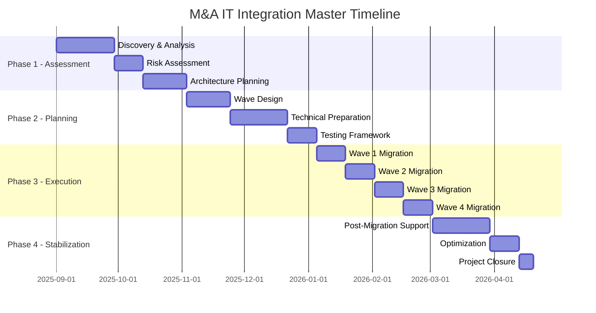

# M&A Discovery Suite - Migration Planning Templates & Checklists
**Complete M&A Integration Templates | Fortune 500 Enterprise Deployment**

---

## Table of Contents

1. [Executive Migration Planning Framework](#1-executive-migration-planning-framework)
2. [Pre-Migration Assessment Templates](#2-pre-migration-assessment-templates)
3. [Migration Wave Planning Templates](#3-migration-wave-planning-templates)
4. [Technical Migration Checklists](#4-technical-migration-checklists)
5. [Risk Assessment & Mitigation Templates](#5-risk-assessment--mitigation-templates)
6. [Communication & Change Management Templates](#6-communication--change-management-templates)
7. [Testing & Validation Templates](#7-testing--validation-templates)
8. [Go-Live & Cutover Templates](#8-go-live--cutover-templates)
9. [Post-Migration Support Templates](#9-post-migration-support-templates)
10. [Compliance & Audit Templates](#10-compliance--audit-templates)

---

## 1. EXECUTIVE MIGRATION PLANNING FRAMEWORK

### 1.1 Strategic Migration Charter Template

#### M&A Migration Project Charter
```yaml
Project Overview:
  Project Name: "[Company A] to [Company B] IT Integration"
  Project Manager: "[Name, Title]"
  Executive Sponsor: "[Name, Title]"
  Start Date: "[YYYY-MM-DD]"
  Target Completion: "[YYYY-MM-DD]"
  Budget: "$[Amount]"
  
Business Case:
  Strategic Objectives:
    - "Achieve operational synergies of $[Amount]M annually"
    - "Consolidate IT infrastructure by [Date]"
    - "Maintain business continuity throughout integration"
    - "Ensure regulatory compliance during transition"
    - "Realize cost savings of [%] by [Date]"
  
  Success Criteria:
    - "99.5% uptime during migration windows"
    - "Zero data loss during migrations"
    - "User productivity maintained at >95%"
    - "Complete integration within [X] months"
    - "Achieve target cost synergies by [Date]"
  
Scope Definition:
  In Scope:
    - "Active Directory consolidation"
    - "Email system migration (Exchange/Office 365)"
    - "File share consolidation and migration"
    - "Application portfolio rationalization"
    - "Network infrastructure integration"
    - "Security framework harmonization"
  
  Out of Scope:
    - "Legacy system decommissioning (Phase 2)"
    - "Business process reengineering"
    - "ERP system integration"
    - "Physical facility consolidation"
  
  Assumptions:
    - "Source systems remain stable during migration"
    - "Required network bandwidth available"
    - "Key personnel available during migration windows"
    - "Regulatory approvals obtained in advance"
    - "Budget approved and funding secured"
  
  Constraints:
    - "Migration must complete during approved windows"
    - "No business disruption during peak seasons"
    - "Compliance requirements must be maintained"
    - "Limited IT resources during holidays"
    - "Regulatory change freezes during audit periods"

Stakeholder Matrix:
  Executive Level:
    - "CEO: Final decision authority and communication"
    - "CFO: Budget approval and financial oversight"
    - "CTO: Technical strategy and architecture decisions"
    - "CISO: Security and compliance oversight"
  
  Management Level:
    - "VP IT Operations: Day-to-day technical execution"
    - "VP Human Resources: Change management and training"
    - "VP Legal: Regulatory compliance and contracts"
    - "VP Business Units: Business requirements and testing"
  
  Operational Level:
    - "IT Managers: Technical implementation teams"
    - "Security Team: Compliance validation and monitoring"
    - "Help Desk: User support during transition"
    - "Network Team: Infrastructure and connectivity"

Risk Assessment Summary:
  High Risk Items:
    - "Data loss during migration: Medium probability, High impact"
    - "Extended downtime: Low probability, High impact"
    - "Regulatory compliance violation: Low probability, Critical impact"
    - "Key personnel departure: Medium probability, Medium impact"
  
  Risk Mitigation Strategy:
    - "Comprehensive backup and rollback procedures"
    - "Extensive testing in isolated environments"
    - "Regulatory compliance validation at each milestone"
    - "Knowledge transfer and cross-training programs"
    - "Dedicated project team with contractor augmentation"

Communication Plan:
  Executive Updates:
    - "Weekly dashboard reports to executive sponsors"
    - "Milestone presentations to board/leadership team"
    - "Monthly all-hands updates on integration progress"
  
  Operational Communications:
    - "Daily stand-up meetings for technical teams"
    - "Weekly status reports to all stakeholders"
    - "Bi-weekly user communication and training updates"
  
  Crisis Communication:
    - "Incident escalation procedures with contact tree"
    - "Emergency communication protocols for major issues"
    - "Media relations plan for external communications"
```

### 1.2 Migration Timeline Master Template

#### High-Level Project Timeline


---

## 2. PRE-MIGRATION ASSESSMENT TEMPLATES

### 2.1 Infrastructure Assessment Checklist

#### Complete Environment Discovery Template
```yaml
Active Directory Assessment:
  Domain Structure:
    ☐ Document current domain topology and trust relationships
    ☐ Inventory all domain controllers and their roles (FSMO)
    ☐ Assess DNS configuration and dependencies
    ☐ Review Group Policy structure and inheritance
    ☐ Document service accounts and their permissions
    
  User and Group Analysis:
    ☐ Total user count: [Number]
    ☐ Active users (last 90 days): [Number]  
    ☐ Service accounts: [Number]
    ☐ Security groups: [Number]
    ☐ Distribution groups: [Number]
    ☐ Nested group relationships documented
    ☐ Orphaned accounts identified: [Number]
    
  Organizational Unit Structure:
    ☐ Current OU design documented
    ☐ Group Policy linkage mapped
    ☐ Delegation of control assessed
    ☐ Target OU structure designed
    ☐ Migration mapping completed

Exchange/Email Assessment:
  Infrastructure Analysis:
    ☐ Exchange version and patch level: [Version]
    ☐ Mailbox count: [Number]
    ☐ Database size: [GB Total]
    ☐ Average mailbox size: [MB]
    ☐ Shared mailboxes: [Number]
    ☐ Resource mailboxes: [Number]
    ☐ Distribution lists: [Number]
    ☐ Transport rules: [Number]
    
  Migration Complexity:
    ☐ Public folders present: [Yes/No]
    ☐ Third-party add-ins identified: [List]
    ☐ Custom applications using MAPI/EWS: [List]
    ☐ Mobile device policies: [Number]
    ☐ Retention policies: [Number]
    ☐ Archive mailboxes: [Number]
    
  Network and Connectivity:
    ☐ Bandwidth between sites: [Mbps]
    ☐ Latency measurements: [ms]
    ☐ Firewall rules documented
    ☐ Load balancer configuration
    ☐ Certificate requirements identified

File System Assessment:
  Share Inventory:
    ☐ Total file servers: [Number]
    ☐ Total shares: [Number]
    ☐ Data volume: [TB]
    ☐ File count: [Millions]
    ☐ Largest single file: [GB]
    ☐ Oldest files: [Date]
    
  Security Analysis:
    ☐ NTFS permissions complexity: [High/Medium/Low]
    ☐ Share-level permissions documented
    ☐ Orphaned permissions identified: [Number]
    ☐ Service account dependencies: [Number]
    ☐ DFS namespace configuration: [Yes/No]
    
  Data Classification:
    ☐ Sensitive data locations identified
    ☐ Retention requirements documented
    ☐ Backup and recovery procedures validated
    ☐ Encryption requirements assessed
    ☐ Compliance requirements identified

Application Portfolio:
  Application Inventory:
    ☐ Total applications: [Number]
    ☐ Business-critical applications: [Number]
    ☐ Legacy applications requiring assessment: [Number]
    ☐ Cloud-based applications: [Number]
    ☐ Custom-developed applications: [Number]
    
  Dependencies and Integration:
    ☐ Active Directory dependencies: [Number]
    ☐ Database dependencies: [Number]
    ☐ File share dependencies: [Number]
    ☐ Network dependencies: [Number]
    ☐ Service account requirements: [Number]
    
  Migration Strategy:
    ☐ Applications to migrate: [Number]
    ☐ Applications to retire: [Number]
    ☐ Applications to replace: [Number]
    ☐ Applications requiring upgrade: [Number]
    ☐ Migration complexity rating: [High/Medium/Low]

Network Infrastructure:
  Current State:
    ☐ Network diagram completed and validated
    ☐ IP address schemes documented
    ☐ VLAN configuration mapped
    ☐ Routing protocols identified
    ☐ Firewall rules documented
    ☐ VPN configurations assessed
    
  Capacity and Performance:
    ☐ Bandwidth utilization measured: [%]
    ☐ Peak usage patterns documented
    ☐ Latency measurements between sites
    ☐ Network equipment inventory completed
    ☐ Upgrade requirements identified
    
  Security Assessment:
    ☐ Network access control policies
    ☐ Intrusion detection/prevention systems
    ☐ Network monitoring capabilities
    ☐ Wireless network security
    ☐ Remote access security
```

### 2.2 Business Impact Assessment Template

#### Business Continuity Planning Worksheet
```yaml
Business Process Impact Analysis:
  Critical Business Processes:
    Process Name: "[Process Description]"
    Criticality Level: "[Critical/High/Medium/Low]"
    Business Owner: "[Name, Title]"
    IT Dependencies: "[List of systems/applications]"
    
    Downtime Tolerance:
      Maximum Acceptable Downtime: "[Hours/Minutes]"
      Recovery Time Objective (RTO): "[Hours/Minutes]"
      Recovery Point Objective (RPO): "[Hours/Minutes]"
    
    Impact Assessment:
      Financial Impact per Hour: "$[Amount]"
      Customer Impact: "[High/Medium/Low]"
      Regulatory Impact: "[High/Medium/Low]"
      Reputation Impact: "[High/Medium/Low]"
    
    Peak Usage Periods:
      Daily: "[Time ranges]"
      Weekly: "[Days of week]"
      Monthly: "[Dates]"
      Seasonal: "[Periods to avoid]"

User Community Analysis:
  User Categories:
    Executive Users (C-Level):
      Count: "[Number]"
      Special Requirements: "[List]"
      Migration Priority: "[High/Medium/Low]"
      Change Resistance Level: "[High/Medium/Low]"
    
    Knowledge Workers:
      Count: "[Number]"
      Typical Usage Patterns: "[Description]"
      Critical Applications: "[List]"
      Training Requirements: "[High/Medium/Low]"
    
    Task Workers:
      Count: "[Number]"
      System Dependencies: "[List]"
      Flexibility for Change: "[High/Medium/Low]"
      Support Requirements: "[High/Medium/Low]"
    
    Mobile/Remote Workers:
      Count: "[Number]"
      Access Methods: "[List]"
      Connectivity Requirements: "[Description]"
      Special Considerations: "[List]"

Business Calendar Analysis:
  Migration Windows:
    Approved Windows:
      - "Weekend: Friday 6 PM - Monday 6 AM"
      - "Holiday periods: [List specific dates]"
      - "Maintenance windows: [Existing scheduled times]"
    
    Blackout Periods:
      - "Month-end/Quarter-end processing"
      - "Annual audit periods"
      - "Peak business seasons"
      - "Board meeting weeks"
      - "Major customer events"
    
    Optimal Migration Periods:
      - "Summer months with reduced activity"
      - "Holiday periods with skeleton staff"
      - "Post-quarter periods with lower activity"
      - "Scheduled maintenance windows"

Regulatory and Compliance Considerations:
  Applicable Regulations:
    SOX Compliance:
      - "Financial data handling requirements"
      - "Change control procedures"
      - "Audit trail maintenance"
      - "Segregation of duties"
    
    GDPR Compliance:
      - "Data protection requirements"
      - "Right to erasure procedures"
      - "Data portability requirements"
      - "Consent management"
    
    HIPAA Compliance:
      - "PHI handling procedures"
      - "Access control requirements"
      - "Audit logging requirements"
      - "Encryption requirements"
    
    Industry-Specific:
      - "Industry regulations: [List]"
      - "Certification requirements: [List]"
      - "Reporting obligations: [List]"
      - "Data retention requirements: [List]"
```

---

## 3. MIGRATION WAVE PLANNING TEMPLATES

### 3.1 Wave Design Template

#### Migration Wave Planning Worksheet
```yaml
Wave Configuration:
  Wave Information:
    Wave Number: "[1, 2, 3, etc.]"
    Wave Name: "[Descriptive name]"
    Description: "[Purpose and scope]"
    Priority Level: "[Critical/High/Medium/Low]"
    
  Timing and Schedule:
    Planned Start Date: "[YYYY-MM-DD HH:MM]"
    Planned End Date: "[YYYY-MM-DD HH:MM]"
    Estimated Duration: "[Hours]"
    Business Impact Window: "[Hours]"
    
    Migration Window Type:
      ☐ Standard Weekend Window
      ☐ Extended Holiday Window  
      ☐ Emergency/Expedited Window
      ☐ Business Hours (Low Impact)
      ☐ Phased/Rolling Migration
    
  Wave Scope and Content:
    User Migration:
      Total Users: "[Number]"
      User Categories:
        - "Executives: [Number]"
        - "Managers: [Number]"  
        - "Staff: [Number]"
        - "Contractors: [Number]"
        - "Service Accounts: [Number]"
      
      Geographic Distribution:
        - "Headquarters: [Number]"
        - "Branch Office A: [Number]"
        - "Branch Office B: [Number]"
        - "Remote Workers: [Number]"
      
      Department Breakdown:
        - "IT: [Number]"
        - "Finance: [Number]"
        - "HR: [Number]"
        - "Sales: [Number]"
        - "Operations: [Number]"
    
    System Components:
      ☐ Active Directory Objects
      ☐ Exchange Mailboxes
      ☐ File Shares and Data
      ☐ Applications and Databases
      ☐ Network Configurations
      ☐ Security Policies
    
  Dependencies and Prerequisites:
    Technical Dependencies:
      - "Previous wave completion: [Wave X]"
      - "Infrastructure readiness: [Component]"
      - "Network configuration: [Requirement]"
      - "Security setup: [Requirement]"
    
    Business Dependencies:
      - "Business approval: [Stakeholder]"
      - "User communication: [Date]"
      - "Training completion: [Percentage]"
      - "Change freeze lift: [Date]"
    
    Resource Dependencies:
      - "Migration team: [X people]"
      - "Subject matter experts: [X people]"
      - "Help desk coverage: [Extended hours]"
      - "Network bandwidth: [Mbps allocated]"

Risk Assessment:
  Wave-Specific Risks:
    Technical Risks:
      Risk: "Large mailbox migration timeouts"
      Probability: "[High/Medium/Low]"
      Impact: "[High/Medium/Low]"
      Mitigation: "Pre-migration cleanup and bandwidth allocation"
      
    Business Risks:
      Risk: "Executive availability during migration"
      Probability: "[High/Medium/Low]"
      Impact: "[High/Medium/Low]"
      Mitigation: "Executive communication and backup access methods"
    
    Timeline Risks:
      Risk: "Migration window overrun"
      Probability: "[High/Medium/Low]"
      Impact: "[High/Medium/Low]"
      Mitigation: "Phased approach with rollback procedures"

Success Criteria:
  Technical Acceptance:
    ☐ All users successfully migrated
    ☐ All mailboxes accessible
    ☐ File access working correctly
    ☐ Applications functioning properly
    ☐ No data loss or corruption
    ☐ Performance within acceptable limits
  
  Business Acceptance:
    ☐ User productivity maintained
    ☐ Critical business processes operational
    ☐ No security incidents
    ☐ Compliance requirements met
    ☐ Stakeholder approval obtained
    ☐ User satisfaction >90%

Rollback Plan:
  Rollback Triggers:
    - "Migration failure rate >5%"
    - "Critical business process failure"
    - "Security incident or data breach"
    - "Performance degradation >50%"
    - "Executive decision to abort"
  
  Rollback Procedures:
    Step 1: "Stop all migration processes immediately"
    Step 2: "Activate incident response team"
    Step 3: "Restore from backup if necessary"
    Step 4: "Communicate status to all stakeholders"
    Step 5: "Document lessons learned"
  
  Rollback Time Estimate: "[Hours]"
  Recovery Point: "[Last known good state]"
```

### 3.2 Wave Execution Checklist Template

#### Pre-Migration Execution Checklist
```yaml
T-Minus 7 Days - Final Preparation:
  Technical Readiness:
    ☐ Migration servers health check passed
    ☐ Database backups completed and verified
    ☐ Source systems health validated
    ☐ Target systems capacity verified
    ☐ Network connectivity tested
    ☐ Bandwidth allocation confirmed
    ☐ Monitoring systems configured
    ☐ Alert thresholds set appropriately
  
  Security and Compliance:
    ☐ Security team approval obtained
    ☐ Compliance checklist completed
    ☐ Audit logging enabled
    ☐ Access controls validated
    ☐ Encryption verification complete
    ☐ Data classification confirmed
  
  Team Readiness:
    ☐ Migration team availability confirmed
    ☐ Subject matter experts on standby
    ☐ Help desk extended coverage arranged
    ☐ Executive sponsors informed
    ☐ Emergency contacts updated
    ☐ Communication plan activated

T-Minus 24 Hours - Go/No-Go Decision:
  Final Validation:
    ☐ Weather and external factors checked
    ☐ Source system stability confirmed (48-hour window)
    ☐ No major incidents in progress
    ☐ Change freeze in effect
    ☐ All team members confirmed available
    ☐ Emergency procedures reviewed with team
  
  Go/No-Go Criteria Assessment:
    ☐ All technical dependencies satisfied
    ☐ All business approvals obtained
    ☐ Risk assessment acceptable
    ☐ Rollback procedures tested
    ☐ Communication plan ready
    
  Decision Authority:
    ☐ Migration Manager recommendation: [Go/No-Go]
    ☐ Technical Lead approval: [Go/No-Go]
    ☐ Security Lead approval: [Go/No-Go]
    ☐ Business Sponsor approval: [Go/No-Go]
    ☐ Executive Sponsor final decision: [Go/No-Go]

T-Minus 2 Hours - Final Countdown:
  Last-Minute Checks:
    ☐ All systems green light
    ☐ Migration tools ready and tested
    ☐ Log monitoring active
    ☐ Help desk briefed and ready
    ☐ Communication channels open
    ☐ Emergency procedures posted
  
  Team Confirmation:
    ☐ Migration team ready: [Names]
    ☐ Network team standby: [Names]
    ☐ Security team standby: [Names]
    ☐ Business liaisons available: [Names]
    ☐ Executive escalation path confirmed
  
  Final Communications:
    ☐ User notification sent
    ☐ Stakeholder notification sent
    ☐ Help desk updated with known issues
    ☐ Status page updated
    ☐ Media monitoring activated (if applicable)
```

---

## 4. TECHNICAL MIGRATION CHECKLISTS

### 4.1 Active Directory Migration Checklist

#### Domain Consolidation Technical Checklist
```yaml
Pre-Migration Technical Setup:
  Forest and Domain Preparation:
    ☐ Forest functional level verified: [Level]
    ☐ Domain functional level verified: [Level]
    ☐ Schema version documented: [Version]
    ☐ FSMO roles documented and healthy
    ☐ Global Catalog servers verified
    ☐ DNS zones replicated and healthy
    ☐ Trust relationships established
    ☐ Trust authentication tested
  
  Replication Health:
    ☐ AD replication healthy (repadmin /replsum)
    ☐ DFS replication healthy (if applicable)
    ☐ DNS replication verified
    ☐ Time synchronization verified (w32tm)
    ☐ Network connectivity tested between all DCs
    ☐ Required ports open and tested
  
  Migration Tool Setup:
    ☐ M&A Discovery Suite installed and configured
    ☐ PowerShell execution policy configured
    ☐ Service accounts created with appropriate permissions
    ☐ Migration tool connectivity tested
    ☐ Log collection configured
    ☐ Error handling procedures documented

User and Group Migration Process:
  Pre-Migration Validation:
    ☐ Source user inventory completed
    ☐ Duplicate accounts identified and resolved
    ☐ Group membership conflicts resolved
    ☐ Service account dependencies documented
    ☐ Password policy conflicts resolved
    ☐ UPN suffix conflicts resolved
  
  Migration Execution:
    ☐ Disable source domain replication (if required)
    ☐ Export users and groups with M&A Discovery Suite
    ☐ Validate export data integrity
    ☐ Import users to target domain
    ☐ Import groups and nested memberships
    ☐ Apply group remapping rules
    ☐ Validate imported objects
    ☐ Test authentication against target domain
    
  Post-Migration Validation:
    ☐ All users successfully migrated
    ☐ Group memberships preserved/remapped correctly
    ☐ Service account functionality verified
    ☐ Kerberos ticket generation tested
    ☐ Group Policy application verified
    ☐ LDAP queries working correctly

Computer and Resource Migration:
  Computer Account Migration:
    ☐ Computer inventory documented
    ☐ Computer naming conflicts resolved
    ☐ Domain join method selected (offline/online)
    ☐ Computer accounts migrated
    ☐ Group Policy assignments updated
    ☐ Certificate re-enrollment completed (if required)
    
  Service Principal Names (SPNs):
    ☐ Existing SPNs documented
    ☐ SPN conflicts identified and resolved
    ☐ SPNs migrated or recreated
    ☐ Service authentication tested
    ☐ Kerberos delegation updated (if applicable)

Group Policy Migration:
  Policy Assessment:
    ☐ Existing GPO inventory documented
    ☐ Policy conflicts identified
    ☐ Security filtering analyzed
    ☐ WMI filters documented
    ☐ Policy dependencies mapped
    
  Policy Migration:
    ☐ GPOs exported from source domain
    ☐ Policy references updated for target domain
    ☐ GPOs imported to target domain
    ☐ Security filtering re-applied
    ☐ Policy links created and tested
    ☐ Policy processing verified (gpresult /r)
```

### 4.2 Exchange Migration Checklist

#### Exchange/Office 365 Migration Checklist
```yaml
Pre-Migration Exchange Setup:
  Source Exchange Analysis:
    ☐ Exchange version and build documented
    ☐ Database sizes and locations documented
    ☐ Mailbox count and sizes analyzed
    ☐ Public folder content assessed
    ☐ Transport rules documented
    ☐ Retention policies documented
    ☐ Mobile device partnerships identified
    
  Target Environment Preparation:
    ☐ Target Exchange/O365 tenant configured
    ☐ Domain verification completed
    ☐ MX record cutover plan documented
    ☐ Autodiscover configuration planned
    ☐ SSL certificate requirements identified
    ☐ Firewall rules configured
    ☐ Migration endpoint configured

Migration Batch Configuration:
  Batch Planning:
    ☐ Users grouped into migration batches
    ☐ Batch size determined based on capacity
    ☐ Migration schedule optimized for network usage
    ☐ Coexistence period defined
    ☐ Cutover method selected (staged/hybrid/cutover)
    
  Migration Tool Setup:
    ☐ M&A Discovery Suite Exchange module configured
    ☐ PowerShell remoting enabled and tested
    ☐ Migration endpoints created and tested
    ☐ Throttling policies configured
    ☐ Error handling and retry logic configured
    ☐ Progress monitoring configured

Mailbox Migration Execution:
  Pre-Migration Tasks:
    ☐ Source mailbox health check
    ☐ Target mailbox provisioning
    ☐ Mail flow routing configured
    ☐ Autodiscover records updated (if applicable)
    ☐ User communication sent
    
  Migration Process:
    ☐ Start migration batch with M&A Discovery Suite
    ☐ Monitor migration progress and performance
    ☐ Handle migration errors and retries
    ☐ Verify mailbox content integrity
    ☐ Test mail flow bidirectionally
    ☐ Validate calendar and contacts
    
  Post-Migration Validation:
    ☐ All mail items successfully migrated
    ☐ Folder structure preserved
    ☐ Permissions and delegates working
    ☐ Out-of-office messages functional
    ☐ Mobile device connectivity restored
    ☐ Shared mailbox access verified

Mail Flow and DNS Updates:
  DNS Configuration:
    ☐ MX record TTL reduced (24 hours before cutover)
    ☐ Autodiscover records prepared
    ☐ SPF records updated
    ☐ DKIM keys configured (if applicable)
    ☐ DMARC policy reviewed
    
  Mail Flow Testing:
    ☐ Internal mail flow tested
    ☐ External mail flow tested
    ☐ Mail routing rules verified
    ☐ Anti-spam/anti-malware working
    ☐ Mail archiving functional
    
  Cutover Activities:
    ☐ Final incremental sync completed
    ☐ MX records updated
    ☐ Autodiscover records updated
    ☐ User communication sent
    ☐ Legacy system access disabled
```

### 4.3 File System Migration Checklist

#### File Share and Data Migration Checklist
```yaml
Pre-Migration File System Assessment:
  Source Environment Analysis:
    ☐ File server inventory completed
    ☐ Share permissions documented
    ☐ NTFS permissions analyzed
    ☐ DFS namespace configuration documented
    ☐ File count and data volume assessed
    ☐ Duplicate files identified
    ☐ Orphaned files identified
    ☐ Large files (>1GB) catalogued
    
  Target Environment Design:
    ☐ Target server capacity planned
    ☐ Folder structure design completed
    ☐ Permission inheritance planned
    ☐ Backup and recovery procedures designed
    ☐ Antivirus exclusions planned
    ☐ Storage tiering strategy defined

Data Classification and Preparation:
  Content Analysis:
    ☐ Sensitive data locations identified
    ☐ Personal data (GDPR) flagged
    ☐ Regulatory data (HIPAA/SOX) identified
    ☐ Intellectual property catalogued
    ☐ Retention requirements documented
    ☐ Data owner approvals obtained
    
  Pre-Migration Cleanup:
    ☐ Duplicate files removed or consolidated
    ☐ Obsolete files archived or deleted
    ☐ Temporary files cleaned
    ☐ System files excluded
    ☐ Broken shortcuts removed
    ☐ Empty folders cleaned

Permission Migration Planning:
  Security Analysis:
    ☐ Current permission structure documented
    ☐ Group membership dependencies mapped
    ☐ Service account dependencies identified
    ☐ Inheritance breakages documented
    ☐ Explicit permissions catalogued
    ☐ Permission conflicts identified
    
  Target Permission Design:
    ☐ New permission structure designed
    ☐ Group remapping rules created
    ☐ Permission inheritance optimized
    ☐ Service account permissions planned
    ☐ Audit access permissions configured

File Migration Execution:
  Migration Tool Configuration:
    ☐ M&A Discovery Suite file migration module configured
    ☐ Source and target paths validated
    ☐ Migration filters applied (file types, dates, sizes)
    ☐ Bandwidth throttling configured
    ☐ Error handling configured
    ☐ Progress reporting configured
    
  Migration Process:
    ☐ Pilot migration executed and validated
    ☐ Incremental copy initiated
    ☐ File integrity verification enabled
    ☐ Progress monitoring active
    ☐ Error resolution procedures active
    ☐ User access temporarily redirected
    
  Final Synchronization:
    ☐ Final incremental sync initiated
    ☐ Delta changes captured
    ☐ File locks cleared
    ☐ Permissions applied to target
    ☐ Share access cutover completed
    ☐ Source access disabled

Post-Migration Validation:
  Data Integrity Verification:
    ☐ File count comparison (source vs target)
    ☐ Data volume comparison
    ☐ Hash verification for critical files
    ☐ File modification dates preserved
    ☐ File attributes preserved
    ☐ Special files (shortcuts, system) verified
    
  Access and Permissions Testing:
    ☐ User access from workstations verified
    ☐ Application access to files verified
    ☐ Permission inheritance working correctly
    ☐ Service account access verified
    ☐ Backup and antivirus access confirmed
    ☐ DFS referrals updated and tested
```

---

## 5. RISK ASSESSMENT & MITIGATION TEMPLATES

### 5.1 Migration Risk Register Template

#### Comprehensive Risk Assessment Matrix
```yaml
Risk Assessment Categories:

Technical Risks:
  Risk ID: "T001"
  Risk Name: "Data Loss During Migration"
  Description: "Potential for data corruption or loss during file/mailbox migration"
  Category: "Technical - Data Integrity"
  
  Risk Assessment:
    Probability: "Low (2/5)"
    Impact: "Critical (5/5)"
    Risk Score: "10 (High)"
    
  Risk Factors:
    - "Large data volumes increase chances of corruption"
    - "Network interruptions during transfer"
    - "Storage system failures"
    - "Human error in migration procedures"
    
  Impact Analysis:
    Business Impact:
      - "Loss of critical business documents"
      - "Regulatory compliance violations"
      - "Legal liability for data loss"
      - "Loss of customer trust"
    
    Financial Impact:
      - "Data recovery costs: $50K - $500K"
      - "Business disruption costs: $100K - $1M per day"
      - "Regulatory fines: $10K - $10M"
      - "Legal settlement costs: $100K - $10M"
    
    Timeline Impact:
      - "Migration delay: 1-4 weeks"
      - "Recovery activities: 1-2 weeks"
      - "Full restoration: 2-6 weeks"
    
  Mitigation Strategies:
    Preventive Measures:
      - "Comprehensive data backup before migration"
      - "Pilot testing with non-critical data"
      - "Checksums and integrity verification"
      - "Redundant migration paths"
      - "Real-time monitoring and alerting"
    
    Detective Measures:
      - "Continuous data integrity monitoring"
      - "Automated hash comparison"
      - "File count and size validation"
      - "User access testing"
    
    Responsive Measures:
      - "Immediate rollback procedures"
      - "Data recovery from backups"
      - "Alternative migration methods"
      - "Emergency communication plan"
    
  Contingency Plans:
    Plan A - Minor Data Loss:
      - "Restore specific files from backup"
      - "Re-run migration for affected items"
      - "Validate integrity and continue"
    
    Plan B - Major Data Loss:
      - "Stop all migration activities"
      - "Activate data recovery team"
      - "Restore entire system from backup"
      - "Investigate root cause"
      - "Implement additional safeguards"
    
    Plan C - Complete System Failure:
      - "Activate disaster recovery procedures"
      - "Restore to previous known good state"
      - "Reassess migration approach"
      - "Consider alternative migration strategy"
  
  Monitoring and Review:
    Risk Indicators:
      - "Backup verification failures"
      - "Network instability patterns"
      - "Storage capacity warnings"
      - "Migration error rate increases"
    
    Review Schedule:
      - "Daily during migration execution"
      - "Weekly during planning phases"
      - "After each migration wave"
      - "Post-incident reviews"

Business Risks:
  Risk ID: "B001"
  Risk Name: "Extended Business Disruption"
  Description: "Migration activities causing prolonged business operational impact"
  Category: "Business - Operations"
  
  Risk Assessment:
    Probability: "Medium (3/5)"
    Impact: "High (4/5)"
    Risk Score: "12 (High)"
    
  Business Continuity Analysis:
    Critical Business Processes:
      - "Customer order processing"
      - "Financial reporting and controls"
      - "Customer service operations"
      - "Supply chain management"
    
    Acceptable Downtime:
      - "Email: 4 hours maximum"
      - "File access: 2 hours maximum"
      - "Business applications: 1 hour maximum"
      - "Customer-facing systems: 30 minutes maximum"
    
  Mitigation Strategies:
    Scheduling Optimization:
      - "Migration during low-business-impact windows"
      - "Phased approach to minimize simultaneous impact"
      - "Seasonal timing to avoid peak periods"
      - "Coordinated communication timeline"
    
    Alternative Service Provision:
      - "Temporary workarounds for critical functions"
      - "Manual processes for essential operations"
      - "Third-party service arrangements"
      - "Remote work capabilities enhancement"

Security Risks:
  Risk ID: "S001"  
  Risk Name: "Security Breach During Migration"
  Description: "Increased vulnerability during migration processes"
  Category: "Security - Confidentiality"
  
  Risk Assessment:
    Probability: "Low (2/5)"
    Impact: "Critical (5/5)"
    Risk Score: "10 (High)"
    
  Security Threat Analysis:
    Threat Vectors:
      - "Privileged account compromise"
      - "Network interception of migration traffic"
      - "Unauthorized access to migration tools"
      - "Social engineering targeting migration team"
      - "Insider threat exploitation"
    
    Data at Risk:
      - "User credentials and authentication data"
      - "Sensitive business documents"
      - "Customer personal information (PII/PHI)"
      - "Financial records and controls"
      - "Intellectual property and trade secrets"
    
  Security Controls:
    Technical Controls:
      - "Encryption of all migration traffic (TLS 1.3)"
      - "Multi-factor authentication for migration tools"
      - "Privileged access management (PAM)"
      - "Network segmentation and monitoring"
      - "Endpoint detection and response (EDR)"
    
    Administrative Controls:
      - "Security clearance verification for team members"
      - "Regular security awareness training"
      - "Incident response plan activation"
      - "Security monitoring and logging"
      - "Third-party security assessments"
```

### 5.2 Risk Mitigation Action Plan Template

#### Risk Response Planning Matrix
```yaml
Risk Mitigation Action Plans:

High-Priority Risk Mitigation:
  Risk: "Data Loss During Migration (T001)"
  
  Primary Mitigation Plan:
    Action Items:
      1. "Implement triple-redundant backup strategy"
         Owner: "Infrastructure Team Lead"
         Due Date: "2025-09-15"
         Status: "In Progress"
         Success Criteria: "All critical data backed up with verification"
         
      2. "Deploy real-time integrity monitoring"
         Owner: "Security Team Lead" 
         Due Date: "2025-09-20"
         Status: "Planning"
         Success Criteria: "100% data integrity verification during transfers"
         
      3. "Create automated rollback procedures"
         Owner: "Migration Team Lead"
         Due Date: "2025-09-25"
         Status: "Not Started"
         Success Criteria: "< 15 minute rollback capability demonstrated"
    
    Resource Requirements:
      Personnel: "2 FTE for 4 weeks"
      Technology: "$50K for monitoring tools"
      Vendor Support: "$25K for professional services"
    
    Success Metrics:
      - "Zero data loss incidents during pilot testing"
      - "< 0.01% error rate in production migration"
      - "100% backup verification success rate"
      - "< 15 minute rollback time demonstrated"
    
  Secondary Mitigation Plan (If Primary Fails):
    Fallback Strategy: "Extend migration timeline and implement staged approach"
    Additional Resources: "$100K and 2 additional weeks"
    Alternative Approach: "Use third-party migration service as backup"
    
  Contingency Plan:
    Trigger Conditions: "Data loss > 0.1% or critical system failure"
    Emergency Actions:
      - "Immediate halt of all migration activities"
      - "Activate data recovery procedures"
      - "Engage emergency response team"
      - "Executive notification within 30 minutes"
    
    Recovery Procedures:
      Step 1: "Assess scope and impact of data loss"
      Step 2: "Prioritize recovery based on business criticality"
      Step 3: "Execute recovery from most recent verified backup"
      Step 4: "Validate recovery completeness"
      Step 5: "Conduct root cause analysis"
      Step 6: "Implement additional safeguards before resuming"

Medium-Priority Risk Mitigation:
  Risk: "Migration Timeline Overrun (P001)"
  
  Proactive Measures:
    Schedule Buffer: "20% time buffer added to all major milestones"
    Resource Flexibility: "On-call consultants contracted for surge capacity"
    Parallel Processing: "Independent migration streams where possible"
    
  Reactive Measures:
    Early Warning System: "Weekly milestone tracking with 3-day alerts"
    Escalation Procedures: "Executive escalation for >5 day delays"
    Resource Augmentation: "Pre-approved budget for additional resources"
    
  Timeline Recovery Options:
    Option 1: "Extend hours (evenings/weekends)"
    Option 2: "Add additional resources/consultants"
    Option 3: "Reduce scope for subsequent waves"
    Option 4: "Implement parallel processing approaches"

Communication and Escalation:
  Risk Communication Matrix:
    Low Risk (Score 1-4):
      Reporting: "Weekly status reports"
      Escalation: "Team lead notification"
      Review: "Monthly risk review meetings"
      
    Medium Risk (Score 5-9):
      Reporting: "Bi-weekly focused updates"
      Escalation: "Manager and stakeholder notification"
      Review: "Bi-weekly risk assessment calls"
      
    High Risk (Score 10-15):
      Reporting: "Daily status updates"
      Escalation: "Executive sponsor immediate notification"
      Review: "Daily risk management calls"
      
    Critical Risk (Score 16-25):
      Reporting: "Real-time status updates"
      Escalation: "C-level and board notification"
      Review: "Emergency response activation"
```

---

## 6. COMMUNICATION & CHANGE MANAGEMENT TEMPLATES

### 6.1 Stakeholder Communication Plan Template

#### Multi-Tier Communication Strategy
```yaml
Executive Communication Plan:
  C-Level Updates:
    Frequency: "Weekly during active migration, Monthly during planning"
    Format: "Executive dashboard + 30-minute briefing"
    Content Focus:
      - "Overall project health and status"
      - "Major milestones achieved/upcoming"
      - "Budget performance vs. plan"
      - "Risk status and mitigation activities"
      - "Strategic decisions required"
    
    Delivery Method:
      Primary: "In-person presentation with dashboard"
      Secondary: "Video conference with screen sharing"
      Backup: "Detailed email with attached dashboard"
    
    Escalation Triggers:
      - "Major milestone delay > 1 week"
      - "Budget variance > 10%"
      - "Critical risk materialization"
      - "Compliance or regulatory issues"
      - "Stakeholder dissatisfaction"

Board/Investor Communication:
  Frequency: "Monthly during migration, Quarterly otherwise"
  Format: "Formal presentation with metrics"
  Content Requirements:
    - "Strategic alignment with business goals"
    - "Financial performance and ROI tracking"
    - "Risk management effectiveness"
    - "Competitive advantage realization"
    - "Compliance and regulatory adherence"
  
  Success Metrics Communication:
    - "Cost synergies achieved: $X.XM (Y% of target)"
    - "Timeline performance: X% on schedule"
    - "User satisfaction: X% positive feedback"
    - "System uptime: XX.X% during migrations"
    - "Risk incidents: X resolved, X open"

Management Communication Plan:
  Middle Management Updates:
    Frequency: "Bi-weekly status calls + monthly department meetings"
    Participants: "VPs, Directors, Senior Managers"
    Content Focus:
      - "Detailed progress by functional area"
      - "Resource allocation and utilization"
      - "Issue resolution and decisions needed"
      - "Impact on daily operations"
      - "Change management activities"
    
  Department Head Briefings:
    Frequency: "Weekly during waves affecting their areas"
    Format: "30-minute focused briefings"
    Customization: "Department-specific impacts and timelines"
    Q&A Sessions: "Open forum for concerns and questions"

User Communication Strategy:
  All-Hands Communications:
    Initial Announcement:
      Timing: "T-30 days before first migration wave"
      Method: "CEO email + town hall meeting + intranet"
      Content: "Strategic rationale, timeline, benefits, support"
      
    Regular Updates:
      Frequency: "Bi-weekly during active migration"
      Method: "Email updates + intranet + digital displays"
      Content: "Progress updates, upcoming changes, success stories"
    
    Wave-Specific Notifications:
      T-7 Days: "Detailed preparation email with checklists"
      T-1 Day: "Final reminder with help desk contact info"
      Go-Live: "Real-time status updates during migration"
      T+1 Day: "Success confirmation and next steps"
  
  Targeted User Group Communications:
    Power Users/Champions:
      Role: "Change advocates and peer support providers"
      Communication: "Weekly champion calls + exclusive updates"
      Training: "Advanced training sessions + early access"
      Support: "Direct escalation path + feedback channel"
    
    Mobile/Remote Users:
      Communication: "Specialized instructions for connectivity"
      Support: "Dedicated help desk queue + remote assistance"
      Testing: "Pre-migration connectivity validation"
      Backup Plans: "Alternative access methods during issues"

Crisis Communication Plan:
  Crisis Definition:
    Level 1 - Minor Impact: "Single system issue, < 2 hour resolution"
    Level 2 - Moderate Impact: "Multiple systems, 2-8 hour resolution"
    Level 3 - Major Impact: "Business process disruption, > 8 hours"
    Level 4 - Critical Impact: "Business continuity threat, data loss risk"
  
  Communication Response Matrix:
    Level 1: "Internal team notification only"
    Level 2: "Management notification + user advisory"  
    Level 3: "Executive notification + user communication"
    Level 4: "All stakeholders + external communication"
  
  Crisis Communication Templates:
    Initial Alert: "Brief factual update with timeline for next update"
    Progress Updates: "Status, actions taken, estimated resolution"
    Resolution Notice: "Issue resolved, root cause, prevention measures"
    Post-Incident Report: "Detailed analysis, lessons learned, improvements"
```

### 6.2 Change Management Execution Template

#### User Adoption and Change Strategy
```yaml
Change Readiness Assessment:
  Organizational Culture Analysis:
    Change History: "How has the organization handled previous major changes?"
    Leadership Style: "Top-down directive vs. collaborative consensus"
    Risk Tolerance: "Conservative vs. innovative approach to new technology"
    Communication Preferences: "Formal vs. informal, digital vs. face-to-face"
    
  User Segment Analysis:
    Early Adopters (10-15%):
      Characteristics: "Technology enthusiasts, change advocates"
      Strategy: "Recruit as champions, provide advanced training"
      Timeline: "Engage T-60 days, deploy first"
      
    Early Majority (35-40%):
      Characteristics: "Pragmatic, need proof of value"
      Strategy: "Show success stories, peer testimonials"
      Timeline: "Engage T-30 days, deploy second"
      
    Late Majority (35-40%):
      Characteristics: "Skeptical, need extensive support"
      Strategy: "Extra training, one-on-one support"
      Timeline: "Engage T-14 days, deploy third"
      
    Laggards (10-15%):
      Characteristics: "Resistant to change, need compelling reasons"
      Strategy: "Executive mandate, intensive support"
      Timeline: "Engage T-7 days, deploy last"

Training and Enablement Program:
  Training Curriculum Design:
    Executive Training (2 hours):
      Content: "Strategic overview, business case, success metrics"
      Format: "Executive briefing with Q&A"
      Timing: "T-30 days before first wave"
      
    Manager Training (4 hours):
      Content: "Detailed changes, team support strategies, escalation"
      Format: "Interactive workshop with scenarios"
      Timing: "T-21 days before affecting their teams"
      
    End User Training (2-6 hours based on role):
      Content: "Hands-on practice, workflow changes, support resources"
      Format: "Classroom + online + just-in-time resources"
      Timing: "T-14 to T-7 days before migration"
      
    Power User Training (8 hours):
      Content: "Advanced features, troubleshooting, peer support"
      Format: "Intensive workshop + ongoing coaching"
      Timing: "T-30 days, ongoing reinforcement"
  
  Training Delivery Methods:
    In-Person Sessions: "Complex topics, high-touch roles"
    Virtual Sessions: "Standard content, geographically dispersed"
    Self-Paced Online: "Basic content, flexible scheduling"
    Micro-Learning: "Just-in-time, specific tasks"
    Peer-to-Peer: "Champion network, informal support"
  
  Training Effectiveness Measurement:
    Knowledge Assessment: "Pre/post training tests"
    Skill Demonstration: "Hands-on exercises during training"
    On-the-Job Performance: "Task completion rates post-migration"
    User Satisfaction: "Training feedback surveys"
    Support Ticket Analysis: "Types and volume of help requests"

Support Infrastructure:
  Help Desk Enhancement:
    Staffing: "2x normal staffing during migration weeks"
    Training: "Specialized training on new systems/processes"
    Hours: "Extended hours (6 AM - 10 PM) during migrations"
    Escalation: "Direct path to migration team for critical issues"
    
  Champion Network:
    Selection Criteria: "Technical aptitude, peer influence, positive attitude"
    Responsibilities: "First-level peer support, feedback collection"
    Training: "Advanced system training + coaching skills"
    Recognition: "Public recognition, professional development opportunities"
    
  Self-Service Resources:
    Knowledge Base: "Searchable repository of FAQs and procedures"
    Video Library: "How-to videos for common tasks"
    Quick Reference Cards: "Printable desk references"
    Mobile App: "Access to resources from mobile devices"
  
  Feedback and Continuous Improvement:
    Feedback Collection Methods:
      - "Pulse surveys (weekly during migration)"
      - "Focus groups (bi-weekly with user segments)"
      - "Help desk ticket analysis (daily)"
      - "Champion network feedback (weekly)"
      - "Management observation reports (daily)"
    
    Rapid Response Process:
      Issue Identification: "< 24 hours from first report"
      Root Cause Analysis: "< 48 hours for user experience issues"
      Solution Development: "< 72 hours for training/process issues"
      Implementation: "< 1 week for non-technical solutions"
      Effectiveness Validation: "< 2 weeks post-implementation"
```

---

## 7. TESTING & VALIDATION TEMPLATES

### 7.1 Migration Testing Strategy Template

#### Comprehensive Testing Framework
```yaml
Testing Strategy Overview:
  Testing Philosophy:
    - "Test early, test often, test thoroughly"
    - "Automate repetitive testing where possible"
    - "Focus on business-critical scenarios"
    - "Validate end-to-end user workflows"
    - "Test failure scenarios and recovery procedures"
  
  Testing Environment Strategy:
    Production Mirror: "Exact replica for high-fidelity testing"
    Staging Environment: "Near-production for integration testing"  
    Development Environment: "Component and unit testing"
    Isolated Test Lab: "Destructive and security testing"

Test Phases and Objectives:
  Phase 1 - Component Testing:
    Objective: "Validate individual migration components"
    Duration: "2 weeks"
    Environment: "Development/Lab"
    
    Test Areas:
      Active Directory Migration:
        - "User account migration accuracy"
        - "Group membership preservation"
        - "Permission inheritance validation"
        - "Service principal name migration"
        - "Kerberos authentication functionality"
      
      Exchange Migration:
        - "Mailbox content migration completeness"
        - "Calendar and contact preservation"
        - "Permission and delegation maintenance"
        - "Public folder migration (if applicable)"
        - "Mail flow routing validation"
      
      File System Migration:
        - "File integrity and hash validation"
        - "NTFS permission preservation"
        - "Large file handling (>1GB)"
        - "Unicode filename support"
        - "Symbolic link and junction handling"
  
  Phase 2 - Integration Testing:
    Objective: "Validate component interactions and workflows"
    Duration: "3 weeks"  
    Environment: "Staging"
    
    Test Scenarios:
      End-to-End User Migration:
        - "User account -> Mailbox -> File access workflow"
        - "Application authentication after migration"
        - "Mobile device reconnection"
        - "VPN access validation"
        - "Single sign-on functionality"
      
      Cross-System Dependencies:
        - "Application database connections"
        - "Service account authentication"
        - "Scheduled task execution"
        - "Print queue access"
        - "Network drive mappings"
  
  Phase 3 - Performance Testing:
    Objective: "Validate performance under load"
    Duration: "2 weeks"
    Environment: "Production Mirror"
    
    Performance Test Scenarios:
      Load Testing:
        - "100 concurrent user migrations"
        - "50GB+ mailbox migrations"
        - "10,000+ file migrations"
        - "Network bandwidth utilization"
        - "Database query performance under load"
      
      Stress Testing:
        - "Maximum concurrent operations"
        - "Resource exhaustion scenarios"
        - "Recovery from overload conditions"
        - "Graceful degradation validation"
      
      Volume Testing:
        - "Enterprise-scale data volumes"
        - "Maximum supported user counts"
        - "Large organizational unit structures"
        - "Complex group membership hierarchies"
  
  Phase 4 - User Acceptance Testing:
    Objective: "Validate business workflows and user experience"
    Duration: "2 weeks"
    Environment: "Production Mirror + Real Users"
    
    Business Process Validation:
      Critical Business Workflows:
        - "Email communication workflows"
        - "File collaboration processes"  
        - "Application access procedures"
        - "Mobile and remote access"
        - "Administrative and IT processes"
      
      User Experience Testing:
        - "Login and authentication experience"
        - "Application performance perception"
        - "File access speed and reliability"
        - "Help desk request resolution"
        - "Training effectiveness validation"

Detailed Test Case Templates:
  Test Case: AD-001 - User Account Migration
    Preconditions:
      - "Source domain functional and accessible"
      - "Target domain prepared and configured"
      - "Migration tool installed and configured"
      - "Test user accounts created in source domain"
    
    Test Steps:
      1. "Launch M&A Discovery Suite migration tool"
      2. "Select test user accounts for migration (10 users)"
      3. "Configure migration parameters (target OU, attributes)"
      4. "Execute user migration process"
      5. "Monitor migration progress and logs"
      6. "Validate migrated accounts in target domain"
    
    Expected Results:
      - "All 10 user accounts successfully migrated"
      - "All user attributes preserved (name, email, dept, etc.)"
      - "User passwords maintained or properly reset"
      - "Group memberships preserved or remapped correctly"
      - "No errors in migration logs"
    
    Pass/Fail Criteria:
      Pass: "100% of users migrated with all attributes correct"
      Fail: "Any user migration failure or data loss"
    
    Test Data Requirements:
      - "10 test users with varied attribute sets"
      - "Users with special characters in names"
      - "Users with multiple group memberships"
      - "Users with service principal names"
      - "Disabled and expired user accounts"

  Test Case: EX-001 - Mailbox Content Migration  
    Preconditions:
      - "Source Exchange server accessible"
      - "Target Exchange/O365 configured"
      - "Migration endpoint established"
      - "Test mailboxes prepared with known content"
    
    Test Steps:
      1. "Document source mailbox content (item count, size)"
      2. "Initiate mailbox migration using M&A Discovery Suite"
      3. "Monitor migration progress and throughput"
      4. "Validate target mailbox content post-migration"
      5. "Test mail flow and functionality"
    
    Expected Results:
      - "100% of mailbox items migrated successfully"
      - "Folder structure and hierarchy preserved"
      - "All message properties maintained"
      - "Calendar and contact items functional"
      - "No corruption or data loss detected"
    
    Validation Checklist:
      ☐ "Item count matches source"
      ☐ "Total size within 1% of source"
      ☐ "Folder permissions preserved"
      ☐ "Calendar appointments functional"
      ☐ "Contact details accessible"
      ☐ "Sent items and drafts preserved"
      ☐ "Attachments open correctly"
```

### 7.2 User Acceptance Testing Template

#### Business Process Validation Framework
```yaml
UAT Planning and Execution:
  UAT Scope Definition:
    Business Processes in Scope:
      - "Daily email and communication workflows"
      - "File access and collaboration processes"
      - "Application authentication and usage"
      - "Mobile and remote access scenarios"
      - "Administrative and support procedures"
    
    User Categories for Testing:
      Executive Users: "5 participants, 2-hour sessions"
      Power Users: "15 participants, 4-hour sessions"  
      Standard Users: "30 participants, 3-hour sessions"
      Mobile Users: "10 participants, 2-hour sessions"
      IT Support Staff: "8 participants, 6-hour sessions"
  
  UAT Test Scenarios:
    Scenario 1: "Morning Startup Routine"
    Description: "User logs in and accesses primary applications"
    Steps:
      1. "Log into workstation using domain credentials"
      2. "Open Outlook and verify email accessibility"
      3. "Access shared network drives"
      4. "Launch 3 primary business applications"
      5. "Test mobile device email synchronization"
    
    Success Criteria:
      - "Login completes within 30 seconds"
      - "All applications launch successfully"
      - "Email accessible within 10 seconds"
      - "Network drives map automatically"
      - "Mobile sync functional within 5 minutes"
    
    User Feedback Collection:
      - "Performance compared to pre-migration"
      - "Any functionality gaps or issues"
      - "Overall satisfaction rating (1-10)"
      - "Confidence level for go-live"
      - "Additional training needs identified"

  UAT Test Case: "File Collaboration Workflow"
    Business Context: "Team collaboration on shared documents"
    User Roles: "Document creator, reviewer, approver"
    
    Test Steps:
      1. Creator: "Create new document in shared folder"
      2. Creator: "Set appropriate NTFS permissions"
      3. Reviewer: "Access document, make comments"
      4. Reviewer: "Save changes and notify approver"
      5. Approver: "Review changes and finalize document"
      6. All: "Verify version history and access logs"
    
    Expected Results:
      - "Document creation and editing successful"
      - "Permissions work as intended"
      - "All users can access appropriate versions"
      - "Performance meets business expectations"
      - "No data loss or corruption"
    
    Acceptance Criteria:
      Performance: "Document access < 3 seconds"
      Functionality: "All permissions work correctly"
      Reliability: "No file locks or corruption"
      Usability: "Workflow unchanged from pre-migration"

UAT Defect Management:
  Defect Classification:
    Severity 1 - Critical:
      Definition: "Prevents core business function"
      Example: "Cannot access email or files"
      Response: "Immediate fix required before go-live"
      
    Severity 2 - High:
      Definition: "Significantly impacts productivity"
      Example: "Slow performance, missing features"
      Response: "Fix required within 48 hours"
      
    Severity 3 - Medium:
      Definition: "Minor inconvenience or workaround available"
      Example: "UI differences, minor bugs"
      Response: "Fix in next maintenance window"
      
    Severity 4 - Low:
      Definition: "Enhancement request or cosmetic issue"
      Example: "Feature improvement suggestions"
      Response: "Consider for future releases"
  
  UAT Exit Criteria:
    Quantitative Criteria:
      - "Zero Severity 1 defects"
      - "< 3 Severity 2 defects with approved workarounds"
      - "< 10 Severity 3 defects total"
      - "User satisfaction score > 8/10"
      - "Business process completion rate > 95%"
    
    Qualitative Criteria:
      - "Key stakeholder approval obtained"
      - "Training effectiveness validated"
      - "Support readiness confirmed"
      - "Risk mitigation plans approved"
      - "Go-live decision formally documented"

UAT Sign-off Template:
  Business Stakeholder Approval:
    "I hereby confirm that the User Acceptance Testing for the M&A IT Integration project has been completed satisfactorily. The migrated systems meet business requirements and are ready for production deployment."
    
    Stakeholder: "[Name, Title]"
    Business Area: "[Department/Function]"
    Date: "[YYYY-MM-DD]"
    
    Specific Confirmations:
      ☐ "All critical business processes tested and working"
      ☐ "User productivity will be maintained or improved"
      ☐ "Training has been adequate for user adoption"
      ☐ "Support procedures are in place and tested"
      ☐ "Risk mitigation measures are acceptable"
      ☐ "Go-live timeline and approach approved"
    
    Conditions/Concerns:
      "[List any conditions for approval or outstanding concerns]"
    
    Signature: "_________________________ Date: ___________"
```

---

## 8. GO-LIVE & CUTOVER TEMPLATES

### 8.1 Cutover Planning Template

#### Migration Wave Cutover Execution Plan
```yaml
Cutover Overview:
  Wave Information:
    Wave ID: "[Wave X]"
    Wave Name: "[Descriptive Name]"
    Scheduled Date: "[YYYY-MM-DD]"
    Start Time: "[HH:MM timezone]"
    Estimated Duration: "[Hours]"
    Business Impact Level: "[Critical/High/Medium/Low]"
  
  Cutover Objectives:
    Primary: "Migrate [X] users from source to target environment"
    Secondary: "Maintain business continuity throughout transition"
    Tertiary: "Minimize user impact and maximize user satisfaction"
  
  Success Criteria:
    Technical: "100% of users successfully migrated with data integrity"
    Business: "< 2 hours business process disruption"
    User Experience: "> 90% user satisfaction in post-cutover survey"

Pre-Cutover Activities (T-48 hours):
  Final Preparation Tasks:
    ☐ "Execute final backup of all source systems"
    ☐ "Validate target system capacity and readiness"
    ☐ "Confirm network bandwidth allocation"
    ☐ "Complete final user communication"
    ☐ "Activate extended help desk coverage"
    ☐ "Brief all team members on procedures"
    ☐ "Test all emergency escalation procedures"
    ☐ "Confirm availability of all key personnel"
  
  Final Validation Checks:
    System Health:
      ☐ "Source systems: [Health status]"
      ☐ "Target systems: [Health status]"
      ☐ "Network connectivity: [Status]"
      ☐ "Migration tools: [Status]"
      ☐ "Monitoring systems: [Status]"
    
    Team Readiness:
      ☐ "Migration team: [X/X confirmed]"
      ☐ "Technical support: [X/X confirmed]"
      ☐ "Business liaisons: [X/X confirmed]"  
      ☐ "Help desk staff: [X/X confirmed]"
      ☐ "Executive sponsors: [Availability confirmed]"
    
    Communication Readiness:
      ☐ "User notification sent and acknowledged"
      ☐ "Stakeholder briefing completed"
      ☐ "Help desk scripts updated"
      ☐ "Status page prepared for updates"
      ☐ "Emergency contact tree activated"

Cutover Execution Timeline:
  T-0 (Migration Start):
    Time: "[Start Time]"
    Duration: "15 minutes"
    Activities:
      - "Migration team assembly and roll call"
      - "Final system health verification"
      - "Begin user access restrictions to source systems"
      - "Initiate migration process in M&A Discovery Suite"
      - "Activate real-time monitoring and logging"
    
    Go/No-Go Checklist:
      ☐ "All team members present and ready"
      ☐ "All systems showing green status"  
      ☐ "No critical issues in progress"
      ☐ "Network and bandwidth confirmed available"
      ☐ "Final executive approval received"
    
    Communication Actions:
      - "Send migration start notification to stakeholders"
      - "Update status page with 'Migration in Progress'"
      - "Activate help desk for user support"
      - "Begin regular status updates (every 30 minutes)"
  
  T+1 Hour (Migration Progress Check):
    Expected Status: "25% completion"
    Key Validations:
      ☐ "User migration proceeding as planned"
      ☐ "No critical errors in migration logs"
      ☐ "Performance metrics within expected ranges"
      ☐ "Help desk call volume manageable"
      ☐ "No escalation triggers activated"
    
    Corrective Actions (if needed):
      - "Address any performance bottlenecks"
      - "Resolve authentication or connectivity issues"
      - "Adjust migration batch sizes if necessary"
      - "Provide additional user support if call volume high"
  
  T+3 Hours (Mid-Point Assessment):
    Expected Status: "75% completion"
    Critical Decision Point: "Continue vs. Initiate Rollback"
    
    Continue Criteria:
      ☐ "Migration success rate > 95%"
      ☐ "No data integrity issues detected"
      ☐ "Performance within acceptable parameters"
      ☐ "Business impact within tolerance"
      ☐ "User feedback predominantly positive"
    
    Rollback Triggers:
      - "Migration failure rate > 5%"
      - "Data corruption or integrity issues"
      - "Critical business process failure"
      - "Security incident detection"
      - "Executive decision to abort"
  
  T+5 Hours (Migration Completion):
    Expected Status: "100% completion"
    Completion Validation:
      ☐ "All users successfully migrated"
      ☐ "Data integrity verification passed"
      ☐ "User authentication working"
      ☐ "Mail flow functioning correctly"
      ☐ "File access permissions correct"
      ☐ "Applications accessible and functional"
    
    Cutover Activities:
      - "Switch DNS/network routing to target"
      - "Disable access to source systems"
      - "Update user workstation configurations"
      - "Activate target system monitoring"
      - "Begin post-migration validation testing"

Post-Cutover Activities (T+6 to T+24 hours):
  Immediate Post-Cutover (T+6 hours):
    Validation Tasks:
      ☐ "End-to-end user workflow testing"
      ☐ "Critical business process validation"
      ☐ "Performance monitoring and tuning"
      ☐ "User experience feedback collection"
      ☐ "Help desk issue trend analysis"
    
    Communication Actions:
      - "Migration completion announcement"
      - "Success metrics communication"
      - "Thank you message to migration team"
      - "User guidance for new environment"
      - "Known issues and workarounds publication"
  
  Extended Monitoring (T+24 hours):
    Stability Validation:
      ☐ "24-hour system stability confirmed"
      ☐ "User adoption metrics positive"
      ☐ "Help desk call volume normalized"
      ☐ "Performance metrics within targets"
      ☐ "No critical issues outstanding"
    
    Success Confirmation:
      - "Business stakeholder sign-off"
      - "Technical validation completion"
      - "User satisfaction survey results"
      - "Project milestone achievement"
      - "Preparation for next wave (if applicable)"
```

### 8.2 Emergency Rollback Procedures Template

#### Comprehensive Rollback Response Plan
```yaml
Rollback Decision Framework:
  Rollback Authority:
    Primary Decision Maker: "Migration Manager"
    Escalation Authority: "IT Director"
    Final Authority: "CTO/Executive Sponsor"
    
  Decision Criteria:
    Automatic Rollback Triggers:
      - "Migration failure rate > 10%"
      - "Data corruption detection"
      - "Critical system unavailability > 2 hours"
      - "Security breach or unauthorized access"
      - "Complete network connectivity failure"
    
    Management Discretion Triggers:
      - "Migration failure rate 5-10%"
      - "Performance degradation > 50%"
      - "Business process disruption > 4 hours"
      - "Excessive user complaints/help desk volume"
      - "Inability to meet go-live timeline"
  
  Time-Based Decision Points:
    T+2 Hours: "First rollback decision checkpoint"
    T+4 Hours: "Second rollback decision checkpoint"  
    T+6 Hours: "Final rollback opportunity before full commitment"
    T+8 Hours: "Point of no return - rollback becomes very complex"

Rollback Execution Procedures:
  Immediate Response (0-30 minutes):
    Emergency Actions:
      1. "STOP all ongoing migration processes immediately"
      2. "Activate incident response team"
      3. "Preserve current state for analysis"
      4. "Notify all stakeholders of rollback decision"
      5. "Begin rollback communications to users"
    
    Team Mobilization:
      - "Migration team: Stop all activities, assess current state"
      - "Infrastructure team: Prepare for system restoration"
      - "Network team: Prepare connectivity rollback"
      - "Help desk: Prepare user communication scripts"
      - "Security team: Monitor for additional issues"
  
  System Restoration (30 minutes - 2 hours):
    Data Restoration:
      ☐ "Restore Active Directory from pre-migration backup"
      ☐ "Restore Exchange databases from backup"
      ☐ "Restore file systems from backup"
      ☐ "Verify data integrity of restored systems"
      ☐ "Test restored system functionality"
    
    Network and Access Restoration:
      ☐ "Revert DNS changes to original configuration"
      ☐ "Restore network routing to source systems"
      ☐ "Re-enable access to source systems"
      ☐ "Disable access to target systems"
      ☐ "Update firewall rules as needed"
    
    User Environment Restoration:
      ☐ "Revert workstation configurations"
      ☐ "Restore user profiles and settings"
      ☐ "Re-establish VPN and remote access"
      ☐ "Restore mobile device configurations"
      ☐ "Test user authentication and access"
  
  Validation and Communication (2-4 hours):
    System Validation:
      ☐ "All source systems operational"
      ☐ "User authentication working"
      ☐ "Email flow restored"
      ☐ "File access functional"
      ☐ "Applications accessible"
      ☐ "Performance within normal parameters"
    
    User Communication:
      Immediate Notification: "Systems have been restored to original state"
      Detailed Update: "Explanation of what happened and next steps"
      Follow-up: "Timeline for resolution and next migration attempt"
    
    Stakeholder Briefing:
      - "Executive summary of rollback reasons"
      - "Current system status and stability"
      - "User impact assessment"
      - "Root cause analysis timeline"  
      - "Next steps and revised timeline"

Post-Rollback Activities:
  Incident Analysis (24-48 hours):
    Root Cause Investigation:
      ☐ "Technical failure analysis"
      ☐ "Process breakdown identification"
      ☐ "Timeline reconstruction"
      ☐ "Decision point analysis"
      ☐ "Communications effectiveness review"
    
    Lessons Learned Documentation:
      - "What went wrong and why"
      - "What worked well during rollback"
      - "Process improvements needed"
      - "Technology adjustments required"
      - "Training gaps identified"
  
  Recovery Planning (48-72 hours):
    Issue Resolution:
      ☐ "Technical problems addressed"
      ☐ "Process improvements implemented"
      ☐ "Additional testing completed"
      ☐ "Team training updated"
      ☐ "Risk mitigation enhanced"
    
    Revised Migration Plan:
      - "Updated timeline with lessons learned"
      - "Enhanced testing procedures"
      - "Improved rollback procedures"
      - "Additional resource allocation"
      - "Stakeholder re-approval process"
  
  Team and Organization Recovery:
    Team Morale Management:
      - "Team debrief and lessons learned session"
      - "Recognition of team efforts during crisis"
      - "Process improvement contributions welcomed"
      - "Confidence building for next attempt"
    
    Stakeholder Confidence Restoration:
      - "Transparent communication about improvements"
      - "Enhanced testing and validation plans"
      - "Additional oversight and checkpoints"
      - "Clear success criteria and exit ramps"
      - "Executive sponsorship reconfirmation"
```

---

## 9. POST-MIGRATION SUPPORT TEMPLATES

### 9.1 Hypercare Support Plan Template

#### 30-Day Post-Migration Support Framework
```yaml
Hypercare Overview:
  Support Period: "30 days post-cutover"
  Support Model: "24/7 for first 7 days, business hours extended for remaining period"
  Team Structure: "Dedicated hypercare team + escalation to migration specialists"
  Success Metrics: "User satisfaction >95%, incident resolution <2 hours avg"

Support Team Structure:
  Hypercare Team Lead:
    Name: "[Lead Name]"
    Role: "Overall hypercare coordination and escalation management"
    Availability: "24/7 first week, business hours + on-call weeks 2-4"
    Contact: "[Phone] / [Email] / [Messaging]"
    
  Technical Support Specialists (3):
    Names: "[Specialist 1], [Specialist 2], [Specialist 3]"
    Role: "Front-line technical issue resolution"
    Coverage: "8-hour rotating shifts to provide 24/7 coverage"
    Expertise: "Active Directory, Exchange, File Systems, Applications"
    
  Business Liaisons (by department):
    IT Department: "[Name] - [Contact]"
    Finance: "[Name] - [Contact]"
    HR: "[Name] - [Contact]"
    Sales: "[Name] - [Contact]"
    Operations: "[Name] - [Contact]"
    
  Subject Matter Expert On-Call:
    Active Directory: "[Name] - [Contact]"
    Exchange/Email: "[Name] - [Contact]"
    File Systems: "[Name] - [Contact]"
    Network/Infrastructure: "[Name] - [Contact]"
    Security: "[Name] - [Contact]"

Support Process and Escalation:
  Tier 1 - Help Desk:
    Response Time: "< 15 minutes acknowledgment"
    Resolution Target: "< 1 hour for common issues"
    Escalation Criteria: "> 30 minutes without resolution"
    
    Common Issues Handled:
      - "Password resets and account lockouts"
      - "Email configuration assistance"
      - "File access permission requests"
      - "Application login problems"
      - "Mobile device reconnection"
    
  Tier 2 - Hypercare Team:
    Response Time: "< 30 minutes from escalation"
    Resolution Target: "< 2 hours for standard issues"
    Escalation Criteria: "> 1 hour without resolution or high business impact"
    
    Issues Handled:
      - "Complex authentication problems"
      - "Email migration residual issues"
      - "File permission inheritance problems"
      - "Application integration issues"
      - "Performance degradation investigation"
    
  Tier 3 - Subject Matter Experts:
    Response Time: "< 1 hour from escalation"
    Resolution Target: "< 4 hours for complex technical issues"
    Escalation Criteria: "System-wide impact or executive escalation"
    
    Issues Handled:
      - "System architecture problems"
      - "Database corruption or integrity issues"
      - "Security incidents or breaches"
      - "Performance bottlenecks requiring tuning"
      - "Integration failures with external systems"

Daily Support Activities:
  Morning Standup (9:00 AM):
    Participants: "Hypercare team + business liaisons"
    Duration: "30 minutes"
    Agenda:
      - "Review overnight incidents and resolutions"
      - "Current open issues status and ownership"
      - "Planned maintenance or changes"
      - "User feedback and satisfaction trends"
      - "Escalation items requiring attention"
    
  Daily Health Check:
    System Performance Review:
      ☐ "Server performance metrics within normal ranges"
      ☐ "Network utilization and latency acceptable"
      ☐ "Database performance and blocking analysis"
      ☐ "Application response times meeting SLA"
      ☐ "User login success rates >99%"
    
    User Experience Monitoring:
      ☐ "Help desk ticket volume and trend analysis"
      ☐ "User satisfaction survey responses review"
      ☐ "Business liaison feedback collection"
      ☐ "Social media and communication channel monitoring"
      ☐ "Executive stakeholder pulse check"
  
  End-of-Day Wrap-up (6:00 PM):
    Activities:
      - "Day's incident summary and resolution status"
      - "Handoff to night shift team"
      - "Priority items for next day"
      - "Escalation items requiring overnight attention"
      - "Communication updates for stakeholders"

Weekly Support Review:
  Week 1 - Critical Period:
    Focus Areas: "Stability, immediate issue resolution, user confidence"
    Meeting Frequency: "Daily executive briefings"
    Key Metrics:
      - "System uptime >99.5%"
      - "User satisfaction >90%"
      - "Critical issues resolution <4 hours"
      - "Help desk volume trending downward"
    
  Week 2-3 - Stabilization:
    Focus Areas: "Optimization, process refinement, knowledge transfer"
    Meeting Frequency: "Bi-weekly stakeholder updates"
    Key Metrics:
      - "Help desk volume <150% of baseline"
      - "User satisfaction >95%"
      - "Repeat issues <5% of total"
      - "Process improvement implementation"
    
  Week 4 - Transition Preparation:
    Focus Areas: "Handover to steady-state support, documentation"
    Meeting Frequency: "Weekly status review"
    Key Metrics:
      - "Help desk volume approaching baseline"
      - "User satisfaction >95%"
      - "Knowledge base completeness >90%"
      - "Team transition readiness confirmed"

Issue Tracking and Knowledge Management:
  Issue Categories and SLA:
    Category 1 - Critical (Business Down):
      Definition: "Complete system unavailability or data loss"
      Response Time: "15 minutes"
      Resolution Target: "2 hours"
      Communication: "Immediate executive notification + hourly updates"
    
    Category 2 - High (Significant Impact):  
      Definition: "Major functionality impaired, many users affected"
      Response Time: "30 minutes"
      Resolution Target: "4 hours"
      Communication: "Management notification + bi-hourly updates"
    
    Category 3 - Medium (Limited Impact):
      Definition: "Minor functionality issues, few users affected"
      Response Time: "2 hours"
      Resolution Target: "8 hours"
      Communication: "Daily status updates"
    
    Category 4 - Low (Enhancement/Question):
      Definition: "Information requests, minor improvements"
      Response Time: "4 hours"
      Resolution Target: "24 hours"
      Communication: "Weekly summary reporting"
  
  Knowledge Base Development:
    Content Creation: "Document all unique issues and resolutions"
    Review Process: "Daily review and approval by team lead"
    User Access: "Self-service portal with searchable knowledge base"
    Continuous Improvement: "Weekly content review and enhancement"

Hypercare Exit Criteria:
  Quantitative Metrics:
    - "Help desk volume within 110% of pre-migration baseline"
    - "User satisfaction score >95% for two consecutive weeks"
    - "System uptime >99.9% for final two weeks"
    - "Average incident resolution time <2 hours"
    - "No Category 1 incidents for final week"
    - "Repeat issue rate <2% of total issues"
  
  Qualitative Assessments:
    - "Business stakeholder confidence in system stability"
    - "User adoption and comfort level with new environment"
    - "Support team confidence in issue resolution capabilities"
    - "Knowledge base completeness and usability"
    - "Steady-state support team readiness for handover"
  
  Transition Activities:
    - "Complete documentation of all known issues and workarounds"
    - "Transfer knowledge and procedures to steady-state support team"
    - "Update support scripts and troubleshooting guides"
    - "Conduct final stakeholder satisfaction survey"
    - "Document lessons learned and recommendations for future waves"
```

---

## 10. COMPLIANCE & AUDIT TEMPLATES

### 10.1 Migration Audit Trail Template

#### Comprehensive Audit Documentation Framework
```yaml
Audit Trail Requirements:
  Regulatory Compliance:
    SOX Requirements:
      - "Complete change control documentation"
      - "Segregation of duties validation"
      - "Financial data handling audit trail"
      - "Access control change logging"
      - "Management approval documentation"
    
    GDPR Requirements:
      - "Personal data processing activities log"
      - "Consent management records"
      - "Data subject rights exercise tracking"
      - "Data breach notification procedures"
      - "Privacy impact assessment documentation"
    
    HIPAA Requirements:
      - "PHI access and modification logs"
      - "Administrative, physical, technical safeguards"
      - "Business associate agreement compliance"
      - "Risk assessment and management documentation"
      - "Incident response and breach notification"

Migration Activity Documentation:
  Pre-Migration Documentation:
    Discovery and Assessment:
      ☐ "Source environment inventory with timestamps"
      ☐ "Data classification and sensitivity analysis"
      ☐ "Risk assessment with mitigation measures"
      ☐ "Stakeholder approval and sign-offs"
      ☐ "Compliance framework alignment validation"
    
    Planning and Design:
      ☐ "Migration strategy and methodology"
      ☐ "Technical architecture and design documents"
      ☐ "Security controls and implementation plan"
      ☐ "Testing strategy and validation procedures"
      ☐ "Rollback and recovery procedures"
  
  During-Migration Documentation:
    Real-Time Logging:
      - "All user and system activities with timestamps"
      - "Data access and modification events"
      - "Security event monitoring and alerts"
      - "Performance metrics and system health"
      - "Error conditions and resolution actions"
    
    Change Control Records:
      - "All configuration changes with approval"
      - "Emergency changes with post-approval"
      - "Change implementation validation"
      - "Rollback actions if required"
      - "Change communication and notification"
  
  Post-Migration Documentation:
    Validation and Verification:
      ☐ "Data integrity validation results"
      ☐ "User acceptance testing outcomes"
      ☐ "Security control effectiveness testing"
      ☐ "Performance baseline establishment"
      ☐ "Business process validation results"
    
    Compliance Certification:
      ☐ "Regulatory requirement compliance validation"
      ☐ "Security framework implementation confirmation"
      ☐ "Data protection measure effectiveness"
      ☐ "Audit trail completeness verification"
      ☐ "Stakeholder acceptance and sign-off"

Audit Evidence Collection:
  Automated Logging:
    System Logs:
      - "Windows Event Logs (Security, System, Application)"
      - "Active Directory replication and authentication logs"
      - "Exchange message tracking and transport logs"
      - "File system access and modification logs"
      - "Network device and firewall logs"
    
    Application Logs:
      - "M&A Discovery Suite migration activity logs"
      - "Database transaction and audit logs"
      - "Custom application authentication and access logs"
      - "Backup and recovery operation logs"
      - "Monitoring system alert and notification logs"
  
  Manual Documentation:
    Process Documentation:
      - "Step-by-step procedure execution records"
      - "Exception handling and resolution notes"
      - "Team member activity and responsibility logs"
      - "Stakeholder communication and approval records"
      - "Vendor and third-party coordination documentation"
    
    Evidence Preservation:
      - "Screenshots of critical system states"
      - "Configuration file snapshots"
      - "Database schema and data samples"
      - "Network configuration documentation"
      - "Security setting verification records"

Audit Report Template:
  Executive Summary:
    Migration Overview:
      Project: "M&A IT Integration - [Company A] to [Company B]"
      Period: "[Start Date] to [End Date]"
      Scope: "[Systems and data included in migration]"
      Compliance Frameworks: "[SOX, GDPR, HIPAA, etc.]"
    
    Audit Objectives:
      - "Verify compliance with regulatory requirements"
      - "Validate data integrity throughout migration"
      - "Confirm security controls effectiveness"
      - "Assess change control procedure adherence"
      - "Document lessons learned and recommendations"
    
    Overall Assessment:
      Compliance Rating: "[Fully Compliant/Substantially Compliant/Non-Compliant]"
      Risk Level: "[Low/Medium/High]"
      Recommendations: "[Number] recommendations for improvement"
      Follow-up Required: "[Yes/No] - [Timeline if applicable]"
  
  Detailed Findings:
    Compliance Area 1 - Data Protection:
      Requirement: "All personal data must be protected during migration"
      Evidence Reviewed:
        - "Data classification records"
        - "Encryption implementation documentation"  
        - "Access control configuration"
        - "Data handling procedure compliance"
      
      Findings:
        Positive: "All personal data properly classified and encrypted"
        Areas for Improvement: "Access logging could be enhanced"
        Non-Compliance: "None identified"
      
      Risk Assessment: "Low risk - controls are effective"
      Recommendations:
        1. "Implement enhanced access logging for sensitive data"
        2. "Consider automated data classification tools"
        3. "Regular review of data handling procedures"
    
    Compliance Area 2 - Change Control:
      Requirement: "All changes must be approved and documented"
      Evidence Reviewed:
        - "Change request forms and approvals"
        - "Emergency change procedures"
        - "Change implementation records"
        - "Post-change validation documentation"
      
      Findings:
        Positive: "95% of changes properly approved in advance"
        Areas for Improvement: "Emergency change documentation timing"
        Non-Compliance: "3 changes lacked post-approval documentation"
      
      Risk Assessment: "Medium risk - process compliance gaps"
      Recommendations:
        1. "Enhance emergency change approval process"
        2. "Automate change documentation where possible"
        3. "Improve post-change validation procedures"

Audit Trail Retention Policy:
  Retention Requirements:
    SOX Compliance: "7 years minimum retention"
    GDPR Compliance: "Retention based on lawful basis, typically 6 years"
    HIPAA Compliance: "6 years minimum retention"
    Internal Policy: "10 years for major system changes"
  
  Storage Requirements:
    Primary Storage: "Online access for 2 years"
    Secondary Storage: "Nearline access for years 3-7"
    Archive Storage: "Offline storage for years 8-10"
    Backup Copies: "Geographic separation, encrypted"
  
  Access Controls:
    Read Access: "Audit team, compliance officers, legal"
    Modification: "No modification allowed - append only"
    Deletion: "Only per approved retention schedule"
    External Access: "Approved external auditors with NDA"

Continuous Compliance Monitoring:
  Automated Monitoring:
    Daily Checks:
      ☐ "Log collection completeness"
      ☐ "Audit trail integrity verification"
      ☐ "Access control compliance"
      ☐ "Data encryption status"
      ☐ "Security event correlation"
    
    Weekly Reviews:
      ☐ "Compliance metric trending"
      ☐ "Exception analysis and resolution"
      ☐ "Control effectiveness assessment"
      ☐ "Risk indicator monitoring"
      ☐ "Remediation progress tracking"
  
  Periodic Assessments:
    Monthly: "Comprehensive compliance dashboard review"
    Quarterly: "Risk assessment and control validation"
    Annually: "Full compliance audit and certification"
    Ad-hoc: "Incident-triggered compliance reviews"
```

---

## CONCLUSION

This comprehensive migration planning template library provides Fortune 500 enterprises with the complete framework necessary to execute successful M&A IT integration projects. Each template has been designed to ensure:

### Key Benefits Delivered:
- **Risk Mitigation**: Comprehensive risk assessment and mitigation strategies
- **Compliance Assurance**: Built-in templates for SOX, GDPR, HIPAA, and other frameworks  
- **Quality Assurance**: Extensive testing and validation procedures
- **Stakeholder Communication**: Multi-tier communication plans for all audiences
- **Operational Excellence**: Detailed checklists ensuring nothing is overlooked
- **Audit Readiness**: Complete documentation and evidence collection procedures

### Implementation Approach:
1. **Customize Templates**: Adapt templates to specific organizational needs and requirements
2. **Stakeholder Review**: Ensure all stakeholders review and approve relevant templates
3. **Tool Integration**: Configure M&A Discovery Suite to support template execution
4. **Team Training**: Train teams on template usage and procedures
5. **Continuous Improvement**: Update templates based on lessons learned

### Success Factors:
- **Executive Sponsorship**: Strong leadership commitment to template adherence
- **Team Discipline**: Consistent use of templates and procedures across all activities
- **Quality Focus**: Never skip validation steps or cut corners on testing
- **Communication Excellence**: Keep all stakeholders informed using template frameworks
- **Continuous Learning**: Document lessons learned and improve templates

---

**Document Information**:
- **Version**: 1.0
- **Last Updated**: 2025-08-23
- **Next Review**: 2025-09-23
- **Document Owner**: Migration Planning Team
- **Classification**: Internal Use - Planning Templates

---

*These migration planning templates represent industry best practices for Fortune 500 M&A IT integration projects. They should be customized for specific organizational requirements while maintaining the core structure and quality standards.*