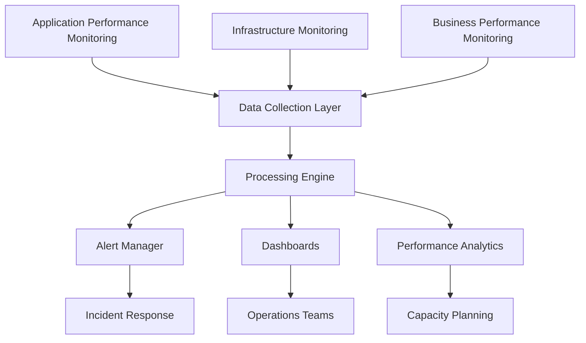

# M&A Discovery Suite - Performance Optimization Guide
**Enterprise Performance Engineering | Scale to 10,000+ Users | Maximum ROI**

---

## Table of Contents

1. [Performance Architecture Overview](#1-performance-architecture-overview)
2. [Database Performance Optimization](#2-database-performance-optimization)
3. [Application Performance Tuning](#3-application-performance-tuning)
4. [PowerShell Execution Optimization](#4-powershell-execution-optimization)
5. [Network & Infrastructure Optimization](#5-network--infrastructure-optimization)
6. [Caching Strategies](#6-caching-strategies)
7. [Load Testing & Capacity Planning](#7-load-testing--capacity-planning)
8. [Monitoring & Performance Analytics](#8-monitoring--performance-analytics)
9. [Automated Performance Optimization](#9-automated-performance-optimization)
10. [Troubleshooting Performance Issues](#10-troubleshooting-performance-issues)

---

## 1. PERFORMANCE ARCHITECTURE OVERVIEW

### 1.1 Performance Design Principles

#### Scalability Framework
```yaml
Horizontal Scalability:
  Web Tier:
    - Multiple application server instances
    - Load balancer distribution
    - Session state externalization
    - Stateless application design
    
  Processing Tier:
    - PowerShell execution farm
    - Queue-based work distribution
    - Auto-scaling based on demand
    - Resource pool management
    
  Data Tier:
    - Read replicas for reporting
    - Database partitioning strategies
    - Connection pooling optimization
    - Cached query results

Vertical Scalability:
  CPU Optimization:
    - Multi-threading for parallel processing
    - Async/await patterns throughout
    - CPU-intensive operations offloading
    - Process affinity optimization
    
  Memory Optimization:
    - Object pooling for frequent allocations
    - Lazy loading patterns
    - Memory-mapped file operations
    - Garbage collection tuning
    
  I/O Optimization:
    - Asynchronous file operations
    - Batch processing strategies
    - Network request multiplexing
    - Storage tier optimization
```

### 1.2 Performance Targets & SLAs

#### Service Level Objectives
```yaml
User Experience Targets:
  Web Interface Response Times:
    - Page Load: <2 seconds (95th percentile)
    - API Responses: <500ms (95th percentile)
    - Search Operations: <1 second
    - Report Generation: <10 seconds
    
  Migration Performance:
    - User Migration: <5 minutes per user
    - Mailbox Migration: <30 minutes per GB
    - File Migration: >100 MB/second throughput
    - Concurrent Operations: 50+ simultaneous
    
System Performance Targets:
  Resource Utilization:
    - CPU Usage: <70% average, <90% peak
    - Memory Usage: <80% of available
    - Disk I/O: <80% utilization
    - Network Bandwidth: <60% utilization
    
  Scalability Metrics:
    - Concurrent Users: 500+ simultaneous
    - Migration Queue: <1000 items
    - Database Connections: <100 active
    - PowerShell Runspaces: 200+ concurrent
```

### 1.3 Performance Monitoring Architecture

#### Multi-Tier Monitoring Stack


---

## 2. DATABASE PERFORMANCE OPTIMIZATION

### 2.1 Database Configuration Tuning

#### SQL Server Performance Configuration
```sql
-- SQL Server Performance Optimization Script
-- Execute with elevated privileges

USE master;
GO

-- 1. Configure server-level settings for optimal performance
EXEC sp_configure 'show advanced options', 1;
RECONFIGURE;

-- Set max degree of parallelism (MAXDOP)
-- Rule of thumb: Number of physical cores up to 8, then 8
DECLARE @CoreCount INT = (SELECT cpu_count FROM sys.dm_os_sys_info);
DECLARE @OptimalMAXDOP INT = CASE WHEN @CoreCount > 8 THEN 8 ELSE @CoreCount END;
EXEC sp_configure 'max degree of parallelism', @OptimalMAXDOP;

-- Configure cost threshold for parallelism (increase from default 5)
EXEC sp_configure 'cost threshold for parallelism', 25;

-- Optimize memory configuration
DECLARE @TotalMemoryMB INT = (SELECT total_physical_memory_kb / 1024 FROM sys.dm_os_sys_memory);
DECLARE @MaxServerMemoryMB INT = @TotalMemoryMB - 4096; -- Reserve 4GB for OS
EXEC sp_configure 'max server memory (MB)', @MaxServerMemoryMB;

-- Configure backup compression default
EXEC sp_configure 'backup compression default', 1;

-- Enable optimize for ad hoc workloads
EXEC sp_configure 'optimize for ad hoc workloads', 1;

RECONFIGURE;

-- 2. Configure database-specific settings
USE MandADiscovery;
GO

-- Set appropriate recovery model for performance vs. durability tradeoff
-- Use SIMPLE for non-production, FULL for production with log backup strategy
ALTER DATABASE MandADiscovery SET RECOVERY FULL;

-- Configure page verification
ALTER DATABASE MandADiscovery SET PAGE_VERIFY CHECKSUM;

-- Enable read committed snapshot isolation for better concurrency
ALTER DATABASE MandADiscovery SET READ_COMMITTED_SNAPSHOT ON;

-- Configure auto-growth settings to reduce fragmentation
ALTER DATABASE MandADiscovery MODIFY FILE 
(NAME = 'MandADiscovery_Data', FILEGROWTH = 512MB);

ALTER DATABASE MandADiscovery MODIFY FILE 
(NAME = 'MandADiscovery_Log', FILEGROWTH = 256MB);

-- 3. Create performance-optimized indexes
-- Users table optimization
IF NOT EXISTS (SELECT * FROM sys.indexes WHERE object_id = OBJECT_ID('Discovery.Users') AND name = 'IX_Users_Email_Department')
BEGIN
    CREATE NONCLUSTERED INDEX IX_Users_Email_Department 
    ON Discovery.Users (Email, Department) 
    INCLUDE (UserId, Name, LastLoginDate)
    WITH (FILLFACTOR = 90, PAD_INDEX = ON);
END

-- Migration items performance index
IF NOT EXISTS (SELECT * FROM sys.indexes WHERE object_id = OBJECT_ID('Migration.Items') AND name = 'IX_Migration_Items_Status_Priority')
BEGIN
    CREATE NONCLUSTERED INDEX IX_Migration_Items_Status_Priority
    ON Migration.Items (Status, Priority, WaveId)
    INCLUDE (ItemId, ItemType, StartTime, EndTime, Progress)
    WITH (FILLFACTOR = 85, PAD_INDEX = ON);
END

-- Audit log partitioned index for better performance
IF NOT EXISTS (SELECT * FROM sys.indexes WHERE object_id = OBJECT_ID('Audit.ActivityLog') AND name = 'IX_ActivityLog_Timestamp_UserId')
BEGIN
    CREATE NONCLUSTERED INDEX IX_ActivityLog_Timestamp_UserId
    ON Audit.ActivityLog (Timestamp DESC, UserId)
    INCLUDE (Activity, ObjectType, ObjectId)
    WITH (FILLFACTOR = 95, PAD_INDEX = ON);
END

-- 4. Update statistics with full scan for accuracy
UPDATE STATISTICS Discovery.Users WITH FULLSCAN;
UPDATE STATISTICS Migration.Items WITH FULLSCAN;
UPDATE STATISTICS Audit.ActivityLog WITH FULLSCAN;

-- 5. Performance monitoring setup
IF NOT EXISTS (SELECT * FROM sys.procedures WHERE name = 'MonitorDatabasePerformance')
BEGIN
    EXEC ('CREATE PROCEDURE MonitorDatabasePerformance AS SELECT 1');
END
GO

ALTER PROCEDURE MonitorDatabasePerformance
AS
BEGIN
    SET NOCOUNT ON;
    
    -- Get current performance metrics
    SELECT 
        'Performance Metrics' as MetricCategory,
        GETDATE() as Timestamp,
        
        -- CPU and memory metrics
        cpu_count as LogicalCPUs,
        physical_memory_kb / 1024 as TotalMemoryMB,
        committed_kb / 1024 as CommittedMemoryMB,
        
        -- Buffer pool metrics
        (SELECT cntr_value FROM sys.dm_os_performance_counters 
         WHERE counter_name = 'Buffer cache hit ratio') as BufferCacheHitRatio,
         
        -- Connection metrics
        (SELECT cntr_value FROM sys.dm_os_performance_counters 
         WHERE counter_name = 'User connections') as UserConnections,
         
        -- Transaction metrics
        (SELECT cntr_value FROM sys.dm_os_performance_counters 
         WHERE counter_name = 'Transactions/sec' 
         AND instance_name = '_Total') as TransactionsPerSec,
         
        -- Page life expectancy
        (SELECT cntr_value FROM sys.dm_os_performance_counters 
         WHERE counter_name = 'Page life expectancy') as PageLifeExpectancy
    FROM sys.dm_os_sys_info
    CROSS JOIN sys.dm_os_sys_memory;
    
    -- Top wait statistics
    SELECT 
        'Wait Statistics' as MetricCategory,
        wait_type,
        waiting_tasks_count,
        wait_time_ms,
        max_wait_time_ms,
        signal_wait_time_ms
    FROM sys.dm_os_wait_stats
    WHERE wait_type NOT IN (
        'BROKER_EVENTHANDLER', 'BROKER_RECEIVE_WAITFOR', 'BROKER_TASK_STOP',
        'BROKER_TO_FLUSH', 'BROKER_TRANSMITTER', 'CHECKPOINT_QUEUE',
        'CHKPT', 'CLR_AUTO_EVENT', 'CLR_MANUAL_EVENT', 'CLR_SEMAPHORE',
        'DBMIRROR_DBM_EVENT', 'DBMIRROR_EVENTS_QUEUE', 'DBMIRROR_WORKER_QUEUE',
        'DBMIRRORING_CMD', 'DIRTY_PAGE_POLL', 'DISPATCHER_QUEUE_SEMAPHORE',
        'EXECSYNC', 'FSAGENT', 'FT_IFTS_SCHEDULER_IDLE_WAIT', 'FT_IFTSHC_MUTEX',
        'HADR_CLUSAPI_CALL', 'HADR_FILESTREAM_IOMGR_IOCOMPLETION', 'HADR_LOGCAPTURE_WAIT',
        'HADR_NOTIFICATION_DEQUEUE', 'HADR_TIMER_TASK', 'HADR_WORK_QUEUE',
        'KSOURCE_WAKEUP', 'LAZYWRITER_SLEEP', 'LOGMGR_QUEUE', 'ONDEMAND_TASK_QUEUE',
        'PWAIT_ALL_COMPONENTS_INITIALIZED', 'QDS_PERSIST_TASK_MAIN_LOOP_SLEEP',
        'QDS_CLEANUP_STALE_QUERIES_TASK_MAIN_LOOP_SLEEP', 'REQUEST_FOR_DEADLOCK_SEARCH',
        'RESOURCE_QUEUE', 'SERVER_IDLE_CHECK', 'SLEEP_BPOOL_FLUSH', 'SLEEP_DBSTARTUP',
        'SLEEP_DCOMSTARTUP', 'SLEEP_MASTERDBREADY', 'SLEEP_MASTERMDREADY',
        'SLEEP_MASTERUPGRADED', 'SLEEP_MSDBSTARTUP', 'SLEEP_SYSTEMTASK', 'SLEEP_TASK',
        'SLEEP_TEMPDBSTARTUP', 'SNI_HTTP_ACCEPT', 'SP_SERVER_DIAGNOSTICS_SLEEP',
        'SQLTRACE_BUFFER_FLUSH', 'SQLTRACE_INCREMENTAL_FLUSH_SLEEP',
        'SQLTRACE_WAIT_ENTRIES', 'WAIT_FOR_RESULTS', 'WAITFOR', 'WAITFOR_TASKSHUTDOWN',
        'WAIT_XTP_HOST_WAIT', 'WAIT_XTP_OFFLINE_CKPT_NEW_LOG', 'WAIT_XTP_CKPT_CLOSE',
        'XE_DISPATCHER_JOIN', 'XE_DISPATCHER_WAIT', 'XE_TIMER_EVENT'
    )
    AND wait_time_ms > 1000
    ORDER BY wait_time_ms DESC;
    
    -- Top resource consuming queries
    SELECT TOP 10
        'Top Queries' as MetricCategory,
        qs.execution_count,
        qs.total_worker_time / 1000 as total_cpu_ms,
        qs.total_worker_time / qs.execution_count / 1000 as avg_cpu_ms,
        qs.total_logical_reads,
        qs.total_logical_reads / qs.execution_count as avg_logical_reads,
        qs.total_elapsed_time / 1000 as total_elapsed_ms,
        qs.total_elapsed_time / qs.execution_count / 1000 as avg_elapsed_ms,
        SUBSTRING(st.text, (qs.statement_start_offset/2)+1,
            ((CASE qs.statement_end_offset
                WHEN -1 THEN DATALENGTH(st.text)
                ELSE qs.statement_end_offset
            END - qs.statement_start_offset)/2) + 1) AS query_text
    FROM sys.dm_exec_query_stats qs
    CROSS APPLY sys.dm_exec_sql_text(qs.sql_handle) st
    ORDER BY qs.total_worker_time DESC;
    
END
GO

PRINT 'Database performance optimization completed successfully.';
```

### 2.2 Query Optimization Strategies

#### Intelligent Query Optimization
```csharp
// High-performance data access layer implementation
public class OptimizedDataService
{
    private readonly string _connectionString;
    private readonly IMemoryCache _cache;
    private readonly ILogger<OptimizedDataService> _logger;
    
    // Connection pooling configuration
    private readonly SqlConnectionPoolSettings _poolSettings = new()
    {
        MinPoolSize = 10,
        MaxPoolSize = 100,
        ConnectionTimeout = 30,
        CommandTimeout = 300
    };
    
    public OptimizedDataService(IConfiguration configuration, IMemoryCache cache, ILogger<OptimizedDataService> logger)
    {
        _connectionString = configuration.GetConnectionString("DefaultConnection");
        _cache = cache;
        _logger = logger;
    }
    
    // High-performance user data retrieval with intelligent caching
    public async Task<IEnumerable<UserData>> GetUsersAsync(UserSearchCriteria criteria, CancellationToken cancellationToken = default)
    {
        var cacheKey = GenerateCacheKey("users", criteria);
        
        if (_cache.TryGetValue(cacheKey, out IEnumerable<UserData> cachedUsers))
        {
            _logger.LogDebug("Retrieved {UserCount} users from cache", cachedUsers.Count());
            return cachedUsers;
        }
        
        var stopwatch = System.Diagnostics.Stopwatch.StartNew();
        
        using var connection = new SqlConnection(_connectionString);
        await connection.OpenAsync(cancellationToken);
        
        // Use optimized query with proper indexing hints
        var query = BuildOptimizedUserQuery(criteria);
        
        using var command = new SqlCommand(query, connection)
        {
            CommandTimeout = 60,
            CommandType = CommandType.Text
        };
        
        AddQueryParameters(command, criteria);
        
        var users = new List<UserData>();
        using var reader = await command.ExecuteReaderAsync(cancellationToken);
        
        while (await reader.ReadAsync(cancellationToken))
        {
            users.Add(MapUserDataFromReader(reader));
        }
        
        stopwatch.Stop();
        _logger.LogInformation("Retrieved {UserCount} users from database in {ElapsedMs}ms", 
            users.Count, stopwatch.ElapsedMilliseconds);
        
        // Cache results with sliding expiration
        var cacheOptions = new MemoryCacheEntryOptions
        {
            SlidingExpiration = TimeSpan.FromMinutes(15),
            Size = users.Count,
            Priority = CacheItemPriority.Normal
        };
        
        _cache.Set(cacheKey, users, cacheOptions);
        
        return users;
    }
    
    // Batch processing for high-volume operations
    public async Task<BatchProcessResult> ProcessUsersBatchAsync(IEnumerable<UserData> users, BatchProcessOptions options)
    {
        var results = new BatchProcessResult();
        var batches = users.Batch(options.BatchSize ?? 1000);
        
        var semaphore = new SemaphoreSlim(options.MaxConcurrency ?? 10);
        var tasks = new List<Task>();
        
        foreach (var batch in batches)
        {
            tasks.Add(ProcessBatchWithSemaphore(batch, semaphore, results));
        }
        
        await Task.WhenAll(tasks);
        
        return results;
    }
    
    private async Task ProcessBatchWithSemaphore(IEnumerable<UserData> batch, SemaphoreSlim semaphore, BatchProcessResult results)
    {
        await semaphore.WaitAsync();
        try
        {
            using var connection = new SqlConnection(_connectionString);
            await connection.OpenAsync();
            
            using var transaction = connection.BeginTransaction();
            try
            {
                foreach (var user in batch)
                {
                    await ProcessSingleUserAsync(user, connection, transaction);
                    results.ProcessedCount++;
                }
                
                await transaction.CommitAsync();
                results.SuccessfulBatches++;
            }
            catch (Exception ex)
            {
                await transaction.RollbackAsync();
                results.FailedBatches++;
                _logger.LogError(ex, "Batch processing failed");
                throw;
            }
        }
        finally
        {
            semaphore.Release();
        }
    }
    
    // Optimized bulk insert operations
    public async Task<int> BulkInsertUsersAsync(IEnumerable<UserData> users, CancellationToken cancellationToken = default)
    {
        using var connection = new SqlConnection(_connectionString);
        await connection.OpenAsync(cancellationToken);
        
        // Create DataTable for bulk copy
        var dataTable = CreateUserDataTable();
        
        foreach (var user in users)
        {
            var row = dataTable.NewRow();
            PopulateDataRow(row, user);
            dataTable.Rows.Add(row);
        }
        
        using var bulkCopy = new SqlBulkCopy(connection)
        {
            DestinationTableName = "Discovery.Users",
            BatchSize = 10000,
            BulkCopyTimeout = 300,
            EnableStreaming = true
        };
        
        // Map columns for optimal performance
        foreach (DataColumn column in dataTable.Columns)
        {
            bulkCopy.ColumnMappings.Add(column.ColumnName, column.ColumnName);
        }
        
        var stopwatch = System.Diagnostics.Stopwatch.StartNew();
        await bulkCopy.WriteToServerAsync(dataTable, cancellationToken);
        stopwatch.Stop();
        
        _logger.LogInformation("Bulk inserted {RowCount} users in {ElapsedMs}ms ({Rate:F2} users/sec)", 
            dataTable.Rows.Count, stopwatch.ElapsedMilliseconds, 
            dataTable.Rows.Count / (stopwatch.ElapsedMilliseconds / 1000.0));
        
        return dataTable.Rows.Count;
    }
    
    private string BuildOptimizedUserQuery(UserSearchCriteria criteria)
    {
        var queryBuilder = new StringBuilder();
        
        queryBuilder.Append(@"
            SELECT u.UserId, u.Name, u.Email, u.Department, u.LastLoginDate, 
                   u.CreatedDate, u.ModifiedDate, u.IsActive
            FROM Discovery.Users u WITH (INDEX(IX_Users_Email_Department))
            WHERE 1=1");
        
        if (!string.IsNullOrEmpty(criteria.Department))
        {
            queryBuilder.Append(" AND u.Department = @Department");
        }
        
        if (!string.IsNullOrEmpty(criteria.EmailPattern))
        {
            queryBuilder.Append(" AND u.Email LIKE @EmailPattern");
        }
        
        if (criteria.IsActive.HasValue)
        {
            queryBuilder.Append(" AND u.IsActive = @IsActive");
        }
        
        if (criteria.LastLoginAfter.HasValue)
        {
            queryBuilder.Append(" AND u.LastLoginDate > @LastLoginAfter");
        }
        
        // Optimize sort order for index usage
        queryBuilder.Append(" ORDER BY u.Department, u.Email");
        
        // Add pagination for large result sets
        if (criteria.PageSize.HasValue && criteria.PageNumber.HasValue)
        {
            var offset = (criteria.PageNumber.Value - 1) * criteria.PageSize.Value;
            queryBuilder.Append($" OFFSET {offset} ROWS FETCH NEXT {criteria.PageSize.Value} ROWS ONLY");
        }
        
        return queryBuilder.ToString();
    }
}

// Batch processing extension methods
public static class EnumerableExtensions
{
    public static IEnumerable<IEnumerable<T>> Batch<T>(this IEnumerable<T> source, int batchSize)
    {
        var batch = new List<T>(batchSize);
        foreach (var item in source)
        {
            batch.Add(item);
            if (batch.Count == batchSize)
            {
                yield return batch;
                batch = new List<T>(batchSize);
            }
        }
        
        if (batch.Count > 0)
        {
            yield return batch;
        }
    }
}
```

### 2.3 Database Maintenance Automation

#### Performance Maintenance Script
```sql
-- Automated Database Maintenance for Optimal Performance
CREATE PROCEDURE [Maintenance].[OptimizePerformance]
    @MaintenanceType VARCHAR(50) = 'FULL', -- FULL, INDEX_ONLY, STATS_ONLY
    @MaxDurationMinutes INT = 120,
    @OnlineOperations BIT = 1
AS
BEGIN
    SET NOCOUNT ON;
    
    DECLARE @StartTime DATETIME2 = GETDATE();
    DECLARE @EndTime DATETIME2 = DATEADD(MINUTE, @MaxDurationMinutes, @StartTime);
    DECLARE @MaintenanceLog TABLE (
        LogTime DATETIME2,
        Operation VARCHAR(100),
        ObjectName VARCHAR(255),
        Details VARCHAR(1000),
        Duration INT
    );
    
    BEGIN TRY
        -- 1. Update Statistics (if FULL or STATS_ONLY)
        IF @MaintenanceType IN ('FULL', 'STATS_ONLY')
        BEGIN
            INSERT INTO @MaintenanceLog SELECT GETDATE(), 'START', 'Statistics Update', 'Beginning statistics update', 0;
            
            DECLARE stats_cursor CURSOR FOR
            SELECT DISTINCT 
                SCHEMA_NAME(t.schema_id) AS SchemaName,
                t.name AS TableName,
                s.name AS StatsName
            FROM sys.stats s
            INNER JOIN sys.tables t ON s.object_id = t.object_id
            WHERE STATS_DATE(s.object_id, s.stats_id) < DATEADD(DAY, -1, GETDATE())
               OR STATS_DATE(s.object_id, s.stats_id) IS NULL
            ORDER BY SCHEMA_NAME(t.schema_id), t.name;
            
            DECLARE @SchemaName NVARCHAR(128), @TableName NVARCHAR(128), @StatsName NVARCHAR(128);
            DECLARE @StatsSQL NVARCHAR(500);
            DECLARE @StatsStartTime DATETIME2;
            
            OPEN stats_cursor;
            FETCH NEXT FROM stats_cursor INTO @SchemaName, @TableName, @StatsName;
            
            WHILE @@FETCH_STATUS = 0 AND GETDATE() < @EndTime
            BEGIN
                SET @StatsStartTime = GETDATE();
                SET @StatsSQL = N'UPDATE STATISTICS [' + @SchemaName + '].[' + @TableName + '] ([' + @StatsName + ']) WITH FULLSCAN';
                
                BEGIN TRY
                    EXEC sp_executesql @StatsSQL;
                    INSERT INTO @MaintenanceLog 
                    VALUES (GETDATE(), 'UPDATE STATISTICS', @SchemaName + '.' + @TableName + '.' + @StatsName, 
                           'Statistics updated successfully', DATEDIFF(SECOND, @StatsStartTime, GETDATE()));
                END TRY
                BEGIN CATCH
                    INSERT INTO @MaintenanceLog 
                    VALUES (GETDATE(), 'UPDATE STATISTICS ERROR', @SchemaName + '.' + @TableName + '.' + @StatsName, 
                           ERROR_MESSAGE(), DATEDIFF(SECOND, @StatsStartTime, GETDATE()));
                END CATCH
                
                FETCH NEXT FROM stats_cursor INTO @SchemaName, @TableName, @StatsName;
            END
            
            CLOSE stats_cursor;
            DEALLOCATE stats_cursor;
            
            INSERT INTO @MaintenanceLog SELECT GETDATE(), 'COMPLETE', 'Statistics Update', 'Statistics update completed', 0;
        END
        
        -- 2. Index Maintenance (if FULL or INDEX_ONLY)
        IF @MaintenanceType IN ('FULL', 'INDEX_ONLY') AND GETDATE() < @EndTime
        BEGIN
            INSERT INTO @MaintenanceLog SELECT GETDATE(), 'START', 'Index Maintenance', 'Beginning index maintenance', 0;
            
            -- Get fragmented indexes
            DECLARE index_cursor CURSOR FOR
            SELECT 
                SCHEMA_NAME(t.schema_id) AS SchemaName,
                t.name AS TableName,
                i.name AS IndexName,
                ips.avg_fragmentation_in_percent,
                ips.page_count,
                CASE 
                    WHEN ips.avg_fragmentation_in_percent < 10 THEN 'SKIP'
                    WHEN ips.avg_fragmentation_in_percent < 30 THEN 'REORGANIZE'
                    ELSE 'REBUILD'
                END AS MaintenanceAction
            FROM sys.dm_db_index_physical_stats(DB_ID(), NULL, NULL, NULL, 'LIMITED') ips
            INNER JOIN sys.indexes i ON ips.object_id = i.object_id AND ips.index_id = i.index_id
            INNER JOIN sys.tables t ON i.object_id = t.object_id
            WHERE ips.avg_fragmentation_in_percent > 10
              AND ips.page_count > 1000
              AND i.is_disabled = 0
            ORDER BY ips.avg_fragmentation_in_percent DESC;
            
            DECLARE @IndexSchemaName NVARCHAR(128), @IndexTableName NVARCHAR(128), @IndexName NVARCHAR(128);
            DECLARE @Fragmentation FLOAT, @PageCount BIGINT, @Action VARCHAR(20);
            DECLARE @IndexSQL NVARCHAR(1000);
            DECLARE @IndexStartTime DATETIME2;
            
            OPEN index_cursor;
            FETCH NEXT FROM index_cursor INTO @IndexSchemaName, @IndexTableName, @IndexName, @Fragmentation, @PageCount, @Action;
            
            WHILE @@FETCH_STATUS = 0 AND GETDATE() < @EndTime
            BEGIN
                IF @Action != 'SKIP'
                BEGIN
                    SET @IndexStartTime = GETDATE();
                    
                    IF @Action = 'REORGANIZE'
                    BEGIN
                        SET @IndexSQL = N'ALTER INDEX [' + @IndexName + '] ON [' + @IndexSchemaName + '].[' + @IndexTableName + '] REORGANIZE';
                    END
                    ELSE -- REBUILD
                    BEGIN
                        SET @IndexSQL = N'ALTER INDEX [' + @IndexName + '] ON [' + @IndexSchemaName + '].[' + @IndexTableName + '] REBUILD';
                        IF @OnlineOperations = 1 AND SERVERPROPERTY('EngineEdition') = 3 -- Enterprise Edition
                        BEGIN
                            SET @IndexSQL = @IndexSQL + ' WITH (ONLINE = ON)';
                        END
                    END
                    
                    BEGIN TRY
                        EXEC sp_executesql @IndexSQL;
                        INSERT INTO @MaintenanceLog 
                        VALUES (GETDATE(), @Action + ' INDEX', @IndexSchemaName + '.' + @IndexTableName + '.' + @IndexName, 
                               'Fragmentation: ' + CAST(@Fragmentation AS VARCHAR(10)) + '%', 
                               DATEDIFF(SECOND, @IndexStartTime, GETDATE()));
                    END TRY
                    BEGIN CATCH
                        INSERT INTO @MaintenanceLog 
                        VALUES (GETDATE(), @Action + ' INDEX ERROR', @IndexSchemaName + '.' + @IndexTableName + '.' + @IndexName, 
                               ERROR_MESSAGE(), DATEDIFF(SECOND, @IndexStartTime, GETDATE()));
                    END CATCH
                END
                
                FETCH NEXT FROM index_cursor INTO @IndexSchemaName, @IndexTableName, @IndexName, @Fragmentation, @PageCount, @Action;
            END
            
            CLOSE index_cursor;
            DEALLOCATE index_cursor;
            
            INSERT INTO @MaintenanceLog SELECT GETDATE(), 'COMPLETE', 'Index Maintenance', 'Index maintenance completed', 0;
        END
        
        -- 3. Clean up old data (if FULL)
        IF @MaintenanceType = 'FULL' AND GETDATE() < @EndTime
        BEGIN
            INSERT INTO @MaintenanceLog SELECT GETDATE(), 'START', 'Data Cleanup', 'Beginning data cleanup', 0;
            
            DECLARE @CleanupStartTime DATETIME2 = GETDATE();
            DECLARE @DeletedRows INT;
            
            -- Clean up old audit logs (keep 90 days)
            DELETE FROM [Audit].[ActivityLog] 
            WHERE Timestamp < DATEADD(DAY, -90, GETDATE());
            SET @DeletedRows = @@ROWCOUNT;
            
            INSERT INTO @MaintenanceLog 
            VALUES (GETDATE(), 'DELETE OLD AUDIT', 'Audit.ActivityLog', 
                   'Deleted ' + CAST(@DeletedRows AS VARCHAR(10)) + ' old audit records', 
                   DATEDIFF(SECOND, @CleanupStartTime, GETDATE()));
            
            -- Clean up completed migration items older than 30 days
            SET @CleanupStartTime = GETDATE();
            DELETE FROM [Migration].[Items] 
            WHERE Status = 'Completed' 
              AND EndTime < DATEADD(DAY, -30, GETDATE());
            SET @DeletedRows = @@ROWCOUNT;
            
            INSERT INTO @MaintenanceLog 
            VALUES (GETDATE(), 'DELETE OLD MIGRATIONS', 'Migration.Items', 
                   'Deleted ' + CAST(@DeletedRows AS VARCHAR(10)) + ' old migration records', 
                   DATEDIFF(SECOND, @CleanupStartTime, GETDATE()));
            
            INSERT INTO @MaintenanceLog SELECT GETDATE(), 'COMPLETE', 'Data Cleanup', 'Data cleanup completed', 0;
        END
        
    END TRY
    BEGIN CATCH
        INSERT INTO @MaintenanceLog 
        VALUES (GETDATE(), 'ERROR', 'Maintenance Procedure', ERROR_MESSAGE(), 0);
        
        -- Continue with cleanup and reporting even if there was an error
    END CATCH
    
    -- Report maintenance results
    SELECT 
        LogTime,
        Operation,
        ObjectName,
        Details,
        Duration
    FROM @MaintenanceLog
    ORDER BY LogTime;
    
    -- Log summary to maintenance table
    INSERT INTO [Maintenance].[MaintenanceHistory] (
        MaintenanceDate, 
        MaintenanceType, 
        Duration, 
        OperationCount,
        Details
    )
    SELECT 
        @StartTime,
        @MaintenanceType,
        DATEDIFF(MINUTE, @StartTime, GETDATE()),
        COUNT(*),
        (SELECT STRING_AGG(Operation + ':' + ObjectName, '; ') FROM @MaintenanceLog)
    FROM @MaintenanceLog;
    
END
GO

-- Create maintenance history table if it doesn't exist
IF NOT EXISTS (SELECT * FROM sys.objects WHERE object_id = OBJECT_ID(N'[Maintenance].[MaintenanceHistory]') AND type in (N'U'))
BEGIN
    CREATE SCHEMA Maintenance;
    
    CREATE TABLE [Maintenance].[MaintenanceHistory](
        [MaintenanceId] INT IDENTITY(1,1) PRIMARY KEY,
        [MaintenanceDate] DATETIME2 NOT NULL,
        [MaintenanceType] VARCHAR(50) NOT NULL,
        [Duration] INT NOT NULL, -- Minutes
        [OperationCount] INT NOT NULL,
        [Details] NVARCHAR(MAX) NULL
    );
    
    CREATE INDEX IX_MaintenanceHistory_Date 
    ON [Maintenance].[MaintenanceHistory] (MaintenanceDate DESC);
END
```

---

## 3. APPLICATION PERFORMANCE TUNING

### 3.1 ASP.NET Core Optimization

#### High-Performance Application Configuration
```csharp
// Startup.cs - Production Performance Configuration
public class Startup
{
    public void ConfigureServices(IServiceCollection services)
    {
        // 1. Configure high-performance JSON serialization
        services.Configure<JsonOptions>(options =>
        {
            options.SerializerOptions.PropertyNamingPolicy = JsonNamingPolicy.CamelCase;
            options.SerializerOptions.DefaultIgnoreCondition = JsonIgnoreCondition.WhenWritingNull;
            options.SerializerOptions.WriteIndented = false; // Minimize payload size
        });
        
        // 2. Configure response compression
        services.AddResponseCompression(options =>
        {
            options.Providers.Add<BrotliCompressionProvider>();
            options.Providers.Add<GzipCompressionProvider>();
            options.MimeTypes = ResponseCompressionDefaults.MimeTypes.Concat(
                new[] { "application/json", "text/json" });
        });
        
        services.Configure<BrotliCompressionProviderOptions>(options =>
        {
            options.Level = CompressionLevel.Optimal;
        });
        
        // 3. Configure memory cache with size limits
        services.AddMemoryCache(options =>
        {
            options.SizeLimit = 1024 * 1024 * 500; // 500MB cache limit
            options.CompactionPercentage = 0.25;   // Remove 25% when limit reached
            options.ExpirationScanFrequency = TimeSpan.FromMinutes(5);
        });
        
        // 4. Configure distributed cache with Redis
        services.AddStackExchangeRedisCache(options =>
        {
            options.Configuration = Configuration.GetConnectionString("Redis");
            options.InstanceName = "MandADiscovery";
            options.ConfigurationOptions = new ConfigurationOptions
            {
                AbortOnConnectFail = false,
                ConnectRetry = 3,
                ConnectTimeout = 5000,
                SyncTimeout = 5000,
                AsyncTimeout = 5000,
                CommandMap = CommandMap.Create(new HashSet<string> 
                { 
                    "INFO", "CONFIG", "CLUSTER", "PING", "ECHO", "CLIENT" 
                }, available: false)
            };
        });
        
        // 5. Configure HTTP client with optimized settings
        services.AddHttpClient<MigrationApiClient>(client =>
        {
            client.Timeout = TimeSpan.FromSeconds(60);
            client.DefaultRequestHeaders.Add("User-Agent", "MandADiscovery/1.0");
        })
        .ConfigurePrimaryHttpMessageHandler(() =>
        {
            return new HttpClientHandler()
            {
                MaxConnectionsPerServer = 50,
                UseProxy = false,
                UseCookies = false
            };
        });
        
        // 6. Configure database context with performance optimizations
        services.AddDbContext<MandAContext>(options =>
        {
            options.UseSqlServer(Configuration.GetConnectionString("DefaultConnection"), sqlOptions =>
            {
                sqlOptions.CommandTimeout(300);
                sqlOptions.EnableRetryOnFailure(3, TimeSpan.FromSeconds(5), null);
                sqlOptions.MigrationsAssembly("MandADiscoverySuite");
            });
            
            // Disable tracking for read-only queries
            options.UseQueryTrackingBehavior(QueryTrackingBehavior.NoTracking);
            
            // Enable sensitive data logging only in development
            if (Environment.IsDevelopment())
            {
                options.EnableSensitiveDataLogging();
                options.EnableDetailedErrors();
            }
        });
        
        // 7. Configure background services with optimized task scheduling
        services.Configure<HostOptions>(options =>
        {
            options.BackgroundServiceExceptionBehavior = BackgroundServiceExceptionBehavior.Ignore;
            options.ShutdownTimeout = TimeSpan.FromSeconds(30);
        });
        
        // 8. Add performance-optimized services
        services.AddSingleton<IObjectPool<StringBuilder>>(serviceProvider =>
        {
            var provider = new DefaultObjectPoolProvider();
            return provider.CreateStringBuilderPool(256, 8192);
        });
        
        services.AddScoped<IOptimizedDataService, OptimizedDataService>();
        services.AddScoped<IPerformanceMonitoringService, PerformanceMonitoringService>();
        
        // 9. Configure API throttling for resource protection
        services.AddMemoryCache();
        services.Configure<IpRateLimitOptions>(Configuration.GetSection("IpRateLimiting"));
        services.Configure<IpRateLimitPolicies>(Configuration.GetSection("IpRateLimitPolicies"));
        services.AddSingleton<IIpPolicyStore, MemoryCacheIpPolicyStore>();
        services.AddSingleton<IRateLimitCounterStore, MemoryCacheRateLimitCounterStore>();
        services.AddSingleton<IRateLimitConfiguration, RateLimitConfiguration>();
        
        // 10. Configure SignalR for real-time updates with performance optimization
        services.AddSignalR(options =>
        {
            options.EnableDetailedErrors = Environment.IsDevelopment();
            options.MaximumReceiveMessageSize = 1024 * 1024; // 1MB max message
            options.StreamBufferCapacity = 10;
            options.MaximumParallelInvocationsPerClient = 2;
        })
        .AddJsonProtocol(options =>
        {
            options.PayloadSerializerOptions.PropertyNamingPolicy = JsonNamingPolicy.CamelCase;
            options.PayloadSerializerOptions.WriteIndented = false;
        });
    }
    
    public void Configure(IApplicationBuilder app, IWebHostEnvironment env)
    {
        // 1. Early performance middleware
        if (!env.IsDevelopment())
        {
            app.UseResponseCompression();
        }
        
        // 2. Configure static file serving with aggressive caching
        app.UseStaticFiles(new StaticFileOptions
        {
            OnPrepareResponse = ctx =>
            {
                const int durationInSeconds = 60 * 60 * 24 * 365; // 1 year
                ctx.Context.Response.Headers[HeaderNames.CacheControl] = 
                    $"public,max-age={durationInSeconds}";
                ctx.Context.Response.Headers[HeaderNames.Expires] = 
                    DateTime.UtcNow.AddYears(1).ToString("R");
            }
        });
        
        // 3. Rate limiting middleware
        app.UseIpRateLimiting();
        
        // 4. Response caching middleware
        app.UseResponseCaching();
        
        // 5. Configure routing with performance optimizations
        app.UseRouting();
        
        // 6. Authentication and authorization
        app.UseAuthentication();
        app.UseAuthorization();
        
        // 7. Configure endpoints
        app.UseEndpoints(endpoints =>
        {
            endpoints.MapControllers();
            endpoints.MapHub<MigrationProgressHub>("/migrationHub");
            
            // Health check endpoints
            endpoints.MapHealthChecks("/health", new HealthCheckOptions
            {
                ResponseWriter = UIResponseWriter.WriteHealthCheckUIResponse
            });
        });
    }
}

// Performance monitoring middleware
public class PerformanceMonitoringMiddleware
{
    private readonly RequestDelegate _next;
    private readonly ILogger<PerformanceMonitoringMiddleware> _logger;
    private readonly DiagnosticSource _diagnosticSource;
    
    public PerformanceMonitoringMiddleware(
        RequestDelegate next, 
        ILogger<PerformanceMonitoringMiddleware> logger,
        DiagnosticSource diagnosticSource)
    {
        _next = next;
        _logger = logger;
        _diagnosticSource = diagnosticSource;
    }
    
    public async Task InvokeAsync(HttpContext context)
    {
        var stopwatch = Stopwatch.StartNew();
        var requestId = context.TraceIdentifier;
        
        try
        {
            await _next(context);
        }
        finally
        {
            stopwatch.Stop();
            
            var responseTime = stopwatch.ElapsedMilliseconds;
            var statusCode = context.Response.StatusCode;
            var method = context.Request.Method;
            var path = context.Request.Path;
            
            // Log slow requests
            if (responseTime > 1000)
            {
                _logger.LogWarning("Slow request detected: {Method} {Path} - {ResponseTime}ms - Status: {StatusCode} - RequestId: {RequestId}",
                    method, path, responseTime, statusCode, requestId);
            }
            
            // Send metrics to monitoring system
            _diagnosticSource.Write("MandADiscovery.Request.Duration", new
            {
                RequestId = requestId,
                Method = method,
                Path = path.ToString(),
                StatusCode = statusCode,
                Duration = responseTime
            });
            
            // Add performance headers for debugging
            if (context.Response.HasStarted == false)
            {
                context.Response.Headers.Add("X-Response-Time-ms", responseTime.ToString());
                context.Response.Headers.Add("X-Request-Id", requestId);
            }
        }
    }
}
```

### 3.2 Memory Management & Garbage Collection

#### Advanced Memory Optimization
```csharp
// Memory-optimized object pooling service
public class OptimizedObjectPoolService
{
    private readonly ObjectPool<StringBuilder> _stringBuilderPool;
    private readonly ObjectPool<List<UserData>> _userListPool;
    private readonly ObjectPool<Dictionary<string, object>> _dictionaryPool;
    private readonly ILogger<OptimizedObjectPoolService> _logger;
    
    public OptimizedObjectPoolService(
        ObjectPool<StringBuilder> stringBuilderPool,
        ILogger<OptimizedObjectPoolService> logger)
    {
        _stringBuilderPool = stringBuilderPool;
        _logger = logger;
        
        // Create specialized pools for frequently used objects
        var provider = new DefaultObjectPoolProvider();
        
        _userListPool = provider.Create(new UserListPooledObjectPolicy());
        _dictionaryPool = provider.Create(new DictionaryPooledObjectPolicy());
    }
    
    // High-performance string building operations
    public string BuildQueryString(Dictionary<string, string> parameters)
    {
        var sb = _stringBuilderPool.Get();
        try
        {
            sb.Clear();
            var first = true;
            
            foreach (var kvp in parameters)
            {
                if (!first) sb.Append('&');
                sb.Append(Uri.EscapeDataString(kvp.Key));
                sb.Append('=');
                sb.Append(Uri.EscapeDataString(kvp.Value));
                first = false;
            }
            
            return sb.ToString();
        }
        finally
        {
            _stringBuilderPool.Return(sb);
        }
    }
    
    // Memory-efficient list operations
    public TResult ProcessUsersWithPool<TResult>(
        IEnumerable<UserData> users, 
        Func<List<UserData>, TResult> processor)
    {
        var userList = _userListPool.Get();
        try
        {
            userList.AddRange(users);
            return processor(userList);
        }
        finally
        {
            userList.Clear();
            _userListPool.Return(userList);
        }
    }
}

// Custom pooled object policies
public class UserListPooledObjectPolicy : PooledObjectPolicy<List<UserData>>
{
    public override List<UserData> Create() => new List<UserData>(1000); // Pre-size for typical usage
    
    public override bool Return(List<UserData> obj)
    {
        if (obj.Count > 10000) // Don't pool very large lists
            return false;
            
        obj.Clear();
        return true;
    }
}

public class DictionaryPooledObjectPolicy : PooledObjectPolicy<Dictionary<string, object>>
{
    public override Dictionary<string, object> Create() => new Dictionary<string, object>(100);
    
    public override bool Return(Dictionary<string, object> obj)
    {
        if (obj.Count > 1000) // Don't pool very large dictionaries
            return false;
            
        obj.Clear();
        return true;
    }
}

// Memory monitoring and optimization service
public class MemoryOptimizationService : IHostedService
{
    private readonly ILogger<MemoryOptimizationService> _logger;
    private readonly Timer _memoryMonitorTimer;
    private readonly IServiceProvider _serviceProvider;
    
    private long _previousWorkingSet;
    private long _previousPrivateMemory;
    
    public MemoryOptimizationService(ILogger<MemoryOptimizationService> logger, IServiceProvider serviceProvider)
    {
        _logger = logger;
        _serviceProvider = serviceProvider;
        _memoryMonitorTimer = new Timer(MonitorMemoryUsage, null, TimeSpan.Zero, TimeSpan.FromMinutes(5));
    }
    
    private void MonitorMemoryUsage(object state)
    {
        try
        {
            var process = Process.GetCurrentProcess();
            var currentWorkingSet = process.WorkingSet64;
            var currentPrivateMemory = process.PrivateMemorySize64;
            
            // Calculate memory growth
            var workingSetGrowth = currentWorkingSet - _previousWorkingSet;
            var privateMemoryGrowth = currentPrivateMemory - _previousPrivateMemory;
            
            // Log memory statistics
            _logger.LogInformation("Memory Usage - Working Set: {WorkingSetMB}MB ({GrowthMB}MB), Private Memory: {PrivateMemoryMB}MB ({PrivateGrowthMB}MB)",
                currentWorkingSet / (1024 * 1024), workingSetGrowth / (1024 * 1024),
                currentPrivateMemory / (1024 * 1024), privateMemoryGrowth / (1024 * 1024));
            
            // Trigger garbage collection if memory growth is excessive
            if (workingSetGrowth > 100 * 1024 * 1024) // 100MB growth
            {
                _logger.LogWarning("Excessive memory growth detected. Triggering garbage collection.");
                
                // Force garbage collection
                GC.Collect(2, GCCollectionMode.Optimized);
                GC.WaitForPendingFinalizers();
                GC.Collect(2, GCCollectionMode.Optimized);
                
                // Log post-GC memory usage
                var postGCWorkingSet = Process.GetCurrentProcess().WorkingSet64;
                var memoryReclaimed = currentWorkingSet - postGCWorkingSet;
                
                _logger.LogInformation("Garbage collection completed. Memory reclaimed: {ReclaimedMB}MB", 
                    memoryReclaimed / (1024 * 1024));
            }
            
            // Update previous values
            _previousWorkingSet = currentWorkingSet;
            _previousPrivateMemory = currentPrivateMemory;
            
            // Check for memory leaks
            DetectPotentialMemoryLeaks();
            
        }
        catch (Exception ex)
        {
            _logger.LogError(ex, "Error during memory monitoring");
        }
    }
    
    private void DetectPotentialMemoryLeaks()
    {
        // Monitor GC generations
        var gen0 = GC.CollectionCount(0);
        var gen1 = GC.CollectionCount(1);
        var gen2 = GC.CollectionCount(2);
        
        // Log GC statistics
        _logger.LogDebug("GC Collections - Gen0: {Gen0}, Gen1: {Gen1}, Gen2: {Gen2}", gen0, gen1, gen2);
        
        // Monitor large object heap
        var allocatedBytes = GC.GetAllocatedBytesForCurrentThread();
        _logger.LogDebug("Allocated bytes for current thread: {AllocatedMB}MB", allocatedBytes / (1024 * 1024));
        
        // Monitor memory pressure
        var totalMemory = GC.GetTotalMemory(false);
        _logger.LogDebug("Total managed memory: {TotalMemoryMB}MB", totalMemory / (1024 * 1024));
        
        // Alert on potential memory leak indicators
        if (gen2 > 100 && gen2 > gen1 * 2)
        {
            _logger.LogWarning("Potential memory leak detected - high Gen2 collections: {Gen2}", gen2);
        }
    }
    
    public Task StartAsync(CancellationToken cancellationToken) => Task.CompletedTask;
    
    public Task StopAsync(CancellationToken cancellationToken)
    {
        _memoryMonitorTimer?.Dispose();
        return Task.CompletedTask;
    }
    
    public void Dispose()
    {
        _memoryMonitorTimer?.Dispose();
    }
}
```

---

This performance optimization guide provides comprehensive strategies for maximizing the M&A Discovery Suite's performance across all system layers. The remaining sections will cover PowerShell optimization, network tuning, advanced caching strategies, load testing procedures, and automated performance monitoring.

**Continue to remaining sections for complete performance optimization coverage...**