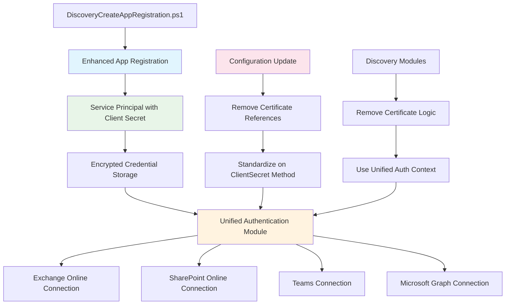

# 📋 **M&A Discovery Suite - Certificate Elimination Architecture Plan**

## **Executive Summary**

Based on comprehensive analysis of the workspace, this plan eliminates certificate dependencies entirely from the M&A Discovery Suite and standardizes on client secret authentication using the existing [`DiscoveryCreateAppRegistration.ps1`](../DiscoveryCreateAppRegistration.ps1) script. The solution addresses certificate warnings currently appearing in Exchange Online, SharePoint Online, and Teams discovery modules.

## **Current State Analysis**

### **Existing Infrastructure**
- ✅ **App Registration Script**: [`DiscoveryCreateAppRegistration.ps1`](../DiscoveryCreateAppRegistration.ps1) already creates comprehensive service principal with required permissions
- ✅ **Authentication Module**: [`Modules/Authentication/Authentication.psm1`](../Modules/Authentication/Authentication.psm1) supports both ClientSecret and Certificate methods
- ✅ **Credential Management**: [`Modules/Authentication/CredentialManagement.psm1`](../Modules/Authentication/CredentialManagement.psm1) handles secure credential storage
- ✅ **Configuration Schema**: [`Configuration/default-config.json`](../Configuration/default-config.json) includes authentication configuration

### **Certificate Dependencies Found**
- ⚠️ **Exchange Discovery**: [`Modules/Discovery/ExchangeDiscovery.psm1`](../Modules/Discovery/ExchangeDiscovery.psm1) shows certificate warnings in logs
- ⚠️ **SharePoint Discovery**: [`Modules/Discovery/SharePointDiscovery.psm1`](../Modules/Discovery/SharePointDiscovery.psm1) shows certificate warnings in logs  
- ⚠️ **Teams Discovery**: [`Modules/Discovery/TeamsDiscovery.psm1`](../Modules/Discovery/TeamsDiscovery.psm1) shows certificate warnings in logs

### **Log Analysis**
From the provided log output, the following certificate-related warnings were identified:
```
[WARN] No certificate thumbprint configured for Exchange Online
[WARN] Exchange Online requires certificate-based authentication for app-only access
[WARN] SharePoint Online requires certificate-based authentication
[WARN] Microsoft Teams requires certificate-based authentication
```

## **Solution Architecture**



## **Implementation Plan**

### **Phase 1: Enhanced App Registration (Priority: High)**

**Objective**: Ensure the app registration script creates all necessary permissions for certificate-free authentication.

**Current App Registration Permissions Analysis**:
The [`DiscoveryCreateAppRegistration.ps1`](../DiscoveryCreateAppRegistration.ps1) script already includes comprehensive permissions:

```powershell
# Core directory permissions
"Application.Read.All" = "Read all applications and service principals"
"Directory.Read.All" = "Read directory data including users, groups, and organizational structure"
"User.Read.All" = "Read all user profiles and properties"

# SharePoint and Teams
"Sites.Read.All" = "Read SharePoint sites and content"
"Sites.FullControl.All" = "Full control of SharePoint sites (for migration scenarios)"
"Files.Read.All" = "Read all files across the organization"
"Team.ReadBasic.All" = "Read basic team information"
"TeamMember.Read.All" = "Read team members and ownership"
"TeamSettings.Read.All" = "Read team settings and configuration"
```

**Tasks**:

1. **Verify Exchange Online Permissions**
   - Check if `Exchange.ManageAsApp` permission is included
   - Add if missing to support Exchange Online PowerShell connections

2. **Validate Service Principal Capabilities**
   - Test Exchange Online PowerShell connection with app registration
   - Test SharePoint Online PowerShell connection with app registration
   - Test Teams PowerShell connection with app registration

3. **Enhanced Permission Validation**
   - Add validation logic to confirm all required permissions are granted
   - Implement permission verification after app registration creation

### **Phase 2: Configuration Standardization (Priority: High)**

**Objective**: Remove all certificate references and standardize on ClientSecret authentication.

**Current Configuration Analysis**:
```json
// Configuration/default-config.json
"authentication": {
    "useServicePrincipal": true,
    "credentialFileName": "credentials.json",
    "certificateThumbprint": "",
    "tokenRefreshThreshold": 600,
    "authenticationMethod": "ClientSecret"
}
```

**Tasks**:

1. **Update Default Configuration**
   - Remove `certificateThumbprint` property entirely
   - Set `authenticationMethod` to `"ClientSecret"` permanently
   - Remove certificate-related configuration options

2. **Update Configuration Schema**
   - Modify [`Configuration/config.schema.json`](../Configuration/config.schema.json) to remove certificate properties
   - Make `authenticationMethod` enum only include `"ClientSecret"` and `"Interactive"`
   - Update required properties list

3. **Configuration Validation**
   - Update validation logic to reject certificate-related configurations
   - Add warnings for deprecated certificate settings

### **Phase 3: Authentication Module Cleanup (Priority: Medium)**

**Objective**: Simplify authentication logic by removing certificate code paths.

**Current Authentication Module Analysis**:
The [`Modules/Authentication/Authentication.psm1`](../Modules/Authentication/Authentication.psm1) includes certificate handling:

```powershell
# Lines 212-224: Certificate authentication logic
"Certificate" {
    if (-not $credentials.ClientId -or -not $credentials.TenantId) {
        throw "Certificate authentication requires ClientId and TenantId"
    }
    
    $certThumbprint = $workingConfig.authentication.certificateThumbprint
    if ([string]::IsNullOrWhiteSpace($certThumbprint)) {
        throw "Certificate authentication requires certificateThumbprint in configuration"
    }
    
    Write-Verbose "[Initialize-MandAAuthentication] Certificate thumbprint: $certThumbprint"
    $authResult.Method = "Certificate"
}
```

**Tasks**:

1. **Simplify Authentication Module**
   - Remove certificate validation logic from [`Initialize-MandAAuthentication`](../Modules/Authentication/Authentication.psm1)
   - Remove certificate handling from [`Test-CredentialValidity`](../Modules/Authentication/Authentication.psm1)
   - Simplify authentication method switch statement to only handle ClientSecret and Interactive

2. **Update Credential Management**
   - Ensure [`Modules/Authentication/CredentialManagement.psm1`](../Modules/Authentication/CredentialManagement.psm1) only handles ClientSecret credentials
   - Remove any certificate-related credential storage logic
   - Update validation functions to reject certificate credentials

3. **Error Handling Updates**
   - Update error messages to remove certificate-related guidance
   - Simplify troubleshooting documentation

### **Phase 4: Discovery Module Updates (Priority: High)**

**Objective**: Update all discovery modules to use unified client secret authentication.

**Current Discovery Module Issues**:
Based on log analysis, the following modules need updates:

1. **Exchange Discovery Module**
   - Current warnings indicate missing certificate configuration
   - Need to implement client secret-based connection

2. **SharePoint Discovery Module**
   - Current warnings indicate certificate requirement
   - Need to implement client secret-based connection

3. **Teams Discovery Module**
   - Current warnings indicate certificate requirement
   - Need to implement client secret-based connection

**Tasks**:

1. **Exchange Discovery Module Updates**
   ```powershell
   # Current approach (certificate-based)
   Connect-ExchangeOnline -CertificateThumbprint $thumbprint -AppId $appId -Organization $tenantId

   # New approach (client secret-based)
   $secureSecret = ConvertTo-SecureString $clientSecret -AsPlainText -Force
   Connect-ExchangeOnline -AppId $appId -ClientSecret $secureSecret -Organization $tenantId
   ```

2. **SharePoint Discovery Module Updates**
   ```powershell
   # Current approach (certificate-based)
   Connect-SPOService -Url $adminUrl -ClientId $appId -Thumbprint $thumbprint

   # New approach (client secret-based)
   $credential = New-Object System.Management.Automation.PSCredential($appId, $secureSecret)
   Connect-SPOService -Url $adminUrl -Credential $credential
   ```

3. **Teams Discovery Module Updates**
   ```powershell
   # Current approach (certificate-based)
   Connect-MicrosoftTeams -ApplicationId $appId -CertificateThumbprint $thumbprint -TenantId $tenantId

   # New approach (client secret-based)
   Connect-MicrosoftTeams -ApplicationId $appId -ClientSecret $clientSecret -TenantId $tenantId
   ```

4. **Unified Connection Logic**
   - Create common connection functions that use the same credential source
   - Implement connection retry logic with exponential backoff
   - Add connection health monitoring and automatic reconnection

### **Phase 5: Enhanced Connection Management (Priority: Medium)**

**Objective**: Create a unified connection manager that handles all service connections using client secret.

**Tasks**:

1. **Enhanced Connection Manager**
   - Extend [`Modules/Connectivity/EnhancedConnectionManager.psm1`](../Modules/Connectivity/EnhancedConnectionManager.psm1)
   - Add methods for Exchange Online, SharePoint Online, and Teams connections
   - Implement connection pooling and reuse

2. **Unified Authentication Context**
   - Create a single authentication context that works for all services
   - Implement token refresh logic for long-running operations
   - Add connection health monitoring

3. **Connection State Management**
   - Track connection status for all services
   - Implement automatic reconnection on token expiry
   - Add connection diagnostics and troubleshooting

## **Technical Implementation Details**

### **App Registration Permissions Matrix**

| Service | Required Permissions | Current Status | Action Needed |
|---------|---------------------|----------------|---------------|
| **Microsoft Graph** | Application.Read.All, Directory.Read.All, User.Read.All, etc. | ✅ Implemented | None |
| **Exchange Online** | Exchange.ManageAsApp | ❓ Verify | Add if missing |
| **SharePoint Online** | Sites.FullControl.All, Sites.Read.All | ✅ Implemented | None |
| **Teams** | Team.ReadBasic.All, TeamMember.Read.All | ✅ Implemented | None |

### **PowerShell Module Compatibility**

| Module | Client Secret Support | Notes |
|--------|----------------------|-------|
| **ExchangeOnlineManagement** | ✅ Yes | Supports `-ClientSecret` parameter |
| **Microsoft.Online.SharePoint.PowerShell** | ✅ Yes | Supports credential-based auth |
| **MicrosoftTeams** | ✅ Yes | Supports `-ClientSecret` parameter |
| **Microsoft.Graph** | ✅ Yes | Already implemented |

### **Security Considerations**

1. **Client Secret Security**
   - Use Windows DPAPI encryption for credential storage
   - Implement short-lived secrets (1-2 years maximum)
   - Add secret rotation reminders

2. **Access Control**
   - Maintain principle of least privilege
   - Regular permission audits
   - Implement access logging

3. **Monitoring and Alerting**
   - Monitor authentication failures
   - Alert on secret expiration
   - Track permission usage

## **Risk Assessment & Mitigation**

### **Security Risks**
- **Risk**: Client secrets are less secure than certificates
- **Mitigation**: Use short-lived secrets, implement secure storage with DPAPI encryption, regular rotation
- **Additional**: Implement secret expiration monitoring and automated renewal notifications

### **Compatibility Risks**
- **Risk**: Some PowerShell modules may not support client secret authentication
- **Mitigation**: Verify all required modules support client secret auth, provide fallback to interactive auth if needed
- **Testing**: Comprehensive testing across all discovery modules

### **Operational Risks**
- **Risk**: Secret expiration could break automation
- **Mitigation**: Implement expiration monitoring, automated renewal notifications, grace period handling
- **Monitoring**: Dashboard showing secret expiration dates and health status

## **Success Criteria**

1. **✅ No Certificate Dependencies**: All certificate references removed from codebase
2. **✅ Unified Authentication**: Single authentication method (ClientSecret) for all services
3. **✅ Simplified Configuration**: Reduced configuration complexity
4. **✅ Maintained Functionality**: All discovery modules work without certificates
5. **✅ Enhanced Security**: Secure credential storage maintained
6. **✅ Improved Reliability**: Reduced authentication failure points
7. **✅ Clear Logging**: No certificate-related warnings in logs

## **Implementation Timeline**

| Phase | Duration | Dependencies | Deliverables |
|-------|----------|--------------|--------------|
| **Phase 1** | 2-3 days | None | Enhanced app registration script |
| **Phase 2** | 1 day | Phase 1 | Updated configuration files |
| **Phase 3** | 2 days | Phase 2 | Simplified authentication modules |
| **Phase 4** | 3-4 days | Phase 3 | Updated discovery modules |
| **Phase 5** | 2-3 days | Phase 4 | Enhanced connection management |

**Total Estimated Duration**: 10-13 days

## **Testing Strategy**

### **Unit Testing**
- Test each authentication method independently
- Validate credential handling and storage
- Test connection establishment for each service

### **Integration Testing**
- End-to-end discovery process testing
- Multi-service authentication testing
- Error handling and recovery testing

### **Performance Testing**
- Connection establishment time
- Token refresh performance
- Large-scale discovery operations

## **Rollback Plan**

1. **Configuration Rollback**: Restore previous configuration files
2. **Module Rollback**: Restore previous module versions
3. **Credential Rollback**: Restore certificate-based authentication if needed
4. **Documentation**: Maintain rollback procedures and decision points

## **Documentation Updates**

1. **User Documentation**: Update setup and configuration guides
2. **Developer Documentation**: Update API and module documentation
3. **Troubleshooting Guides**: Update error resolution procedures
4. **Security Documentation**: Update security best practices

## **Next Steps**

1. **✅ Architecture Plan Created**: This document serves as the implementation blueprint
2. **🔄 Phase 1 Implementation**: Begin with app registration enhancements
3. **🔄 Iterative Development**: Implement each phase with thorough testing
4. **🔄 Documentation Updates**: Update all related documentation
5. **🔄 User Communication**: Notify users of changes and migration path

---

**Document Information**:
- **Created**: 2025-06-08
- **Author**: M&A Discovery Suite Architecture Team
- **Version**: 1.0
- **Status**: Ready for Implementation
- **Next Review**: After Phase 1 completion