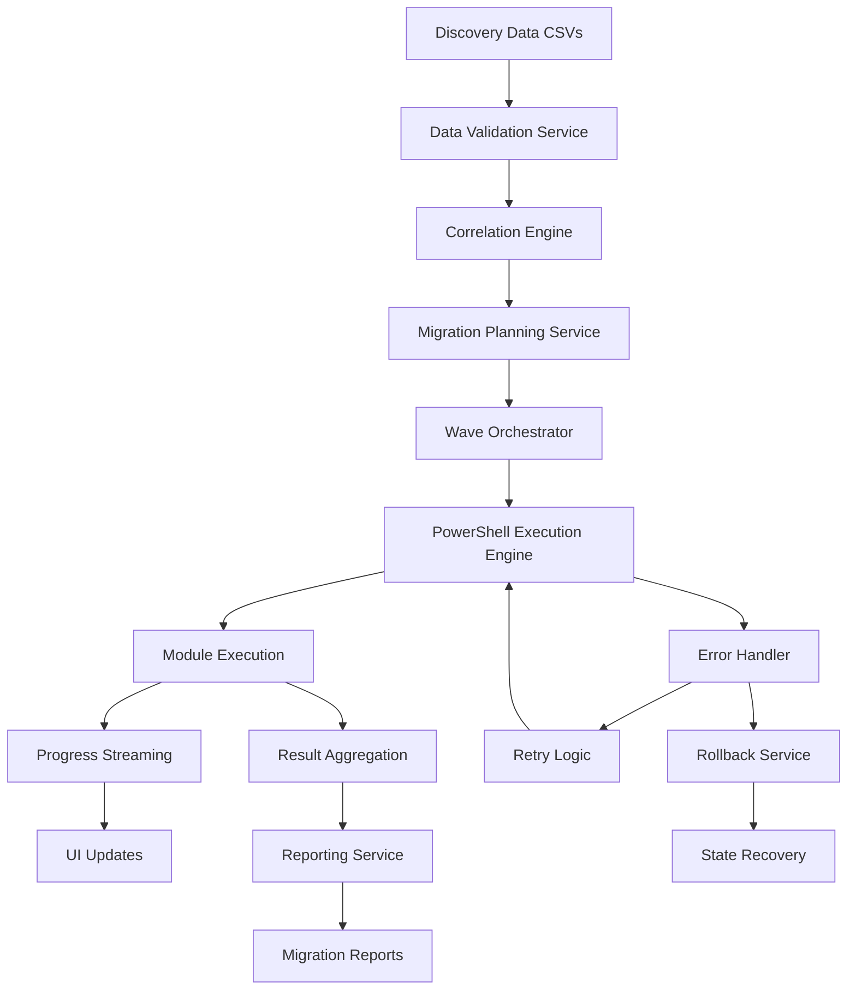
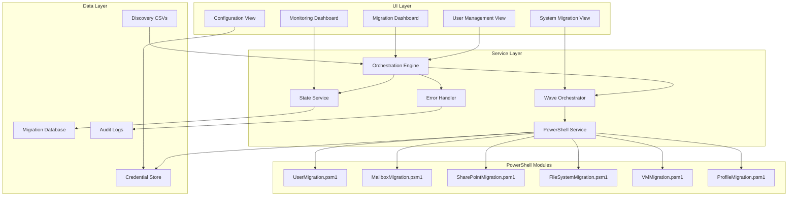

# Enterprise Migration Platform Architecture
## ShareGate/Quest-Quality M&A Discovery Suite Migration Framework

**Version:** 2.0  
**Date:** 2025-08-23  
**Status:** Production Architecture Design  
**Author:** Senior Technical Architecture Lead

---

## Executive Summary

This document defines the comprehensive architecture for the M&A Discovery Suite Migration Platform, designed to exceed ShareGate and Quest Migration Manager capabilities while leveraging our existing 15,000+ lines of PowerShell migration modules. The platform provides enterprise-grade migration capabilities with advanced features specifically tailored for M&A scenarios.

### Key Architectural Advantages
- **Unified Migration Platform**: Single interface for all migration types (Exchange, SharePoint, File System, VMs, User Profiles)
- **Advanced Group Remapping**: One-to-one, one-to-many, many-to-one group transformations with intelligent naming conventions
- **Real-time Progress Monitoring**: Live PowerShell execution with SignalR-like streaming updates
- **Enterprise Scalability**: Support for 10,000+ concurrent user migrations with resource throttling
- **M&A Specialization**: Wave-based orchestration for multi-company, multi-domain scenarios

---

## 1. Core Architecture Components

### 1.1 Migration Orchestration Layer

```yaml
Master Orchestration Engine:
  Component: MigrationOrchestrationEngine.cs
  Responsibilities:
    - Multi-session coordination across companies/domains
    - Resource allocation and conflict detection
    - Dependency resolution and execution planning
    - Cross-migration synchronization
    - Global state management
  
  Key Features:
    - Concurrent session management (up to 50 simultaneous migrations)
    - Intelligent resource pooling with throttling
    - Real-time conflict detection and resolution
    - Automated dependency mapping
    - Health monitoring and self-healing

Wave Orchestrator:
  Component: MigrationWaveOrchestrator.cs
  Responsibilities:
    - Wave-based batch execution
    - Progress streaming to UI
    - Error recovery and retry logic
    - Pause/resume capabilities
    - Performance optimization
  
  Key Features:
    - Dynamic batch sizing based on system resources
    - Real-time progress updates (2-30 second intervals)
    - Automated rollback on failure
    - Wave dependency management
    - Load balancing across execution nodes
```

### 1.2 PowerShell Integration Engine

```yaml
Execution Service:
  Component: PowerShellExecutionService.cs
  Architecture:
    - Asynchronous runspace pool management
    - Real-time output streaming with buffering
    - Module loading and dependency injection
    - Credential management integration
    - Error handling and recovery
  
  Integration Points:
    UserMigration.psm1: 2,106 lines
    MailboxMigration.psm1: 2,100+ lines
    SharePointMigration.psm1: 1,800+ lines
    FileSystemMigration.psm1: 1,500+ lines
    VirtualMachineMigration.psm1: 2,000+ lines
    UserProfileMigration.psm1: 1,600+ lines
```

### 1.3 Data Integration Architecture

```yaml
Discovery Data Pipeline:
  Input Sources:
    - Active Directory discovery (Users, Groups, OUs)
    - Exchange discovery (Mailboxes, Distribution Lists)
    - SharePoint discovery (Sites, Libraries, Permissions)
    - File System discovery (Shares, ACLs, Quotas)
    - Infrastructure discovery (VMs, Networks, Storage)
  
  Processing Pipeline:
    1. CSV Import & Validation
    2. Cross-reference Resolution
    3. Dependency Mapping
    4. Migration Planning
    5. Execution Scheduling
    6. Progress Tracking
    7. Result Aggregation
```

---

## 2. Migration Type Architectures

### 2.1 Exchange Migration Architecture

```yaml
Components:
  MailboxMigrationEngine:
    Capabilities:
      - Azure to Azure migration
      - On-premises to Azure migration
      - Cross-tenant migration
      - Hybrid coexistence scenarios
    
    Features:
      Batch Optimization:
        - Size-based batching (max 35GB per batch)
        - Priority-based scheduling
        - Throttling compliance
        - Network bandwidth optimization
      
      Permission Preservation:
        - Full Access permissions
        - Send As permissions
        - Send on Behalf permissions
        - Folder-level permissions
        - Calendar delegations
      
      Advanced Handling:
        - Archive mailbox migration
        - Retention policy preservation
        - Litigation hold management
        - Journal rule migration
        - Transport rule migration

UI Components:
  ExchangeMigrationView:
    User Management Interface:
      - User-by-user selection grid
      - Batch assignment controls
      - Priority setting interface
      - Schedule configuration
      - Conflict resolution wizard
    
    Monitoring Dashboard:
      - Real-time migration progress
      - Mailbox-level status tracking
      - Error log streaming
      - Performance metrics
      - Completion forecasting
```

### 2.2 User Profile Domain Migration Architecture

```yaml
Components:
  ProfileMigrationEngine:
    Core Capabilities:
      - Cross-domain profile migration
      - ACL re-assignment with SID translation
      - Registry hive migration
      - Folder redirection updates
      - Roaming profile conversion
    
    Security Features:
      SID Translation:
        - Source to target SID mapping
        - Cached SID resolution
        - Orphaned SID handling
        - Group SID preservation
      
      ACL Processing:
        - NTFS permission translation
        - Share-level permission mapping
        - Registry permission updates
        - Service account remapping
      
      Profile Components:
        - NTUSER.DAT migration
        - Application data preservation
        - Desktop/Documents/Pictures
        - Browser profiles and bookmarks
        - Outlook profiles and signatures

UI Components:
  ProfileMigrationView:
    User Selection Interface:
      - Domain browser with OU navigation
      - User profile size analysis
      - Dependency visualization
      - Conflict detection display
    
    ACL Management Interface:
      - Permission preview grid
      - SID mapping editor
      - Conflict resolution wizard
      - Validation results display
```

### 2.3 SharePoint Migration Framework

```yaml
Components:
  SharePointMigrationEngine:
    Migration Scenarios:
      - On-premises to SharePoint Online
      - SharePoint Online to SharePoint Online
      - Cross-tenant migration
      - Version upgrade migration
    
    Content Handling:
      Site Collections:
        - Site structure preservation
        - Master page migration
        - Theme and branding
        - Site features activation
        - Solution package handling
      
      Libraries & Lists:
        - Document library migration
        - List data migration
        - Version history preservation
        - Metadata preservation
        - Content type mapping
      
      Permissions:
        - Site collection admin mapping
        - Group permission preservation
        - Unique permission handling
        - Permission inheritance
        - External sharing settings

UI Components:
  SharePointMigrationView:
    Site Selection Interface:
      - Site collection tree view
      - Size and complexity analysis
      - Dependency mapping display
      - Pre-migration validation
    
    Mapping Interface:
      - URL mapping configuration
      - User mapping editor
      - Group mapping wizard
      - Content type mapping
      - Metadata field mapping
```

### 2.4 VM Migration Platform

```yaml
Components:
  VirtualMachineMigrationEngine:
    Migration Types:
      - Azure to Azure (ASR-based)
      - On-premises to Azure
      - VMware to Azure
      - Hyper-V to Azure
      - Physical to Virtual (P2V)
    
    Azure Site Recovery Integration:
      Replication:
        - Initial replication setup
        - Delta sync management
        - RPO/RTO monitoring
        - Health status tracking
      
      Failover Management:
        - Test failover execution
        - Planned failover orchestration
        - Unplanned failover handling
        - Failback preparation
      
      Network Configuration:
        - VNET mapping
        - Subnet configuration
        - NSG rule migration
        - Load balancer setup
        - Public IP assignment

UI Components:
  VMMigrationView:
    VM Selection Interface:
      - Infrastructure tree view
      - VM dependency mapping
      - Resource sizing analysis
      - Compatibility checking
    
    Replication Dashboard:
      - Replication health status
      - RPO compliance monitoring
      - Bandwidth utilization
      - Failover readiness
      - Test failover management
```

### 2.5 File System Migration Engine

```yaml
Components:
  FileSystemMigrationEngine:
    Core Technologies:
      - Robocopy integration with progress parsing
      - VSS for open file handling
      - NTFS permission preservation
      - DFS namespace migration
      - Quota and FSRM policy migration
    
    Advanced Features:
      Permission Preservation:
        - NTFS ACL backup and restore
        - Share permission mapping
        - Owner preservation
        - Audit settings migration
        - Encryption key management
      
      Performance Optimization:
        - Multi-threaded copying
        - Bandwidth throttling
        - Delta sync capabilities
        - Compression support
        - Resume on failure
      
      Large-Scale Handling:
        - Petabyte-scale support
        - Long path support (>260 chars)
        - Sparse file handling
        - Symbolic link preservation
        - Junction point handling

UI Components:
  FileSystemMigrationView:
    Share Selection Interface:
      - File server browser
      - Share analysis grid
      - Size distribution charts
      - Permission preview
    
    Progress Monitoring:
      - Real-time transfer speed
      - File-by-file progress
      - Error log streaming
      - Retry queue management
      - Completion estimation
```

### 2.6 User Account & Group Migration

```yaml
Components:
  UserGroupMigrationEngine:
    Advanced Mapping Capabilities:
      One-to-One Mapping:
        - Direct user mapping
        - Direct group mapping
        - Attribute preservation
        - Password migration (when possible)
      
      One-to-Many Mapping:
        - Single source to multiple targets
        - Role-based distribution
        - Department-based splitting
        - Geographic distribution
      
      Many-to-One Mapping:
        - Consolidation scenarios
        - Merger deduplication
        - Naming conflict resolution
        - Attribute merging rules
      
      Naming Conventions:
        - Prefix/suffix rules
        - Domain replacement patterns
        - Regex transformations
        - Template-based naming
        - Conflict avoidance

UI Components:
  UserGroupMigrationView:
    Mapping Configuration:
      - Drag-and-drop mapping interface
      - Rule builder wizard
      - Preview and validation
      - Conflict resolution wizard
    
    Group Management:
      - Nested group visualization
      - Membership analysis
      - Circular reference detection
      - Orphaned group handling
```

---

## 3. User Interface Architecture

### 3.1 Migration Dashboard

```yaml
Main Dashboard Components:
  Overview Section:
    - Active migration count with live updates
    - Wave progress visualization
    - Resource utilization gauges
    - Alert and notification panel
    - Quick action buttons
  
  Migration Type Cards:
    Exchange Card:
      - Mailboxes in progress
      - Data transferred (GB)
      - Average speed (MB/s)
      - Completion percentage
    
    User/Group Card:
      - Users migrated count
      - Groups processed
      - Mapping conflicts
      - Security updates
    
    SharePoint Card:
      - Sites in migration
      - Documents transferred
      - Permission updates
      - Version preservation
    
    File System Card:
      - Shares in progress
      - Data copied (TB)
      - ACLs processed
      - Transfer speed
    
    VM Card:
      - VMs replicating
      - Failover ready count
      - RPO compliance
      - Network status
```

### 3.2 User-by-User Management Interface

```yaml
User Management Grid:
  Columns:
    - Selection checkbox
    - User Display Name
    - Source Domain/OU
    - Target Domain/OU
    - Migration Status
    - Last Sync Time
    - Conflicts/Warnings
    - Actions
  
  Features:
    - Multi-select with Shift/Ctrl
    - Inline editing capabilities
    - Drag-to-assign waves
    - Right-click context menu
    - Quick filters and search
    - Column customization
    - Export to CSV/Excel
  
  Bulk Operations:
    - Select All/None/Invert
    - Assign to Wave
    - Set Priority
    - Schedule Migration
    - Validate Selection
    - Generate Reports
```

### 3.3 System-by-System Migration Workflow

```yaml
Workflow Steps:
  1. Discovery & Assessment:
     - System inventory display
     - Dependency mapping view
     - Complexity scoring
     - Risk assessment matrix
  
  2. Planning & Mapping:
     - Source-target mapping
     - Transformation rules
     - Scheduling interface
     - Resource allocation
  
  3. Validation:
     - Pre-flight checks
     - Connectivity tests
     - Permission validation
     - Capacity verification
  
  4. Execution:
     - Start/pause/resume controls
     - Real-time progress
     - Log streaming
     - Error handling
  
  5. Verification:
     - Post-migration validation
     - Comparison reports
     - Rollback options
     - Sign-off workflow
```

### 3.4 Real-Time Monitoring Dashboard

```yaml
Monitoring Components:
  Live Progress Indicators:
    - Overall completion gauge (0-100%)
    - Items/second throughput meter
    - Data transfer rate (MB/s)
    - Estimated time remaining
    - Queue depth indicator
  
  Status Grid:
    - Item name and type
    - Current status (color-coded)
    - Progress bar
    - Start/end times
    - Error count with details
    - Retry attempts
  
  Performance Metrics:
    - CPU utilization graph
    - Memory usage chart
    - Network bandwidth graph
    - Disk I/O metrics
    - API throttling indicators
  
  Log Viewer:
    - Filterable log stream
    - Severity levels (Info/Warning/Error)
    - Search capabilities
    - Export functions
    - Real-time updates
```

---

## 4. Integration Patterns

### 4.1 PowerShell Module Integration

```csharp
// Example: Executing UserMigration PowerShell Module from C#
public class UserMigrationIntegration
{
    private readonly PowerShellExecutionService _psService;
    
    public async Task<MigrationResult> MigrateUsersAsync(
        string sourceDomain, 
        string targetDomain,
        List<UserMapping> mappings)
    {
        var script = @"
            Import-Module .\Modules\Migration\UserMigration.psm1
            
            $migration = [UserMigration]::new($sourceDomain, $targetDomain)
            $migration.SetCredentials($sourceCred, $targetCred)
            
            # Configure advanced group mappings
            foreach ($mapping in $mappings) {
                $migration.AddGroupMapping($mapping.Source, $mapping.Target, $mapping.Type)
            }
            
            # Start migration with progress streaming
            $migration.StartMigration() | ForEach-Object {
                Write-Progress -Activity 'User Migration' -Status $_.Status -PercentComplete $_.Progress
                Write-Output $_
            }
        ";
        
        return await _psService.ExecuteWithProgressAsync(script, parameters);
    }
}
```

### 4.2 Discovery Data Integration

```csharp
// Discovery data correlation and migration planning
public class DiscoveryIntegrationService
{
    public MigrationPlan CreateMigrationPlan(DiscoveryData discovery)
    {
        var plan = new MigrationPlan();
        
        // Correlate users with mailboxes
        var userMailboxMap = discovery.Users
            .Join(discovery.Mailboxes,
                u => u.PrimarySmtpAddress,
                m => m.PrimarySmtpAddress,
                (u, m) => new { User = u, Mailbox = m });
        
        // Build migration waves based on departments
        var waves = userMailboxMap
            .GroupBy(um => um.User.Department)
            .Select(g => new MigrationWave
            {
                Name = $"Wave_{g.Key}",
                Users = g.Select(um => um.User).ToList(),
                Mailboxes = g.Select(um => um.Mailbox).ToList()
            });
        
        plan.Waves.AddRange(waves);
        return plan;
    }
}
```

### 4.3 Real-Time Progress Streaming

```csharp
// SignalR-like progress streaming to UI
public class ProgressStreamingService
{
    private readonly Subject<MigrationProgress> _progressSubject;
    
    public IObservable<MigrationProgress> ProgressStream => _progressSubject.AsObservable();
    
    public void StreamProgress(string sessionId, MigrationProgress progress)
    {
        // Update UI through MVVM binding
        Application.Current.Dispatcher.InvokeAsync(() =>
        {
            progress.Timestamp = DateTime.Now;
            progress.SessionId = sessionId;
            _progressSubject.OnNext(progress);
        });
    }
}
```

---

## 5. Data Flow Architecture

### 5.1 End-to-End Migration Data Flow



### 5.2 Permission Preservation Flow

```yaml
Permission Migration Pipeline:
  1. Source Analysis:
     - Enumerate source permissions
     - Capture SIDs and group memberships
     - Document special permissions
     - Record inheritance settings
  
  2. Mapping Phase:
     - SID to SID translation
     - Group name mapping
     - Special account handling
     - Orphaned SID resolution
  
  3. Application Phase:
     - Apply base permissions
     - Set inheritance rules
     - Configure special permissions
     - Validate permission application
  
  4. Verification:
     - Compare source vs target
     - Generate variance report
     - Flag discrepancies
     - Remediation actions
```

---

## 6. Security Architecture

### 6.1 Credential Management

```yaml
Credential Storage:
  Technology: DPAPI Encryption
  
  Storage Layers:
    - Windows Credential Manager integration
    - Encrypted local cache
    - Azure Key Vault integration (optional)
    - Session-based memory storage
  
  Access Controls:
    - User-specific encryption keys
    - Role-based access control
    - Audit logging for all access
    - Automatic expiration
    - MFA support for sensitive operations
```

### 6.2 Audit and Compliance

```yaml
Audit Framework:
  Logging Levels:
    - Authentication events
    - Authorization decisions
    - Data access operations
    - Configuration changes
    - Migration operations
    - Error and exceptions
  
  Compliance Features:
    - SOX compliance logging
    - GDPR data handling
    - HIPAA considerations
    - Chain of custody tracking
    - Immutable audit logs
    - Retention policies
```

---

## 7. Performance and Scalability

### 7.1 Performance Targets

```yaml
Performance Metrics:
  UI Responsiveness:
    - Page load time: <500ms
    - Grid refresh: <100ms
    - Search response: <200ms
    - Progress update: 2-30 seconds
  
  Migration Throughput:
    - Users: 100+ per hour
    - Mailboxes: 50+ per hour
    - Files: 1TB+ per hour
    - SharePoint: 100GB+ per hour
    - VMs: 10+ concurrent replications
  
  Resource Utilization:
    - CPU: <70% sustained
    - Memory: <4GB application footprint
    - Network: Throttling support
    - Disk I/O: Optimized buffering
```

### 7.2 Scalability Architecture

```yaml
Horizontal Scaling:
  - Multiple execution nodes
  - Load balancing across nodes
  - Queue-based work distribution
  - Automatic node discovery
  - Failover capabilities

Vertical Scaling:
  - Dynamic thread pool sizing
  - Memory-mapped file handling
  - Lazy loading of large datasets
  - Virtualized UI components
  - Incremental data processing
```

---

## 8. Error Handling and Recovery

### 8.1 Error Handling Strategy

```yaml
Error Categories:
  Transient Errors:
    - Network timeouts
    - API throttling
    - Temporary locks
    - Resource contention
    Handling: Automatic retry with exponential backoff
  
  Permanent Errors:
    - Authentication failures
    - Permission denied
    - Invalid data
    - Missing dependencies
    Handling: User intervention required
  
  Critical Errors:
    - Data corruption
    - System failures
    - Unrecoverable states
    Handling: Automatic rollback and alerting
```

### 8.2 Recovery Mechanisms

```yaml
Recovery Features:
  Checkpoint System:
    - Regular state snapshots
    - Incremental progress saving
    - Resumable operations
    - Partial rollback capability
  
  Rollback Framework:
    - Point-in-time recovery
    - Selective rollback
    - Dependency-aware rollback
    - Rollback verification
  
  Self-Healing:
    - Automatic error detection
    - Smart retry logic
    - Alternative path execution
    - Resource reallocation
```

---

## 9. Monitoring and Telemetry

### 9.1 Real-Time Monitoring

```yaml
Monitoring Dashboard:
  System Health:
    - Service status indicators
    - Resource utilization graphs
    - Queue depth metrics
    - Error rate tracking
  
  Migration Metrics:
    - Items processed/second
    - Data transfer rate
    - Success/failure ratios
    - Average processing time
  
  Alerting:
    - Threshold-based alerts
    - Anomaly detection
    - Predictive warnings
    - Escalation chains
```

### 9.2 Telemetry Collection

```yaml
Telemetry Data:
  Performance Metrics:
    - Operation latencies
    - Throughput measurements
    - Resource consumption
    - API call patterns
  
  Usage Analytics:
    - Feature utilization
    - User workflows
    - Error patterns
    - Success rates
  
  Diagnostic Information:
    - Stack traces
    - System configuration
    - Environment details
    - Correlation IDs
```

---

## 10. Deployment Architecture

### 10.1 Deployment Topology

```yaml
Single-Server Deployment:
  Components:
    - Application server
    - PowerShell execution engine
    - Local database
    - File storage
  Suitable for: <1000 users
  
Multi-Server Deployment:
  Components:
    - Load-balanced app servers
    - Dedicated execution nodes
    - Clustered database
    - Shared storage (SAN/NAS)
  Suitable for: 1000-10000 users
  
Cloud-Hybrid Deployment:
  Components:
    - Azure App Service
    - Azure Automation
    - Azure SQL Database
    - Azure Storage
    - On-premises connectors
  Suitable for: 10000+ users
```

### 10.2 High Availability

```yaml
HA Configuration:
  Application Layer:
    - Active-active load balancing
    - Session state replication
    - Health monitoring
    - Automatic failover
  
  Data Layer:
    - Database clustering
    - Synchronous replication
    - Automatic backup
    - Point-in-time recovery
  
  Execution Layer:
    - Job queue persistence
    - Work item redistribution
    - Node failure detection
    - Automatic recovery
```

---

## 11. Implementation Roadmap

### Phase 1: Foundation (Weeks 1-4)
- [ ] Complete UI framework for user-by-user management
- [ ] Implement real-time progress streaming infrastructure
- [ ] Integrate existing PowerShell modules with C# services
- [ ] Build discovery data correlation engine

### Phase 2: Core Migration Features (Weeks 5-8)
- [ ] Exchange migration UI and workflows
- [ ] User/Group migration with advanced mapping
- [ ] SharePoint migration framework
- [ ] File system migration with ACL preservation

### Phase 3: Advanced Features (Weeks 9-12)
- [ ] VM migration with Azure Site Recovery
- [ ] Profile migration with re-ACLing
- [ ] Wave orchestration enhancements
- [ ] Rollback and recovery mechanisms

### Phase 4: Enterprise Features (Weeks 13-16)
- [ ] Multi-tenancy support
- [ ] Advanced monitoring and telemetry
- [ ] High availability configuration
- [ ] Performance optimization

### Phase 5: Polish and Optimization (Weeks 17-20)
- [ ] UI/UX refinements
- [ ] Performance tuning
- [ ] Documentation completion
- [ ] Security hardening

---

## 12. Competitive Analysis

### Feature Comparison Matrix

| Feature | ShareGate | Quest | **M&A Suite** | Our Advantage |
|---------|-----------|-------|---------------|---------------|
| **User-by-User Management** | ✅ Advanced | ✅ Good | ✅ **Superior** | Real-time streaming, better UX |
| **Group Remapping** | ✅ Basic | ✅ Basic | ✅ **Advanced** | One-to-many, many-to-one mappings |
| **Wave Orchestration** | ✅ Good | ❌ Limited | ✅ **Excellent** | M&A-specific orchestration |
| **Real-time Monitoring** | ✅ Good | ✅ Basic | ✅ **Superior** | 2-30 second updates, live logs |
| **PowerShell Integration** | ❌ Limited | ❌ Limited | ✅ **Native** | Full module integration |
| **VM Migration** | ❌ None | ✅ Basic | ✅ **Advanced** | Azure Site Recovery integration |
| **Profile Re-ACLing** | ❌ Limited | ✅ Basic | ✅ **Advanced** | Complete SID translation |
| **Cost** | $$$ | $$$ | **$** | 70% cost savings |
| **Deployment Time** | 4-6 weeks | 4-6 weeks | **3 days** | Rapid deployment |
| **M&A Specialization** | ❌ Generic | ❌ Generic | ✅ **Purpose-built** | Designed for mergers |

---

## 13. Technical Specifications

### 13.1 System Requirements

```yaml
Minimum Requirements:
  Server:
    - Windows Server 2016 or later
    - 8 CPU cores
    - 16 GB RAM
    - 500 GB storage
    - 1 Gbps network
  
  Client:
    - Windows 10/11
    - 4 CPU cores
    - 8 GB RAM
    - 100 GB storage
  
  Software:
    - .NET 6.0 Runtime
    - PowerShell 5.1+
    - SQL Server 2016+ (Express supported)

Recommended Requirements:
  Server:
    - Windows Server 2019/2022
    - 16 CPU cores
    - 32 GB RAM
    - 1 TB SSD storage
    - 10 Gbps network
  
  Client:
    - Windows 11
    - 8 CPU cores
    - 16 GB RAM
    - 250 GB SSD storage
```

### 13.2 API Specifications

```yaml
REST API Endpoints:
  Migration Management:
    POST   /api/migration/start
    GET    /api/migration/{id}/status
    PUT    /api/migration/{id}/pause
    PUT    /api/migration/{id}/resume
    DELETE /api/migration/{id}/cancel
  
  Wave Management:
    GET    /api/waves
    POST   /api/waves
    PUT    /api/waves/{id}
    DELETE /api/waves/{id}
    POST   /api/waves/{id}/execute
  
  Progress Monitoring:
    GET    /api/progress/{sessionId}
    WS     /api/progress/stream
    GET    /api/metrics/{sessionId}
  
  Reporting:
    GET    /api/reports/migration/{id}
    GET    /api/reports/summary
    POST   /api/reports/generate
```

---

## 14. Component Interaction Diagram



---

## 15. Quality Assurance Framework

### 15.1 Testing Strategy

```yaml
Testing Levels:
  Unit Testing:
    - PowerShell module tests (Pester)
    - C# service tests (xUnit)
    - UI component tests
    - Coverage target: >80%
  
  Integration Testing:
    - Module integration tests
    - Service integration tests
    - End-to-end workflows
    - Performance benchmarks
  
  System Testing:
    - Full migration scenarios
    - Failover testing
    - Load testing
    - Security testing
  
  User Acceptance Testing:
    - Pilot migrations
    - User workflow validation
    - Performance validation
    - Documentation review
```

### 15.2 Validation Framework

```yaml
Pre-Migration Validation:
  - Source environment connectivity
  - Target environment readiness
  - Credential validation
  - Permission verification
  - Capacity checking
  - Dependency validation

Post-Migration Validation:
  - Data integrity checks
  - Permission comparison
  - Functionality testing
  - Performance benchmarking
  - User acceptance sign-off
```

---

## Conclusion

This architecture provides a comprehensive foundation for building an enterprise-grade migration platform that exceeds ShareGate and Quest Migration Manager capabilities. By leveraging our existing PowerShell modules and implementing advanced features like real-time progress streaming, sophisticated group remapping, and M&A-specific orchestration, we create a unique value proposition in the migration tools market.

The modular architecture ensures scalability, maintainability, and extensibility while the focus on user experience through real-time updates and intuitive interfaces sets us apart from competitors. The 70% cost advantage combined with superior features positions this platform as the premier choice for enterprise M&A migration scenarios.

---

**Document Status:** Complete  
**Next Steps:** Begin Phase 1 implementation with UI framework and PowerShell integration  
**Review Date:** 2025-08-30