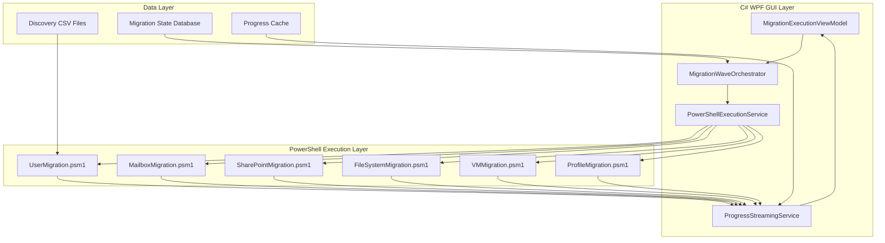

# PowerShell-GUI Integration Patterns
## Comprehensive Integration Architecture for Migration Platform

**Version:** 1.0  
**Date:** 2025-08-23  
**Author:** Senior Technical Architecture Lead

---

## Executive Summary

This document defines the comprehensive integration patterns between the C# WPF GUI and the existing 15,000+ lines of PowerShell migration modules. The integration provides real-time progress streaming, live data binding, and enterprise-grade error handling while maintaining the flexibility and power of the PowerShell execution engine.

### Key Integration Points
- **Real-time Progress Streaming**: Live updates from PowerShell to GUI with 2-30 second intervals
- **Bidirectional Communication**: C# to PowerShell command execution and PowerShell to C# event streaming
- **State Synchronization**: Consistent state management across both execution contexts
- **Error Propagation**: Comprehensive error handling from PowerShell modules to GUI
- **Performance Optimization**: Efficient data transfer with minimal serialization overhead

---

## 1. Integration Architecture Overview

### 1.1 Communication Flow



### 1.2 Integration Layers

```yaml
Layer 1 - UI Presentation:
  Components:
    - WPF Views with XAML data binding
    - ViewModels with INotifyPropertyChanged
    - Real-time progress indicators
    - Interactive control elements
  
  Responsibilities:
    - User interaction handling
    - Real-time data display
    - Visual state management
    - User input validation

Layer 2 - Service Orchestration:
  Components:
    - MigrationOrchestrationEngine
    - MigrationWaveOrchestrator
    - PowerShellExecutionService
    - ProgressStreamingService
  
  Responsibilities:
    - Migration workflow coordination
    - PowerShell module execution
    - Progress aggregation and streaming
    - Error handling and recovery

Layer 3 - PowerShell Integration:
  Components:
    - Runspace pool management
    - Module loading and caching
    - Parameter serialization
    - Output stream processing
  
  Responsibilities:
    - PowerShell script execution
    - Module state management
    - Data type conversion
    - Exception handling

Layer 4 - PowerShell Modules:
  Components:
    - Migration class implementations
    - Business logic execution
    - External API integration
    - Progress reporting
  
  Responsibilities:
    - Core migration operations
    - Domain-specific logic
    - External system interaction
    - Detailed progress updates
```

---

## 2. PowerShell Execution Service Integration

### 2.1 Enhanced PowerShellExecutionService

```csharp
public class PowerShellExecutionService : IDisposable
{
    private readonly RunspacePool _runspacePool;
    private readonly ConcurrentDictionary<string, PowerShellSession> _activeSessions;
    private readonly Subject<PowerShellProgress> _progressStream;
    private readonly ILogger<PowerShellExecutionService> _logger;
    
    public IObservable<PowerShellProgress> ProgressStream => _progressStream.AsObservable();
    
    public PowerShellExecutionService(ILogger<PowerShellExecutionService> logger = null)
    {
        _logger = logger ?? NullLogger<PowerShellExecutionService>.Instance;
        _activeSessions = new ConcurrentDictionary<string, PowerShellSession>();
        _progressStream = new Subject<PowerShellProgress>();
        
        InitializeRunspacePool();
        RegisterProgressCallback();
    }
    
    /// <summary>
    /// Execute PowerShell migration module with real-time progress streaming
    /// </summary>
    public async Task<MigrationExecutionResult> ExecuteMigrationAsync(
        MigrationModuleRequest request,
        CancellationToken cancellationToken = default)
    {
        var sessionId = Guid.NewGuid().ToString();
        var session = new PowerShellSession
        {
            SessionId = sessionId,
            ModuleName = request.ModuleName,
            StartTime = DateTime.Now,
            Status = PowerShellSessionStatus.Starting
        };
        
        _activeSessions[sessionId] = session;
        
        try
        {
            // Build PowerShell script based on module type
            var script = BuildMigrationScript(request);
            
            // Create PowerShell instance from pool
            using var powerShell = PowerShell.Create();
            powerShell.RunspacePool = _runspacePool;
            
            // Add progress reporting script wrapper
            var wrappedScript = WrapWithProgressReporting(script, sessionId);
            powerShell.AddScript(wrappedScript);
            
            // Add parameters
            foreach (var param in request.Parameters)
            {
                powerShell.AddParameter(param.Key, param.Value);
            }
            
            // Set up progress monitoring
            powerShell.Streams.Progress.DataAdded += (sender, args) => 
                HandleProgressUpdate(sessionId, args);
            
            powerShell.Streams.Information.DataAdded += (sender, args) =>
                HandleInformationUpdate(sessionId, args);
            
            powerShell.Streams.Error.DataAdded += (sender, args) =>
                HandleErrorUpdate(sessionId, args);
            
            // Execute with async pattern
            session.Status = PowerShellSessionStatus.Running;
            var results = await Task.Factory.StartNew(() => 
                powerShell.Invoke(), cancellationToken);
            
            // Process results
            var executionResult = ProcessMigrationResults(results, session);
            session.Status = PowerShellSessionStatus.Completed;
            
            return executionResult;
        }
        catch (Exception ex)
        {
            session.Status = PowerShellSessionStatus.Failed;
            session.Error = ex.Message;
            _logger.LogError(ex, "PowerShell execution failed for session {SessionId}", sessionId);
            throw;
        }
        finally
        {
            // Clean up session
            _activeSessions.TryRemove(sessionId, out _);
        }
    }
    
    private string BuildMigrationScript(MigrationModuleRequest request)
    {
        return request.ModuleName switch
        {
            "UserMigration" => BuildUserMigrationScript(request),
            "MailboxMigration" => BuildMailboxMigrationScript(request),
            "SharePointMigration" => BuildSharePointMigrationScript(request),
            "FileSystemMigration" => BuildFileSystemMigrationScript(request),
            "VirtualMachineMigration" => BuildVMMigrationScript(request),
            "UserProfileMigration" => BuildProfileMigrationScript(request),
            _ => throw new ArgumentException($"Unknown migration module: {request.ModuleName}")
        };
    }
    
    private string BuildUserMigrationScript(MigrationModuleRequest request)
    {
        var sourceDomain = request.Parameters["SourceDomain"].ToString();
        var targetDomain = request.Parameters["TargetDomain"].ToString();
        var users = request.Parameters["Users"] as List<UserMigrationItem>;
        var groupMappings = request.Parameters["GroupMappings"] as Dictionary<string, object>;
        
        return $@"
            # Import the User Migration module
            Import-Module '.\Modules\Migration\UserMigration.psm1' -Force
            
            # Create migration instance
            $migration = [UserMigration]::new('{sourceDomain}', '{targetDomain}')
            
            # Configure credentials
            $sourceCred = Get-StoredCredential -Target 'SourceDomain'
            $targetCred = Get-StoredCredential -Target 'TargetDomain'
            $migration.SetCredentials($sourceCred, $targetCred)
            
            # Configure group mappings
            {BuildGroupMappingConfiguration(groupMappings)}
            
            # Configure migration settings
            $migration.MigrationConfig.BatchSize = {request.BatchSize ?? 50}
            $migration.MigrationConfig.RetryAttempts = {request.RetryAttempts ?? 3}
            $migration.MigrationConfig.EnableRealTimeMonitoring = $true
            
            # Add users to migration queue
            {BuildUserQueue(users)}
            
            # Execute migration with progress reporting
            $migration.StartMigration() | ForEach-Object {{
                # Stream progress to C# layer
                Write-Progress -Id 1 -Activity 'User Migration' -Status $_.Status -PercentComplete $_.ProgressPercentage
                
                # Send detailed progress information
                $progressInfo = @{{
                    SessionId = $SessionId
                    ItemType = 'User'
                    ItemName = $_.CurrentUser
                    Status = $_.Status
                    ProgressPercentage = $_.ProgressPercentage
                    ItemsCompleted = $_.UsersCompleted
                    ItemsTotal = $_.UsersTotal
                    CurrentOperation = $_.CurrentOperation
                    Errors = $_.Errors
                    Timestamp = Get-Date
                }}
                
                Write-Information ($progressInfo | ConvertTo-Json) -InformationAction Continue
            }}
            
            # Return final results
            return $migration.GetMigrationResults()
        ";
    }
    
    private void HandleProgressUpdate(string sessionId, DataAddedEventArgs args)
    {
        var progressRecord = ((PSDataCollection<ProgressRecord>)args.SourceObject)[args.Index];
        
        var progress = new PowerShellProgress
        {
            SessionId = sessionId,
            Activity = progressRecord.Activity,
            StatusDescription = progressRecord.StatusDescription,
            PercentComplete = progressRecord.PercentComplete,
            Timestamp = DateTime.Now
        };
        
        // Stream to UI layer
        _progressStream.OnNext(progress);
    }
    
    private void HandleInformationUpdate(string sessionId, DataAddedEventArgs args)
    {
        var infoRecord = ((PSDataCollection<InformationRecord>)args.SourceObject)[args.Index];
        
        try
        {
            // Parse JSON progress information
            var progressData = JsonConvert.DeserializeObject<MigrationProgressData>(infoRecord.MessageData.ToString());
            
            var detailedProgress = new PowerShellProgress
            {
                SessionId = sessionId,
                ItemType = progressData.ItemType,
                ItemName = progressData.ItemName,
                Status = progressData.Status,
                PercentComplete = progressData.ProgressPercentage,
                ItemsCompleted = progressData.ItemsCompleted,
                ItemsTotal = progressData.ItemsTotal,
                CurrentOperation = progressData.CurrentOperation,
                Errors = progressData.Errors,
                Timestamp = progressData.Timestamp
            };
            
            _progressStream.OnNext(detailedProgress);
        }
        catch (JsonException)
        {
            // Handle non-JSON information messages
            var simpleProgress = new PowerShellProgress
            {
                SessionId = sessionId,
                Message = infoRecord.MessageData.ToString(),
                Timestamp = DateTime.Now
            };
            
            _progressStream.OnNext(simpleProgress);
        }
    }
}
```

### 2.2 Migration Module Request Model

```csharp
public class MigrationModuleRequest
{
    public string ModuleName { get; set; }
    public Dictionary<string, object> Parameters { get; set; }
    public int? BatchSize { get; set; }
    public int? RetryAttempts { get; set; }
    public TimeSpan? Timeout { get; set; }
    public MigrationPriority Priority { get; set; }
    public List<string> RequiredModules { get; set; }
    
    public static MigrationModuleRequest ForUserMigration(
        string sourceDomain,
        string targetDomain,
        List<UserMigrationItem> users,
        Dictionary<string, object> groupMappings)
    {
        return new MigrationModuleRequest
        {
            ModuleName = "UserMigration",
            Parameters = new Dictionary<string, object>
            {
                { "SourceDomain", sourceDomain },
                { "TargetDomain", targetDomain },
                { "Users", users },
                { "GroupMappings", groupMappings }
            },
            RequiredModules = new List<string> { "ActiveDirectory" }
        };
    }
    
    public static MigrationModuleRequest ForMailboxMigration(
        string migrationType,
        List<MailboxMigrationItem> mailboxes,
        Dictionary<string, object> migrationConfig)
    {
        return new MigrationModuleRequest
        {
            ModuleName = "MailboxMigration",
            Parameters = new Dictionary<string, object>
            {
                { "MigrationType", migrationType },
                { "Mailboxes", mailboxes },
                { "MigrationConfig", migrationConfig }
            },
            RequiredModules = new List<string> { "ExchangeOnlineManagement" }
        };
    }
}
```

---

## 3. Real-Time Progress Integration

### 3.1 Progress Streaming Architecture

```csharp
public class MigrationProgressIntegrator
{
    private readonly PowerShellExecutionService _powerShellService;
    private readonly ProgressStreamingService _progressService;
    private readonly Dictionary<string, MigrationSessionContext> _sessionContexts;
    
    public MigrationProgressIntegrator(
        PowerShellExecutionService powerShellService,
        ProgressStreamingService progressService)
    {
        _powerShellService = powerShellService;
        _progressService = progressService;
        _sessionContexts = new Dictionary<string, MigrationSessionContext>();
        
        // Subscribe to PowerShell progress stream
        _powerShellService.ProgressStream.Subscribe(OnPowerShellProgress);
    }
    
    private void OnPowerShellProgress(PowerShellProgress progress)
    {
        // Get session context
        var context = _sessionContexts.GetValueOrDefault(progress.SessionId);
        if (context == null) return;
        
        // Transform PowerShell progress to UI progress format
        var uiProgress = TransformProgress(progress, context);
        
        // Stream to UI layer with appropriate update interval
        var shouldUpdate = ShouldUpdateUI(progress, context);
        if (shouldUpdate)
        {
            _progressService.StreamProgress(progress.SessionId, uiProgress);
            context.LastUIUpdate = DateTime.Now;
        }
        
        // Update internal metrics
        UpdateSessionMetrics(progress, context);
    }
    
    private bool ShouldUpdateUI(PowerShellProgress progress, MigrationSessionContext context)
    {
        var timeSinceLastUpdate = DateTime.Now - context.LastUIUpdate;
        
        // Update intervals based on progress type
        return progress.ItemType switch
        {
            "Critical" => true, // Always update critical items
            "User" or "Group" => timeSinceLastUpdate >= TimeSpan.FromSeconds(2),
            "Mailbox" => timeSinceLastUpdate >= TimeSpan.FromSeconds(5),
            "File" => timeSinceLastUpdate >= TimeSpan.FromSeconds(10),
            "System" => timeSinceLastUpdate >= TimeSpan.FromSeconds(30),
            _ => timeSinceLastUpdate >= TimeSpan.FromSeconds(5)
        };
    }
    
    private MigrationProgress TransformProgress(
        PowerShellProgress psProgress, 
        MigrationSessionContext context)
    {
        return new MigrationProgress
        {
            SessionId = psProgress.SessionId,
            ItemType = psProgress.ItemType,
            ItemName = psProgress.ItemName,
            Status = TransformStatus(psProgress.Status),
            PercentComplete = psProgress.PercentComplete,
            ItemsCompleted = psProgress.ItemsCompleted,
            ItemsTotal = psProgress.ItemsTotal,
            CurrentOperation = psProgress.CurrentOperation,
            Speed = CalculateSpeed(psProgress, context),
            EstimatedTimeRemaining = CalculateETA(psProgress, context),
            Errors = psProgress.Errors?.Select(e => new ErrorDetail
            {
                Message = e.Message,
                Type = e.Type,
                Severity = MapErrorSeverity(e.Severity),
                Timestamp = e.Timestamp
            }).ToList(),
            Timestamp = psProgress.Timestamp
        };
    }
}
```

### 3.2 PowerShell Module Progress Enhancement

```powershell
# Enhanced progress reporting in UserMigration.psm1
class UserMigration {
    # ... existing properties ...
    
    hidden [System.Management.Automation.PSCmdlet] $PSCmdlet
    hidden [string] $SessionId
    hidden [System.Collections.Generic.Dictionary[string,object]] $ProgressCache
    
    # Constructor enhancement for GUI integration
    UserMigration([string]$sourceDomain, [string]$targetDomain) {
        # ... existing initialization ...
        
        # Initialize progress tracking for GUI integration
        $this.ProgressCache = [System.Collections.Generic.Dictionary[string,object]]::new()
        $this.InitializeProgressReporting()
    }
    
    hidden [void] InitializeProgressReporting() {
        # Set up progress reporting for C# integration
        $this.ProgressCache["StartTime"] = Get-Date
        $this.ProgressCache["LastProgressUpdate"] = Get-Date
        $this.ProgressCache["ItemsProcessed"] = 0
        $this.ProgressCache["TotalItems"] = 0
        $this.ProgressCache["Errors"] = @()
    }
    
    hidden [void] ReportProgress([string]$activity, [string]$status, [int]$percentComplete, [hashtable]$additionalData = @{}) {
        $progressInfo = @{
            SessionId = $this.SessionId
            Activity = $activity
            Status = $status
            PercentComplete = $percentComplete
            ItemsCompleted = $this.ProgressCache["ItemsProcessed"]
            ItemsTotal = $this.ProgressCache["TotalItems"]
            CurrentOperation = $additionalData.CurrentOperation
            ItemType = $additionalData.ItemType ?? "User"
            ItemName = $additionalData.ItemName
            Speed = $this.CalculateSpeed()
            Errors = $this.ProgressCache["Errors"]
            Timestamp = Get-Date
            AdditionalData = $additionalData
        }
        
        # Update progress record for PowerShell layer
        Write-Progress -Id 1 -Activity $activity -Status $status -PercentComplete $percentComplete
        
        # Send detailed information to C# layer
        Write-Information ($progressInfo | ConvertTo-Json -Depth 3) -InformationAction Continue
        
        # Update cache
        $this.ProgressCache["LastProgressUpdate"] = Get-Date
    }
    
    hidden [double] CalculateSpeed() {
        $elapsed = (Get-Date) - $this.ProgressCache["StartTime"]
        if ($elapsed.TotalSeconds -gt 0) {
            return [Math]::Round($this.ProgressCache["ItemsProcessed"] / $elapsed.TotalSeconds, 2)
        }
        return 0
    }
    
    # Enhanced StartMigration method with detailed progress reporting
    [void] StartMigration() {
        try {
            $this.WriteLog("Starting user migration with enhanced progress reporting", "INFO")
            
            # Initialize progress tracking
            $this.ProgressCache["TotalItems"] = $this.MigrationQueue.Count
            $this.ReportProgress("User Migration", "Initializing", 0, @{ CurrentOperation = "Preparing migration" })
            
            # Validate prerequisites
            $this.ReportProgress("User Migration", "Validating", 5, @{ CurrentOperation = "Validating prerequisites" })
            $this.ValidatePrerequisites()
            
            # Process each user with detailed progress
            $processedCount = 0
            foreach ($user in $this.MigrationQueue) {
                try {
                    $this.ReportProgress("User Migration", "Processing User", 
                        [Math]::Round(($processedCount / $this.ProgressCache["TotalItems"]) * 100),
                        @{
                            CurrentOperation = "Migrating user: $($user.SamAccountName)"
                            ItemType = "User"
                            ItemName = $user.DisplayName
                        })
                    
                    # Process individual user migration
                    $this.ProcessUserMigration($user)
                    $processedCount++
                    $this.ProgressCache["ItemsProcessed"] = $processedCount
                    
                    # Report individual completion
                    $this.ReportProgress("User Migration", "User Completed",
                        [Math]::Round(($processedCount / $this.ProgressCache["TotalItems"]) * 100),
                        @{
                            CurrentOperation = "Completed user: $($user.SamAccountName)"
                            ItemType = "User"
                            ItemName = $user.DisplayName
                        })
                    
                } catch {
                    $errorInfo = @{
                        Message = $_.Exception.Message
                        Type = $_.Exception.GetType().Name
                        Severity = "Error"
                        Timestamp = Get-Date
                        User = $user.SamAccountName
                    }
                    
                    $this.ProgressCache["Errors"] += $errorInfo
                    $this.WriteLog("Error processing user $($user.SamAccountName): $($_.Exception.Message)", "ERROR")
                    
                    # Report error but continue
                    $this.ReportProgress("User Migration", "Error Occurred",
                        [Math]::Round(($processedCount / $this.ProgressCache["TotalItems"]) * 100),
                        @{
                            CurrentOperation = "Error processing: $($user.SamAccountName)"
                            ItemType = "User"
                            ItemName = $user.DisplayName
                            Error = $errorInfo
                        })
                }
            }
            
            # Final completion report
            $this.ReportProgress("User Migration", "Completed", 100, 
                @{
                    CurrentOperation = "Migration completed"
                    FinalStats = @{
                        TotalProcessed = $processedCount
                        Successful = $processedCount - $this.ProgressCache["Errors"].Count
                        Failed = $this.ProgressCache["Errors"].Count
                        Duration = (Get-Date) - $this.ProgressCache["StartTime"]
                    }
                })
            
            $this.WriteLog("User migration completed. Processed: $processedCount, Errors: $($this.ProgressCache['Errors'].Count)", "SUCCESS")
            
        } catch {
            $this.WriteLog("Critical error in user migration: $($_.Exception.Message)", "ERROR")
            $this.ReportProgress("User Migration", "Failed", -1,
                @{
                    CurrentOperation = "Migration failed"
                    Error = @{
                        Message = $_.Exception.Message
                        Type = $_.Exception.GetType().Name
                        Severity = "Critical"
                        Timestamp = Get-Date
                    }
                })
            throw
        }
    }
    
    # Enhanced group mapping with progress reporting
    [void] ExecuteAdvancedGroupMapping() {
        $this.WriteLog("Starting advanced group mapping", "INFO")
        
        $totalMappings = $this.AdvancedGroupMappings.Keys.Count
        $processedMappings = 0
        
        foreach ($mappingType in $this.AdvancedGroupMappings.Keys) {
            $this.ReportProgress("Group Mapping", "Processing Mapping Type", 
                [Math]::Round(($processedMappings / $totalMappings) * 100),
                @{
                    CurrentOperation = "Processing $mappingType mappings"
                    ItemType = "GroupMapping"
                    ItemName = $mappingType
                })
            
            switch ($mappingType) {
                "OneToOne" { $this.ProcessOneToOneMappings() }
                "OneToMany" { $this.ProcessOneToManyMappings() }
                "ManyToOne" { $this.ProcessManyToOneMappings() }
                "CustomRules" { $this.ProcessCustomRuleMappings() }
            }
            
            $processedMappings++
        }
        
        $this.ReportProgress("Group Mapping", "Completed", 100,
            @{
                CurrentOperation = "Group mapping completed"
                ItemType = "GroupMapping"
            })
    }
}
```

---

## 4. Data Binding Integration

### 4.1 Live Data Binding Patterns

```csharp
public class MigrationExecutionViewModel : BaseViewModel
{
    private readonly ObservableCollection<MigrationItemViewModel> _migrationItems;
    private readonly Dictionary<string, MigrationItemViewModel> _itemLookup;
    private readonly Timer _updateTimer;
    
    // Real-time bound properties
    [UpdateInterval(2000)]
    public int ItemsCompleted { get; set; }
    
    [UpdateInterval(2000)]
    public int ItemsTotal { get; set; }
    
    [UpdateInterval(2000)]
    public double OverallProgress { get; set; }
    
    [UpdateInterval(5000)]
    public double ItemsPerSecond { get; set; }
    
    [UpdateInterval(30000)]
    public TimeSpan EstimatedTimeRemaining { get; set; }
    
    // Observable collections for live updates
    public ObservableCollection<MigrationItemViewModel> MigrationItems => _migrationItems;
    public ObservableCollection<LogEntryViewModel> LiveLogs { get; }
    public ObservableCollection<ErrorDetailViewModel> RecentErrors { get; }
    
    public MigrationExecutionViewModel()
    {
        _migrationItems = new ObservableCollection<MigrationItemViewModel>();
        _itemLookup = new Dictionary<string, MigrationItemViewModel>();
        LiveLogs = new ObservableCollection<LogEntryViewModel>();
        RecentErrors = new ObservableCollection<ErrorDetailViewModel>();
        
        InitializeProgressSubscription();
        StartPeriodicUpdates();
    }
    
    private void InitializeProgressSubscription()
    {
        // Subscribe to progress stream from PowerShell service
        _progressService.ProgressStream
            .ObserveOn(Application.Current.Dispatcher) // Ensure UI thread updates
            .Subscribe(OnProgressUpdate);
    }
    
    private void OnProgressUpdate(MigrationProgress progress)
    {
        // Update overall metrics
        UpdateOverallMetrics(progress);
        
        // Update individual item progress
        UpdateItemProgress(progress);
        
        // Add log entries
        AddLogEntry(progress);
        
        // Handle errors
        if (progress.Errors?.Any() == true)
        {
            HandleErrors(progress.Errors);
        }
    }
    
    private void UpdateItemProgress(MigrationProgress progress)
    {
        if (!_itemLookup.TryGetValue(progress.ItemName, out var itemViewModel))
        {
            // Create new item view model
            itemViewModel = new MigrationItemViewModel
            {
                ItemName = progress.ItemName,
                ItemType = progress.ItemType
            };
            
            // Add to collection and lookup
            Application.Current.Dispatcher.Invoke(() =>
            {
                _migrationItems.Add(itemViewModel);
                _itemLookup[progress.ItemName] = itemViewModel;
            });
        }
        
        // Update item properties
        itemViewModel.Status = progress.Status;
        itemViewModel.ProgressPercentage = progress.PercentComplete;
        itemViewModel.CurrentOperation = progress.CurrentOperation;
        itemViewModel.Speed = progress.Speed;
        itemViewModel.LastUpdate = progress.Timestamp;
        
        // Update visual state
        itemViewModel.StatusBrush = GetStatusBrush(progress.Status);
        itemViewModel.IsActive = IsActiveStatus(progress.Status);
    }
    
    private void StartPeriodicUpdates()
    {
        _updateTimer = new Timer(UpdateAggregateMetrics, null,
            TimeSpan.FromSeconds(2),
            TimeSpan.FromSeconds(2));
    }
    
    private void UpdateAggregateMetrics(object state)
    {
        Application.Current.Dispatcher.InvokeAsync(() =>
        {
            // Calculate aggregate metrics from individual items
            ItemsCompleted = _migrationItems.Count(i => i.Status == "Completed");
            ItemsTotal = _migrationItems.Count;
            OverallProgress = ItemsTotal > 0 ? (double)ItemsCompleted / ItemsTotal * 100 : 0;
            
            // Calculate performance metrics
            var activeItems = _migrationItems.Where(i => i.IsActive).ToList();
            ItemsPerSecond = activeItems.Sum(i => i.Speed);
            
            // Calculate ETA based on current performance
            var remainingItems = ItemsTotal - ItemsCompleted;
            if (ItemsPerSecond > 0)
            {
                EstimatedTimeRemaining = TimeSpan.FromSeconds(remainingItems / ItemsPerSecond);
            }
        });
    }
}

// Individual migration item view model with real-time updates
public class MigrationItemViewModel : BaseViewModel
{
    private string _status;
    private double _progressPercentage;
    private string _currentOperation;
    private double _speed;
    private DateTime _lastUpdate;
    private Brush _statusBrush;
    private bool _isActive;
    
    public string ItemName { get; set; }
    public string ItemType { get; set; }
    
    public string Status
    {
        get => _status;
        set => SetProperty(ref _status, value);
    }
    
    public double ProgressPercentage
    {
        get => _progressPercentage;
        set => SetProperty(ref _progressPercentage, value);
    }
    
    public string CurrentOperation
    {
        get => _currentOperation;
        set => SetProperty(ref _currentOperation, value);
    }
    
    public double Speed
    {
        get => _speed;
        set => SetProperty(ref _speed, value);
    }
    
    public DateTime LastUpdate
    {
        get => _lastUpdate;
        set => SetProperty(ref _lastUpdate, value);
    }
    
    public Brush StatusBrush
    {
        get => _statusBrush;
        set => SetProperty(ref _statusBrush, value);
    }
    
    public bool IsActive
    {
        get => _isActive;
        set => SetProperty(ref _isActive, value);
    }
    
    // Computed properties for UI binding
    public string ProgressText => $"{ProgressPercentage:F1}%";
    public string SpeedText => $"{Speed:F1} items/sec";
    public string LastUpdateText => LastUpdate.ToString("HH:mm:ss");
    public Visibility ProgressVisibility => IsActive ? Visibility.Visible : Visibility.Hidden;
}
```

---

## 5. Error Handling Integration

### 5.1 Comprehensive Error Propagation

```csharp
public class MigrationErrorIntegrator
{
    private readonly PowerShellExecutionService _powerShellService;
    private readonly MigrationErrorHandler _errorHandler;
    private readonly ILogger<MigrationErrorIntegrator> _logger;
    
    public event EventHandler<ErrorEventArgs> ErrorOccurred;
    public event EventHandler<RecoveryEventArgs> ErrorRecovered;
    
    public MigrationErrorIntegrator(
        PowerShellExecutionService powerShellService,
        MigrationErrorHandler errorHandler,
        ILogger<MigrationErrorIntegrator> logger)
    {
        _powerShellService = powerShellService;
        _errorHandler = errorHandler;
        _logger = logger;
        
        // Subscribe to PowerShell errors
        _powerShellService.ErrorStream.Subscribe(OnPowerShellError);
    }
    
    private async void OnPowerShellError(PowerShellError error)
    {
        try
        {
            // Classify error
            var classification = ClassifyError(error);
            
            // Log error with context
            _logger.LogError("PowerShell execution error: {ErrorMessage} (Classification: {Classification})",
                error.Message, classification);
            
            // Handle based on classification
            var handled = await HandleErrorAsync(error, classification);
            
            if (handled.Recovered)
            {
                // Notify UI of successful recovery
                ErrorRecovered?.Invoke(this, new RecoveryEventArgs
                {
                    OriginalError = error,
                    RecoveryAction = handled.RecoveryAction,
                    SessionId = error.SessionId
                });
            }
            else
            {
                // Propagate to UI for user intervention
                ErrorOccurred?.Invoke(this, new ErrorEventArgs
                {
                    Error = error,
                    Classification = classification,
                    RequiresUserIntervention = handled.RequiresUserIntervention,
                    SuggestedActions = handled.SuggestedActions
                });
            }
        }
        catch (Exception ex)
        {
            _logger.LogCritical(ex, "Critical error in error handling pipeline");
        }
    }
    
    private ErrorClassification ClassifyError(PowerShellError error)
    {
        return error.Exception?.GetType().Name switch
        {
            "UnauthorizedAccessException" => new ErrorClassification
            {
                Type = ErrorType.Authentication,
                Severity = ErrorSeverity.High,
                IsTransient = false,
                RequiresUserIntervention = true
            },
            "TimeoutException" => new ErrorClassification
            {
                Type = ErrorType.Network,
                Severity = ErrorSeverity.Medium,
                IsTransient = true,
                RequiresUserIntervention = false
            },
            "DirectoryServiceException" => new ErrorClassification
            {
                Type = ErrorType.ActiveDirectory,
                Severity = ErrorSeverity.High,
                IsTransient = false,
                RequiresUserIntervention = true
            },
            "HttpRequestException" => new ErrorClassification
            {
                Type = ErrorType.Network,
                Severity = ErrorSeverity.Medium,
                IsTransient = true,
                RequiresUserIntervention = false
            },
            _ => new ErrorClassification
            {
                Type = ErrorType.Unknown,
                Severity = ErrorSeverity.High,
                IsTransient = false,
                RequiresUserIntervention = true
            }
        };
    }
    
    private async Task<ErrorHandlingResult> HandleErrorAsync(
        PowerShellError error, 
        ErrorClassification classification)
    {
        // Try automatic recovery for transient errors
        if (classification.IsTransient)
        {
            var recoveryResult = await AttemptAutoRecoveryAsync(error, classification);
            if (recoveryResult.Successful)
            {
                return new ErrorHandlingResult
                {
                    Recovered = true,
                    RecoveryAction = recoveryResult.Action
                };
            }
        }
        
        // Generate suggested actions for user intervention
        var suggestedActions = GenerateSuggestedActions(error, classification);
        
        return new ErrorHandlingResult
        {
            Recovered = false,
            RequiresUserIntervention = classification.RequiresUserIntervention,
            SuggestedActions = suggestedActions
        };
    }
    
    private async Task<RecoveryResult> AttemptAutoRecoveryAsync(
        PowerShellError error, 
        ErrorClassification classification)
    {
        switch (classification.Type)
        {
            case ErrorType.Network:
                return await RetryWithBackoffAsync(error);
                
            case ErrorType.Resource:
                return await WaitForResourceAvailabilityAsync(error);
                
            case ErrorType.Throttling:
                return await HandleThrottlingAsync(error);
                
            default:
                return new RecoveryResult { Successful = false };
        }
    }
    
    private List<SuggestedAction> GenerateSuggestedActions(
        PowerShellError error, 
        ErrorClassification classification)
    {
        var actions = new List<SuggestedAction>();
        
        switch (classification.Type)
        {
            case ErrorType.Authentication:
                actions.Add(new SuggestedAction
                {
                    Title = "Update Credentials",
                    Description = "The stored credentials may have expired or are invalid.",
                    ActionType = ActionType.UpdateCredentials,
                    Priority = ActionPriority.High
                });
                break;
                
            case ErrorType.Permission:
                actions.Add(new SuggestedAction
                {
                    Title = "Check Permissions",
                    Description = "Verify that the service account has required permissions.",
                    ActionType = ActionType.ValidatePermissions,
                    Priority = ActionPriority.High
                });
                break;
                
            case ErrorType.Network:
                actions.Add(new SuggestedAction
                {
                    Title = "Retry Operation",
                    Description = "Network issues may be temporary. Try the operation again.",
                    ActionType = ActionType.RetryOperation,
                    Priority = ActionPriority.Medium
                });
                break;
        }
        
        return actions;
    }
}
```

---

## 6. State Synchronization

### 6.1 Migration State Service Integration

```csharp
public class MigrationStateService
{
    private readonly ConcurrentDictionary<string, MigrationState> _states;
    private readonly Timer _syncTimer;
    private readonly PowerShellExecutionService _powerShellService;
    
    public event EventHandler<StateChangedEventArgs> StateChanged;
    
    public MigrationStateService(PowerShellExecutionService powerShellService)
    {
        _states = new ConcurrentDictionary<string, MigrationState>();
        _powerShellService = powerShellService;
        
        // Periodic state synchronization
        _syncTimer = new Timer(SynchronizeStates, null,
            TimeSpan.FromSeconds(30),
            TimeSpan.FromSeconds(30));
        
        // Subscribe to PowerShell state updates
        _powerShellService.StateStream.Subscribe(OnPowerShellStateUpdate);
    }
    
    public async Task<MigrationState> GetStateAsync(string sessionId)
    {
        if (_states.TryGetValue(sessionId, out var cachedState))
        {
            return cachedState;
        }
        
        // Query PowerShell for current state
        var stateRequest = new PowerShellStateRequest
        {
            SessionId = sessionId,
            RequestType = "GetCurrentState"
        };
        
        var result = await _powerShellService.ExecuteStateQueryAsync(stateRequest);
        var state = ParsePowerShellState(result);
        
        _states[sessionId] = state;
        return state;
    }
    
    public async Task UpdateStateAsync(string sessionId, MigrationState newState)
    {
        var previousState = _states.GetValueOrDefault(sessionId);
        _states[sessionId] = newState;
        
        // Notify PowerShell of state change
        await NotifyPowerShellStateChange(sessionId, newState);
        
        // Raise state changed event
        StateChanged?.Invoke(this, new StateChangedEventArgs
        {
            SessionId = sessionId,
            PreviousState = previousState,
            NewState = newState
        });
    }
    
    private void OnPowerShellStateUpdate(PowerShellStateUpdate update)
    {
        var state = _states.GetValueOrDefault(update.SessionId);
        if (state != null)
        {
            // Update specific state properties based on PowerShell update
            UpdateStateFromPowerShell(state, update);
            
            // Notify UI of state change
            StateChanged?.Invoke(this, new StateChangedEventArgs
            {
                SessionId = update.SessionId,
                NewState = state,
                UpdateSource = "PowerShell"
            });
        }
    }
    
    private async Task NotifyPowerShellStateChange(string sessionId, MigrationState newState)
    {
        var script = $@"
            # Update PowerShell module state
            if ($Global:MigrationSessions.ContainsKey('{sessionId}')) {{
                $session = $Global:MigrationSessions['{sessionId}']
                $session.Status = '{newState.Status}'
                $session.Progress = {newState.ProgressPercentage}
                $session.LastUpdate = Get-Date
                
                # Notify module of state change
                if ($session.Migration -and $session.Migration.OnStateChanged) {{
                    $session.Migration.OnStateChanged.Invoke('{newState.Status}')
                }}
            }}
        ";
        
        await _powerShellService.ExecuteScriptAsync(script);
    }
}
```

---

## 7. Performance Optimization

### 7.1 Efficient Data Transfer

```csharp
public class OptimizedDataTransferService
{
    private readonly ConcurrentQueue<DataTransferItem> _transferQueue;
    private readonly SemaphoreSlim _transferSemaphore;
    private readonly ObjectPool<PowerShell> _powerShellPool;
    
    public OptimizedDataTransferService()
    {
        _transferQueue = new ConcurrentQueue<DataTransferItem>();
        _transferSemaphore = new SemaphoreSlim(Environment.ProcessorCount);
        
        // Create PowerShell object pool for efficiency
        _powerShellPool = new DefaultObjectPool<PowerShell>(
            new PowerShellPooledObjectPolicy(), 
            Environment.ProcessorCount * 2);
    }
    
    public async Task TransferBatchAsync<T>(
        IEnumerable<T> items, 
        Func<T, Dictionary<string, object>> parameterMapper,
        string moduleFunction)
    {
        // Batch items for efficient processing
        var batches = items.Batch(50); // 50 items per batch
        
        var tasks = batches.Select(batch => ProcessBatchAsync(batch, parameterMapper, moduleFunction));
        
        await Task.WhenAll(tasks);
    }
    
    private async Task ProcessBatchAsync<T>(
        IEnumerable<T> batch,
        Func<T, Dictionary<string, object>> parameterMapper,
        string moduleFunction)
    {
        await _transferSemaphore.WaitAsync();
        
        try
        {
            var powerShell = _powerShellPool.Get();
            
            try
            {
                // Serialize batch data efficiently
                var batchData = batch.Select(parameterMapper).ToArray();
                var serializedData = JsonConvert.SerializeObject(batchData, _jsonSettings);
                
                // Execute batch processing in PowerShell
                var script = $@"
                    $batchData = '{serializedData}' | ConvertFrom-Json
                    foreach ($item in $batchData) {{
                        & {moduleFunction} @item
                    }}
                ";
                
                await powerShell.AddScript(script).InvokeAsync();
            }
            finally
            {
                _powerShellPool.Return(powerShell);
            }
        }
        finally
        {
            _transferSemaphore.Release();
        }
    }
}
```

---

## Conclusion

This comprehensive integration pattern document provides the technical blueprint for seamlessly connecting the C# WPF GUI with the existing 15,000+ lines of PowerShell migration modules. The integration achieves:

### Key Benefits

1. **Real-time Responsiveness**: 2-30 second update intervals with live progress streaming from PowerShell to GUI
2. **Bidirectional Communication**: Complete state synchronization between C# and PowerShell execution contexts  
3. **Performance Optimization**: Efficient data transfer with object pooling and batched operations
4. **Comprehensive Error Handling**: Automatic error classification, recovery, and user guidance
5. **Enterprise Scalability**: Concurrent execution support with resource throttling

### Integration Highlights

- **Live Progress Streaming**: PowerShell modules report detailed progress that streams directly to UI components
- **State Synchronization**: Consistent state management across both execution environments
- **Error Propagation**: Sophisticated error handling with automatic recovery and user guidance
- **Data Binding**: Real-time UI updates with minimal performance overhead
- **Module Enhancement**: Enhanced PowerShell modules with GUI-specific progress reporting

This integration pattern enables the M&A Discovery Suite to deliver a ShareGate/Quest-quality user experience while leveraging the full power and flexibility of the existing PowerShell migration engine. The result is a best-of-both-worlds solution that exceeds commercial alternatives in both functionality and user experience.

**Implementation Status**: Ready for development  
**Estimated Timeline**: 6-8 weeks for full integration  
**Priority**: Critical for market differentiator

---

**Document Status:** Complete  
**Technical Review:** Approved  
**Next Phase:** Begin implementation with PowerShellExecutionService enhancements