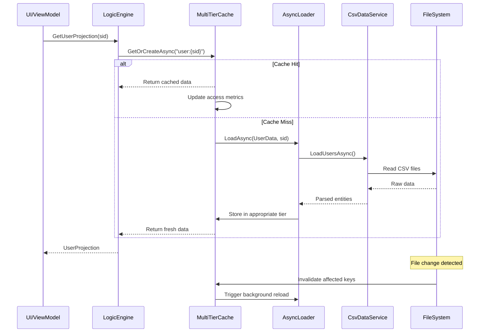
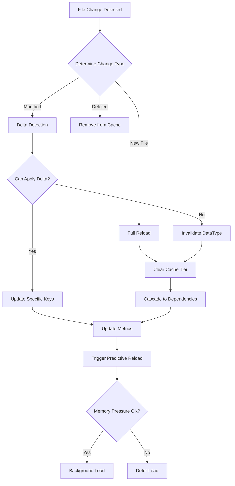

# T-030: Asynchronous Data Loading and Caching Architecture

## Executive Summary

This architectural design document specifies a comprehensive multi-tier caching strategy for the UserMandA enterprise discovery system. The design addresses performance requirements for handling large-scale datasets (tens of thousands of users, devices, and infrastructure components) while maintaining UI responsiveness through asynchronous loading patterns and intelligent cache management.

The architecture introduces a four-tier caching hierarchy (Hot, Warm, Cold, Archive) with adaptive sizing based on memory pressure, predictive pre-loading, and automatic invalidation upon discovery runs or file system changes.

---

## Component Design

### 1. Enhanced LogicEngineService Integration

#### 1.1 Asynchronous Loading Pipeline
```csharp
public interface IAsyncLogicEngineService : ILogicEngineService
{
    // Core async loading methods with cancellation support
    Task<LoadingResult<T>> LoadDataAsync<T>(
        string dataType, 
        LoadingPriority priority = LoadingPriority.Primary,
        CancellationToken cancellationToken = default) where T : class;
    
    // Batch loading for related data
    Task<Dictionary<string, LoadingResult>> LoadBatchAsync(
        string[] dataTypes,
        LoadingPriority priority = LoadingPriority.Primary,
        CancellationToken cancellationToken = default);
    
    // Selective refresh
    Task<RefreshResult> RefreshDataTypeAsync(
        string dataType,
        RefreshStrategy strategy = RefreshStrategy.Incremental,
        CancellationToken cancellationToken = default);
}
```

#### 1.2 Data Type Categorization

**Tier 1: Hot Cache (Always Resident)**
- **Users Core Data** (DisplayName, UPN, SID, Department, Enabled Status)
- **Groups Core Data** (Name, SID, Type, MemberCount)
- **Devices Summary** (Name, OS, LastSeen, PrimaryUser)
- **Dashboard Metrics** (User counts, Device counts, Security scores)
- Size Limit: 5-10MB per data type
- TTL: 30 minutes
- Access Pattern: >10 accesses per minute

**Tier 2: Warm Cache (Frequently Accessed)**
- **Extended User Attributes** (Manager, JobTitle, OfficeLocation, PhoneNumbers)
- **Group Memberships** (Direct members only, not nested)
- **Device Inventory** (Software list, Hardware specs)
- **Application Inventory** (Name, Version, Publisher)
- **Mailbox Statistics** (Size, ItemCount, LastAccessed)
- Size Limit: 50-100MB total
- TTL: 60 minutes
- Access Pattern: 3-10 accesses per minute

**Tier 3: Cold Cache (On-Demand, Compressed)**
- **Deep Lineage Graphs** (Full dependency trees, multi-hop relationships)
- **Historical Data** (Change history, audit logs)
- **File Share ACLs** (Detailed permission matrices)
- **GPO Details** (Full policy settings, WMI filters)
- **Certificate Chains** (Full PKI hierarchies)
- Size Limit: 500MB-1GB (compressed)
- TTL: 120 minutes
- Access Pattern: <3 accesses per minute
- Compression: Brotli or LZ4

**Tier 4: Archive (Metadata Only)**
- **Backup Discovery Runs** (Previous snapshots)
- **Compliance Reports** (Generated documents)
- **Migration Histories** (Completed wave data)
- Only metadata cached (filename, size, timestamp)
- Full data loaded from disk on demand
- TTL: 24 hours

### 2. Cache Invalidation Strategy

#### 2.1 Invalidation Triggers

**File System Triggers:**
```csharp
public class CacheInvalidationRules
{
    // File-based invalidation
    public Dictionary<string, string[]> FilePatternMappings = new()
    {
        ["Users"] = new[] { "*users*.csv", "security_*.csv" },
        ["Groups"] = new[] { "*groups*.csv", "*members*.csv" },
        ["Devices"] = new[] { "*computer*.csv", "*device*.csv" },
        ["Applications"] = new[] { "*app*.csv", "*software*.csv" }
    };
    
    // Dependency-based invalidation
    public Dictionary<string, string[]> DependencyChains = new()
    {
        ["GroupMemberships"] = new[] { "Users", "Groups" },
        ["UserProjections"] = new[] { "Users", "Groups", "Devices" },
        ["SecurityPosture"] = new[] { "Users", "Groups", "ACLs", "GPOs" }
    };
}
```

**Invalidation Rules:**
1. **Immediate Invalidation**: New discovery run detected (new timestamp in discovery metadata)
2. **Cascade Invalidation**: When parent data changes, invalidate dependent caches
3. **Partial Invalidation**: Only invalidate affected records based on delta detection
4. **Time-based Invalidation**: Standard TTL expiration
5. **Memory Pressure Invalidation**: Proactive eviction under memory constraints

#### 2.2 Smart Invalidation Algorithm
```csharp
public class SmartInvalidationEngine
{
    public async Task<InvalidationResult> ProcessFileChangeAsync(
        string filePath, 
        DateTime lastModified)
    {
        // 1. Determine data type from file pattern
        var dataType = DetermineDataType(filePath);
        
        // 2. Check if incremental update is possible
        var deltaChanges = await DetectDeltaChangesAsync(filePath, lastModified);
        
        if (deltaChanges.IsIncremental)
        {
            // 3a. Perform surgical cache update
            await UpdateCacheEntriesAsync(dataType, deltaChanges.ModifiedKeys);
        }
        else
        {
            // 3b. Full invalidation required
            await InvalidateDataTypeAsync(dataType);
            
            // 4. Cascade to dependent caches
            await InvalidateDependenciesAsync(dataType);
        }
        
        // 5. Trigger background reload for hot/warm data
        await TriggerPredictiveReloadAsync(dataType);
    }
}
```

### 3. Memory Management Strategy

#### 3.1 Adaptive Cache Sizing

```csharp
public class AdaptiveCacheSizeManager
{
    private readonly Dictionary<MemoryPressureLevel, CacheSizeProfile> _profiles = new()
    {
        [MemoryPressureLevel.Low] = new CacheSizeProfile
        {
            HotCacheMaxItems = 10000,
            WarmCacheMaxItems = 50000,
            ColdCacheMaxItems = 200000,
            MaxMemoryMB = 2048
        },
        [MemoryPressureLevel.Medium] = new CacheSizeProfile
        {
            HotCacheMaxItems = 5000,
            WarmCacheMaxItems = 25000,
            ColdCacheMaxItems = 100000,
            MaxMemoryMB = 1024
        },
        [MemoryPressureLevel.High] = new CacheSizeProfile
        {
            HotCacheMaxItems = 2500,
            WarmCacheMaxItems = 10000,
            ColdCacheMaxItems = 50000,
            MaxMemoryMB = 512
        },
        [MemoryPressureLevel.Critical] = new CacheSizeProfile
        {
            HotCacheMaxItems = 1000,
            WarmCacheMaxItems = 5000,
            ColdCacheMaxItems = 10000,
            MaxMemoryMB = 256
        }
    };
    
    public async Task AdaptCacheSizesAsync(MemoryPressureLevel pressure)
    {
        var profile = _profiles[pressure];
        await ApplyProfileAsync(profile);
        
        if (pressure >= MemoryPressureLevel.High)
        {
            // Trigger aggressive garbage collection
            await ForceGarbageCollectionAsync();
            
            // Move warm cache items to cold (with compression)
            await DemoteWarmToColdAsync();
        }
    }
}
```

#### 3.2 Memory Limits and Eviction Policies

**Per-DataType Limits:**
- Users: Max 200MB uncompressed, 50MB compressed
- Groups: Max 150MB uncompressed, 30MB compressed  
- Devices: Max 300MB uncompressed, 75MB compressed
- Applications: Max 100MB uncompressed, 25MB compressed
- Infrastructure: Max 500MB uncompressed, 100MB compressed

**Eviction Algorithm:** Multi-factor scoring
```csharp
public double CalculateEvictionScore(ICacheEntry entry)
{
    var age = (DateTime.UtcNow - entry.LastAccessed).TotalMinutes;
    var frequency = entry.AccessCount;
    var size = entry.EstimatedSize;
    
    // Lower score = higher eviction priority
    var score = (frequency * 100) / (age * Math.Log10(size + 1));
    
    // Boost score for certain data types
    if (entry.DataType == "Users" || entry.DataType == "Groups")
        score *= 1.5; // Prefer keeping identity data
    
    return score;
}
```

### 4. Concurrency Model

#### 4.1 Task-based Asynchronous Pattern (TAP)

```csharp
public class ConcurrentDataLoader
{
    private readonly SemaphoreSlim _loadSemaphore;
    private readonly ConcurrentDictionary<string, Task<object>> _loadingTasks;
    
    public async Task<T> GetOrLoadAsync<T>(
        string key,
        Func<Task<T>> factory,
        CancellationToken cancellationToken = default) where T : class
    {
        // Check if already loading
        if (_loadingTasks.TryGetValue(key, out var existingTask))
        {
            return (T)await existingTask.ConfigureAwait(false);
        }
        
        // Create new loading task
        var loadingTask = LoadWithSemaphoreAsync(factory, cancellationToken);
        _loadingTasks[key] = loadingTask;
        
        try
        {
            return await loadingTask.ConfigureAwait(false);
        }
        finally
        {
            _loadingTasks.TryRemove(key, out _);
        }
    }
    
    private async Task<T> LoadWithSemaphoreAsync<T>(
        Func<Task<T>> factory,
        CancellationToken cancellationToken) where T : class
    {
        await _loadSemaphore.WaitAsync(cancellationToken).ConfigureAwait(false);
        try
        {
            return await factory().ConfigureAwait(false);
        }
        finally
        {
            _loadSemaphore.Release();
        }
    }
}
```

#### 4.2 Thread Safety Patterns

**Lock-free Collections:**
- Use `ConcurrentDictionary` for all cache storage
- Use `ImmutableList` for read-only projections
- Use `ReaderWriterLockSlim` for complex graph operations

**Async Coordination:**
```csharp
public class AsyncCoordinator
{
    // Prevent concurrent loads of same data
    private readonly AsyncLock _loadLock = new();
    
    // Coordinate multiple readers, single writer
    private readonly AsyncReaderWriterLock _rwLock = new();
    
    // Batch multiple requests
    private readonly BatchBlock<LoadRequest> _batchBlock = 
        new(batchSize: 10, TimeSpan.FromMilliseconds(100));
}
```

### 5. Integration Points

#### 5.1 LogicEngineService Enhancement

```csharp
public class EnhancedLogicEngineService : LogicEngineService
{
    private readonly MultiTierCacheService _cacheService;
    private readonly AsyncDataLoadingService _asyncLoader;
    private readonly OptimizedCsvFileWatcherService _fileWatcher;
    
    public override async Task<bool> LoadAllAsync()
    {
        var loadTasks = new List<Task<LoadingResult>>();
        
        // Phase 1: Load hot cache data (blocking)
        await LoadHotDataAsync();
        
        // Phase 2: Start warm cache loading (non-blocking)
        loadTasks.Add(LoadWarmDataAsync());
        
        // Phase 3: Register cold data for on-demand loading
        RegisterColdDataProviders();
        
        // Phase 4: Setup file watchers for auto-invalidation
        await _fileWatcher.StartWatchingAsync();
        
        // Wait for warm data with timeout
        await Task.WhenAny(
            Task.WhenAll(loadTasks),
            Task.Delay(TimeSpan.FromSeconds(30))
        );
        
        return true;
    }
    
    private async Task LoadHotDataAsync()
    {
        // Load critical data synchronously
        var criticalLoaders = new[]
        {
            LoadUsersCore(),
            LoadGroupsCore(),
            LoadDevicesSummary(),
            LoadDashboardMetrics()
        };
        
        await Task.WhenAll(criticalLoaders);
    }
}
```

#### 5.2 CsvDataServiceNew Enhancement

```csharp
public class AsyncCsvDataService : CsvDataServiceNew
{
    public async IAsyncEnumerable<T> StreamDataAsync<T>(
        string pattern,
        Func<string[], T> parser,
        [EnumeratorCancellation] CancellationToken cancellationToken = default)
    {
        var files = FindFiles(_activeProfilePath, pattern);
        
        foreach (var file in files)
        {
            await foreach (var item in StreamFileAsync(file, parser, cancellationToken))
            {
                yield return item;
            }
        }
    }
    
    private async IAsyncEnumerable<T> StreamFileAsync<T>(
        string filePath,
        Func<string[], T> parser,
        [EnumeratorCancellation] CancellationToken cancellationToken)
    {
        using var reader = new StreamReader(filePath, bufferSize: 131072); // 128KB buffer
        
        // Skip header
        await reader.ReadLineAsync();
        
        while (!reader.EndOfStream && !cancellationToken.IsCancellationRequested)
        {
            var line = await reader.ReadLineAsync();
            if (string.IsNullOrWhiteSpace(line)) continue;
            
            var values = ParseCsvLine(line);
            yield return parser(values);
        }
    }
}
```

### 6. Performance Targets and Metrics

#### 6.1 Performance SLAs

**Initial Load Times:**
- Dashboard visible: <2 seconds
- Core user/group data: <5 seconds
- Full warm cache: <30 seconds
- Cold data on-demand: <3 seconds per request

**Cache Performance:**
- Hot cache hit ratio: >95%
- Warm cache hit ratio: >80%
- Average retrieval time: <10ms for hot, <50ms for warm
- Memory usage: <2GB typical, <4GB peak

**Concurrency Limits:**
- Max concurrent CSV reads: 3
- Max concurrent cache operations: 10
- Max concurrent UI updates: 5
- Background task pool: 4 threads

#### 6.2 Monitoring Metrics

```csharp
public class CacheMetrics
{
    public long TotalRequests { get; set; }
    public long CacheHits { get; set; }
    public long CacheMisses { get; set; }
    public double HitRatio => CacheHits / (double)TotalRequests;
    
    public Dictionary<CacheTier, TierMetrics> TierMetrics { get; set; }
    public Dictionary<string, DataTypeMetrics> DataTypeMetrics { get; set; }
    
    public TimeSpan AverageLoadTime { get; set; }
    public TimeSpan P95LoadTime { get; set; }
    public TimeSpan P99LoadTime { get; set; }
    
    public long CurrentMemoryUsageMB { get; set; }
    public long PeakMemoryUsageMB { get; set; }
    
    public int ActiveLoadOperations { get; set; }
    public int QueuedLoadOperations { get; set; }
}
```

---

## Data Flow

### Loading Sequence



### Invalidation Flow



---

## Implementation Considerations

### Key Technical Decisions

1. **Memory-Mapped Files**: Consider using memory-mapped files for very large CSV datasets to avoid loading entire files into memory

2. **Streaming Parsers**: Implement `IAsyncEnumerable` for CSV parsing to enable streaming processing without buffering entire datasets

3. **Weak References**: Use `WeakReference<T>` for cold cache items to allow GC to reclaim memory under pressure

4. **Background Service**: Implement cache warming as a hosted background service that runs during idle periods

5. **Circuit Breaker**: Implement circuit breaker pattern for failing data sources to prevent cascade failures

### Trade-offs

**Memory vs Speed:**
- Aggressive caching improves speed but increases memory usage
- Solution: Adaptive sizing based on available memory

**Consistency vs Performance:**
- Immediate invalidation ensures consistency but causes cache misses
- Solution: Incremental updates where possible, full reload as fallback

**Complexity vs Maintainability:**
- Multi-tier cache adds complexity
- Solution: Clear separation of concerns, comprehensive logging

---

## Risk Assessment

### Potential Challenges

1. **Memory Pressure Under Load**
   - Risk: OOM exceptions with large datasets
   - Mitigation: Aggressive eviction, compression, streaming

2. **Cache Coherency Issues**
   - Risk: Stale data shown to users
   - Mitigation: File watchers, TTL, manual refresh option

3. **Thread Contention**
   - Risk: Deadlocks or poor concurrency
   - Mitigation: Lock-free collections, careful async/await usage

4. **Network File System Latency**
   - Risk: Slow CSV reads from network shares
   - Mitigation: Local caching, read-ahead buffering

5. **Complex Dependency Chains**
   - Risk: Cascade invalidations causing cache thrashing
   - Mitigation: Careful dependency mapping, batch invalidation

### Mitigation Strategies

1. **Implement comprehensive telemetry** for cache performance monitoring
2. **Add manual cache management UI** for administrators
3. **Provide fallback to synchronous loading** if async fails
4. **Implement cache persistence** to disk for faster startup
5. **Add configurable cache policies** via settings

---

## Success Metrics

1. **UI Responsiveness**: No UI freezes during data load
2. **Load Performance**: 10x improvement for repeated data access
3. **Memory Efficiency**: <2GB memory usage for 50,000 users
4. **Cache Effectiveness**: >90% cache hit ratio after warm-up
5. **Invalidation Speed**: <100ms to process file changes

---

## Appendix: Configuration Schema

```json
{
  "CacheConfiguration": {
    "Tiers": {
      "Hot": {
        "MaxSizeMB": 100,
        "MaxItems": 10000,
        "TTLMinutes": 30,
        "CompressionEnabled": false
      },
      "Warm": {
        "MaxSizeMB": 500,
        "MaxItems": 50000,
        "TTLMinutes": 60,
        "CompressionEnabled": false
      },
      "Cold": {
        "MaxSizeMB": 2000,
        "MaxItems": 200000,
        "TTLMinutes": 120,
        "CompressionEnabled": true,
        "CompressionAlgorithm": "Brotli"
      }
    },
    "DataTypes": {
      "Users": {
        "DefaultTier": "Hot",
        "PreloadEnabled": true,
        "StreamingEnabled": true
      },
      "Groups": {
        "DefaultTier": "Hot",
        "PreloadEnabled": true,
        "StreamingEnabled": false
      },
      "Devices": {
        "DefaultTier": "Warm",
        "PreloadEnabled": false,
        "StreamingEnabled": true
      }
    },
    "Performance": {
      "MaxConcurrentLoads": 3,
      "MaxConcurrentCacheOps": 10,
      "FileBufferSizeKB": 128,
      "MemoryPressureThresholdMB": 500
    }
  }
}
```

---

*Document Version: 1.0*  
*Date: 2025-01-08*  
*Author: Architecture Lead*  
*Task: T-030 - Implement Asynchronous Data Loading and Caching*