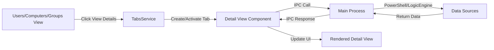

# Epic 1 - Core Data Views Architecture Specification

**Document Version:** 1.0
**Date:** October 2025
**Status:** Implementation-Ready
**Target:** guiv2 TypeScript/React/Electron Implementation

## Executive Summary

This document provides complete architectural specifications for Epic 1: Core Data Views & Functionality. Based on analysis of the WPF implementation, this specification defines the enhanced DataTable component, UsersView, ComputersView, GroupsView, and their respective detail views. The architecture leverages existing patterns from the guiv2 codebase while ensuring 100% feature parity with the original WPF application.

## 1. Enhanced DataTable Component Architecture

### 1.1 Component Overview

**Location:** `src/renderer/components/organisms/DataTable.tsx`

The DataTable component must be enhanced from its current implementation to match WPF DataGrid functionality with the following features:

### 1.2 Core Features

```typescript
interface DataTableProps<T> {
  // Data
  data: T[];
  columns: ColumnDef<T>[];

  // Selection
  enableRowSelection?: boolean;
  enableMultiSelect?: boolean;
  onRowSelect?: (rows: T[]) => void;
  selectedRows?: T[];

  // Context Menu
  contextMenuItems?: ContextMenuItem<T>[];

  // Column Visibility
  enableColumnVisibility?: boolean;
  defaultHiddenColumns?: string[];

  // Export
  enableExport?: boolean;
  exportFormats?: ExportFormat[];
  onExport?: (format: ExportFormat, data: T[]) => void;

  // Search & Filter
  enableGlobalFilter?: boolean;
  globalFilter?: string;
  onGlobalFilterChange?: (value: string) => void;

  // Pagination (existing)
  enablePagination?: boolean;
  pageSize?: number;

  // Sorting (existing)
  enableSorting?: boolean;

  // Loading & Empty States
  isLoading?: boolean;
  loadingMessage?: string;
  emptyMessage?: string;
  emptyIcon?: string;

  // Row Actions
  rowActions?: RowAction<T>[];

  // Performance
  enableVirtualization?: boolean;
}
```

### 1.3 Context Menu System

**Library:** react-contexify (recommended)

```typescript
interface ContextMenuItem<T> {
  id: string;
  label: string;
  icon?: React.ComponentType;
  action: (item: T) => void;
  isEnabled?: (item: T) => boolean;
  isDangerous?: boolean;
  separator?: boolean;
}
```

**Implementation Pattern:**

```typescript
// In DataTable.tsx
import { Menu, Item, Separator, useContextMenu } from 'react-contexify';
import 'react-contexify/dist/ReactContexify.css';

const MENU_ID = 'data-table-context-menu';

// Inside DataTable component
const { show } = useContextMenu({ id: MENU_ID });

const handleContextMenu = (event: React.MouseEvent, row: T) => {
  event.preventDefault();
  show({ event, props: { row } });
};

// Context Menu Component
<Menu id={MENU_ID}>
  {contextMenuItems?.map((item) => (
    item.separator ? (
      <Separator key={item.id} />
    ) : (
      <Item
        key={item.id}
        onClick={({ props }) => item.action(props.row)}
        disabled={item.isEnabled ? !item.isEnabled(props.row) : false}
      >
        {item.icon && <item.icon className="w-4 h-4 mr-2" />}
        {item.label}
      </Item>
    )
  ))}
</Menu>
```

### 1.4 Column Visibility Control

**UI Pattern:** Modal dialog triggered by "Columns" button in toolbar

```typescript
// ColumnVisibilityDialog.tsx
interface ColumnVisibilityDialogProps {
  columns: ColumnDef[];
  visibleColumns: string[];
  onApply: (visibleColumns: string[]) => void;
  onClose: () => void;
}

const ColumnVisibilityDialog: React.FC<ColumnVisibilityDialogProps> = ({
  columns, visibleColumns, onApply, onClose
}) => {
  const [selected, setSelected] = useState(visibleColumns);

  return (
    <Modal isOpen onClose={onClose}>
      <div className="p-6">
        <h2 className="text-xl font-semibold mb-4">Manage Columns</h2>
        <div className="space-y-2 max-h-96 overflow-y-auto">
          {columns.map((column) => (
            <label key={column.id} className="flex items-center">
              <input
                type="checkbox"
                checked={selected.includes(column.id)}
                onChange={(e) => {
                  if (e.target.checked) {
                    setSelected([...selected, column.id]);
                  } else {
                    setSelected(selected.filter(id => id !== column.id));
                  }
                }}
                className="mr-3"
              />
              <span>{column.header}</span>
            </label>
          ))}
        </div>
        <div className="mt-6 flex justify-end space-x-3">
          <button onClick={onClose} className="px-4 py-2">Cancel</button>
          <button
            onClick={() => { onApply(selected); onClose(); }}
            className="px-4 py-2 bg-blue-600 text-white rounded"
          >
            Apply
          </button>
        </div>
      </div>
    </Modal>
  );
};
```

### 1.5 Export Functionality

```typescript
type ExportFormat = 'csv' | 'json' | 'excel';

interface ExportHandler<T> {
  format: ExportFormat;
  handler: (data: T[], columns: ColumnDef<T>[]) => void;
}

// Export implementations
const exportHandlers: Record<ExportFormat, ExportHandler> = {
  csv: {
    format: 'csv',
    handler: (data, columns) => {
      const csv = Papa.unparse(data);
      downloadFile(csv, 'export.csv', 'text/csv');
    }
  },
  json: {
    format: 'json',
    handler: (data) => {
      const json = JSON.stringify(data, null, 2);
      downloadFile(json, 'export.json', 'application/json');
    }
  },
  excel: {
    format: 'excel',
    handler: async (data, columns) => {
      // Use xlsx library
      const ws = XLSX.utils.json_to_sheet(data);
      const wb = XLSX.utils.book_new();
      XLSX.utils.book_append_sheet(wb, ws, "Data");
      XLSX.writeFile(wb, "export.xlsx");
    }
  }
};
```

## 2. Users View Architecture

### 2.1 View Component

**Location:** `src/renderer/views/users/UsersView.tsx`

### 2.2 Column Definitions

Based on the WPF implementation, the UsersView displays the following columns:

```typescript
const userColumns: ColumnDef<UserData>[] = [
  {
    id: 'displayName',
    header: 'Display Name',
    accessorKey: 'DisplayName',
    size: 200
  },
  {
    id: 'userPrincipalName',
    header: 'User Principal Name',
    accessorKey: 'UserPrincipalName',
    size: 250
  },
  {
    id: 'email',
    header: 'Email',
    accessorKey: 'Mail',
    size: 220
  },
  {
    id: 'department',
    header: 'Department',
    accessorKey: 'Department',
    size: 150
  },
  {
    id: 'jobTitle',
    header: 'Job Title',
    accessorKey: 'JobTitle',
    size: 180
  },
  {
    id: 'source',
    header: 'Source',
    accessorKey: 'UserSource',
    size: 120,
    cell: ({ row }) => (
      <span className={cn(
        "font-semibold",
        row.original.UserSource === 'Azure AD' ? 'text-blue-600' : 'text-green-600'
      )}>
        {row.original.UserSource}
      </span>
    )
  },
  {
    id: 'enabled',
    header: 'Enabled',
    accessorKey: 'AccountEnabled',
    size: 80,
    cell: ({ row }) => (
      <input type="checkbox" checked={row.original.AccountEnabled} disabled />
    )
  },
  {
    id: 'samAccount',
    header: 'Sam Account',
    accessorKey: 'SamAccountName',
    size: 120
  },
  {
    id: 'company',
    header: 'Company',
    accessorKey: 'CompanyName',
    size: 120
  },
  {
    id: 'manager',
    header: 'Manager',
    accessorKey: 'ManagerDisplayName',
    size: 150
  },
  {
    id: 'created',
    header: 'Created',
    accessorKey: 'CreatedDateTime',
    size: 120,
    cell: ({ row }) => formatDate(row.original.CreatedDateTime)
  },
  {
    id: 'actions',
    header: 'Actions',
    size: 100,
    cell: ({ row }) => (
      <button
        onClick={() => handleViewDetails(row.original)}
        className="px-3 py-1 bg-green-600 text-white text-xs rounded hover:bg-green-700"
      >
        View Details
      </button>
    )
  }
];
```

### 2.3 Context Menu Items

```typescript
const userContextMenuItems: ContextMenuItem<UserData>[] = [
  {
    id: 'view-details',
    label: 'View Details',
    icon: Eye,
    action: (user) => handleViewDetails(user)
  },
  {
    id: 'copy-upn',
    label: 'Copy UPN',
    icon: Copy,
    action: (user) => {
      navigator.clipboard.writeText(user.UserPrincipalName);
      toast.success('UPN copied to clipboard');
    }
  },
  {
    id: 'copy-email',
    label: 'Copy Email',
    icon: Mail,
    action: (user) => {
      navigator.clipboard.writeText(user.Mail);
      toast.success('Email copied to clipboard');
    }
  },
  {
    id: 'separator-1',
    separator: true
  },
  {
    id: 'export-selection',
    label: 'Export Selection',
    icon: Download,
    action: (user) => handleExportSelection([user])
  },
  {
    id: 'add-to-wave',
    label: 'Add to Migration Wave',
    icon: Plus,
    action: (user) => handleAddToWave(user)
  }
];
```

### 2.4 Logic Hook

**Location:** `src/renderer/hooks/useUsersViewLogic.ts`

```typescript
export const useUsersViewLogic = () => {
  const { users, isLoading, error, setUsers } = useDiscoveryStore();
  const { selectedProfile } = useProfileStore();
  const { openTab } = useTabStore();

  const [searchText, setSearchText] = useState('');
  const [selectedUsers, setSelectedUsers] = useState<UserData[]>([]);

  // Load users on mount and profile change
  useEffect(() => {
    const loadUsers = async () => {
      if (!selectedProfile) return;

      try {
        const result = await window.electron.invoke('get-users', {
          profile: selectedProfile.companyName
        });

        if (result.success) {
          setUsers(result.data);
        } else {
          toast.error(result.error || 'Failed to load users');
        }
      } catch (error) {
        console.error('Failed to load users:', error);
        toast.error('Failed to load users');
      }
    };

    loadUsers();
  }, [selectedProfile, setUsers]);

  // Filter users based on search
  const filteredUsers = useMemo(() => {
    if (!searchText) return users;

    const search = searchText.toLowerCase();
    return users.filter(user =>
      user.DisplayName?.toLowerCase().includes(search) ||
      user.UserPrincipalName?.toLowerCase().includes(search) ||
      user.Mail?.toLowerCase().includes(search) ||
      user.Department?.toLowerCase().includes(search)
    );
  }, [users, searchText]);

  // View user details - opens in new tab
  const handleViewDetails = useCallback((user: UserData) => {
    const tabKey = `userdetail_${user.UserPrincipalName || user.SamAccountName}`;
    const tabTitle = `User Details - ${user.DisplayName}`;

    openTab({
      id: tabKey,
      title: tabTitle,
      component: 'UserDetailView',
      props: { userId: user.UserPrincipalName || user.SamAccountName }
    });
  }, [openTab]);

  // Export functionality
  const handleExport = useCallback(async (format: ExportFormat) => {
    const dataToExport = selectedUsers.length > 0 ? selectedUsers : filteredUsers;

    await window.electron.invoke('export-data', {
      data: dataToExport,
      format,
      filename: `users_export_${Date.now()}`
    });

    toast.success(`Exported ${dataToExport.length} users`);
  }, [selectedUsers, filteredUsers]);

  // Refresh users
  const handleRefresh = useCallback(async () => {
    await window.electron.invoke('refresh-users', {
      profile: selectedProfile?.companyName
    });
  }, [selectedProfile]);

  return {
    users: filteredUsers,
    isLoading,
    error,
    searchText,
    setSearchText,
    selectedUsers,
    setSelectedUsers,
    handleViewDetails,
    handleExport,
    handleRefresh
  };
};
```

## 3. User Detail View Architecture

### 3.1 View Component

**Location:** `src/renderer/views/users/UserDetailView.tsx`

Since no specific UserDetailView exists in the WPF codebase (it uses dynamic tab creation), we'll design based on typical user detail requirements:

### 3.2 Layout Sections

```typescript
interface UserDetailSections {
  overview: UserOverviewData;
  groups: GroupMembership[];
  devices: AssignedDevice[];
  permissions: Permission[];
  mailbox: MailboxInfo;
  licenses: License[];
  activity: ActivityLog[];
}

const UserDetailView: React.FC<{ userId: string }> = ({ userId }) => {
  const { userDetail, loading } = useUserDetailLogic(userId);

  return (
    <div className="p-6 space-y-6">
      {/* Header Section */}
      <div className="bg-white dark:bg-gray-800 rounded-lg p-6 shadow">
        <div className="flex items-center space-x-4">
          <Avatar name={userDetail.DisplayName} size="large" />
          <div>
            <h1 className="text-2xl font-bold">{userDetail.DisplayName}</h1>
            <p className="text-gray-600">{userDetail.JobTitle}</p>
            <p className="text-sm text-gray-500">{userDetail.Department}</p>
          </div>
        </div>
      </div>

      {/* Tab Navigation */}
      <Tabs defaultValue="overview">
        <TabsList>
          <TabsTrigger value="overview">Overview</TabsTrigger>
          <TabsTrigger value="groups">Groups ({userDetail.groups?.length || 0})</TabsTrigger>
          <TabsTrigger value="devices">Devices ({userDetail.devices?.length || 0})</TabsTrigger>
          <TabsTrigger value="permissions">Permissions</TabsTrigger>
          <TabsTrigger value="mailbox">Mailbox</TabsTrigger>
          <TabsTrigger value="licenses">Licenses</TabsTrigger>
          <TabsTrigger value="activity">Activity</TabsTrigger>
        </TabsList>

        <TabsContent value="overview">
          <UserOverviewSection data={userDetail.overview} />
        </TabsContent>

        <TabsContent value="groups">
          <GroupMembershipSection groups={userDetail.groups} />
        </TabsContent>

        <TabsContent value="devices">
          <DevicesSection devices={userDetail.devices} />
        </TabsContent>

        {/* Additional tab contents... */}
      </Tabs>
    </div>
  );
};
```

### 3.3 Data Loading Strategy

```typescript
// useUserDetailLogic.ts
export const useUserDetailLogic = (userId: string) => {
  const [userDetail, setUserDetail] = useState<UserDetailProjection | null>(null);
  const [loading, setLoading] = useState(true);
  const [error, setError] = useState<string | null>(null);

  useEffect(() => {
    const loadUserDetail = async () => {
      setLoading(true);
      setError(null);

      try {
        // Main user detail call - gets correlated data from LogicEngine
        const result = await window.electron.invoke('get-user-detail', { userId });

        if (result.success) {
          setUserDetail(result.data);
        } else {
          setError(result.error);
        }
      } catch (err) {
        setError('Failed to load user details');
        console.error(err);
      } finally {
        setLoading(false);
      }
    };

    loadUserDetail();
  }, [userId]);

  return { userDetail, loading, error };
};
```

## 4. Computers View Architecture

### 4.1 Column Definitions

Based on ComputersView.xaml analysis:

```typescript
const computerColumns: ColumnDef<InfrastructureData>[] = [
  {
    id: 'name',
    header: 'Name',
    accessorKey: 'Name',
    size: 200
  },
  {
    id: 'type',
    header: 'Type',
    accessorKey: 'Type',
    size: 150
  },
  {
    id: 'description',
    header: 'Description',
    accessorKey: 'Description',
    size: 250
  },
  {
    id: 'ipAddress',
    header: 'IP Address',
    accessorKey: 'IPAddress',
    size: 150
  },
  {
    id: 'os',
    header: 'OS',
    accessorKey: 'OperatingSystem',
    size: 150
  },
  {
    id: 'version',
    header: 'Version',
    accessorKey: 'Version',
    size: 100
  },
  {
    id: 'location',
    header: 'Location',
    accessorKey: 'Location',
    size: 150
  },
  {
    id: 'status',
    header: 'Status',
    accessorKey: 'Status',
    size: 100,
    cell: ({ row }) => (
      <StatusBadge status={row.original.Status} />
    )
  },
  {
    id: 'manufacturer',
    header: 'Manufacturer',
    accessorKey: 'Manufacturer',
    size: 150
  },
  {
    id: 'model',
    header: 'Model',
    accessorKey: 'Model',
    size: 150
  },
  {
    id: 'lastSeen',
    header: 'Last Seen',
    accessorKey: 'LastSeen',
    size: 150,
    cell: ({ row }) => formatDateTime(row.original.LastSeen)
  },
  {
    id: 'actions',
    header: 'Actions',
    size: 100,
    cell: ({ row }) => (
      <button
        onClick={() => handleViewAssetDetail(row.original)}
        className="px-3 py-1 bg-green-600 text-white text-xs rounded"
      >
        View Details
      </button>
    )
  }
];
```

### 4.2 Context Menu Items

```typescript
const computerContextMenuItems: ContextMenuItem<InfrastructureData>[] = [
  {
    id: 'view-details',
    label: 'View Details',
    icon: Eye,
    action: (computer) => handleViewAssetDetail(computer)
  },
  {
    id: 'copy-name',
    label: 'Copy Computer Name',
    icon: Copy,
    action: (computer) => {
      navigator.clipboard.writeText(computer.Name);
      toast.success('Computer name copied');
    }
  },
  {
    id: 'copy-ip',
    label: 'Copy IP Address',
    icon: Network,
    action: (computer) => {
      navigator.clipboard.writeText(computer.IPAddress);
      toast.success('IP address copied');
    }
  },
  {
    id: 'separator-1',
    separator: true
  },
  {
    id: 'ping-computer',
    label: 'Ping Computer',
    icon: Activity,
    action: async (computer) => {
      const result = await window.electron.invoke('ping-computer', {
        hostname: computer.Name
      });
      toast.info(result.message);
    }
  },
  {
    id: 'remote-desktop',
    label: 'Remote Desktop',
    icon: Monitor,
    action: (computer) => handleRemoteDesktop(computer)
  },
  {
    id: 'separator-2',
    separator: true
  },
  {
    id: 'export-selection',
    label: 'Export Selection',
    icon: Download,
    action: (computer) => handleExportSelection([computer])
  }
];
```

## 5. Computer Detail View Architecture

### 5.1 Layout Sections

```typescript
interface ComputerDetailSections {
  overview: ComputerOverview;
  hardware: HardwareSpecs;
  software: InstalledSoftware[];
  users: AssignedUsers[];
  network: NetworkConfiguration;
  storage: StorageInfo[];
  events: SystemEvents[];
}

const ComputerDetailView: React.FC<{ computerId: string }> = ({ computerId }) => {
  const { computerDetail, loading } = useComputerDetailLogic(computerId);

  return (
    <div className="p-6 space-y-6">
      {/* Header with computer info and status */}
      <div className="bg-white dark:bg-gray-800 rounded-lg p-6 shadow">
        <div className="flex justify-between items-start">
          <div>
            <h1 className="text-2xl font-bold">{computerDetail.Name}</h1>
            <p className="text-gray-600">{computerDetail.OperatingSystem}</p>
            <p className="text-sm text-gray-500">{computerDetail.Model}</p>
          </div>
          <StatusIndicator status={computerDetail.Status} />
        </div>
      </div>

      {/* Hardware and Software sections in tabs */}
      <Tabs defaultValue="overview">
        <TabsList>
          <TabsTrigger value="overview">Overview</TabsTrigger>
          <TabsTrigger value="hardware">Hardware</TabsTrigger>
          <TabsTrigger value="software">Software ({computerDetail.software?.length || 0})</TabsTrigger>
          <TabsTrigger value="users">Users</TabsTrigger>
          <TabsTrigger value="network">Network</TabsTrigger>
          <TabsTrigger value="storage">Storage</TabsTrigger>
          <TabsTrigger value="events">Events</TabsTrigger>
        </TabsList>

        {/* Tab contents... */}
      </Tabs>
    </div>
  );
};
```

## 6. Groups View Architecture

### 6.1 Column Definitions

Based on GroupsView.xaml:

```typescript
const groupColumns: ColumnDef<GroupData>[] = [
  {
    id: 'displayName',
    header: 'Group Name',
    accessorKey: 'DisplayName',
    size: 200
  },
  {
    id: 'groupType',
    header: 'Group Type',
    accessorKey: 'GroupType',
    size: 150
  },
  {
    id: 'mailEnabled',
    header: 'Mail Enabled',
    accessorKey: 'MailEnabled',
    size: 80,
    cell: ({ row }) => (
      <input type="checkbox" checked={row.original.MailEnabled} disabled />
    )
  },
  {
    id: 'securityEnabled',
    header: 'Security Enabled',
    accessorKey: 'SecurityEnabled',
    size: 80,
    cell: ({ row }) => (
      <input type="checkbox" checked={row.original.SecurityEnabled} disabled />
    )
  },
  {
    id: 'mail',
    header: 'Mail',
    accessorKey: 'Mail',
    size: 220
  },
  {
    id: 'created',
    header: 'Created',
    accessorKey: 'CreatedDateTime',
    size: 120,
    cell: ({ row }) => formatDate(row.original.CreatedDateTime)
  },
  {
    id: 'memberCount',
    header: 'Members',
    accessorKey: 'MemberCount',
    size: 80,
    cell: ({ row }) => (
      <span className="font-semibold">{row.original.MemberCount || 0}</span>
    )
  },
  {
    id: 'actions',
    header: 'Actions',
    size: 100,
    cell: ({ row }) => (
      <button
        onClick={() => handleViewGroupDetail(row.original)}
        className="px-3 py-1 bg-green-600 text-white text-xs rounded"
      >
        View Details
      </button>
    )
  }
];
```

### 6.2 Group Detail View

```typescript
interface GroupDetailSections {
  overview: GroupOverview;
  members: GroupMember[];
  nestedGroups: NestedGroup[];
  permissions: GroupPermission[];
  owners: GroupOwner[];
}

const GroupDetailView: React.FC<{ groupId: string }> = ({ groupId }) => {
  const { groupDetail, loading } = useGroupDetailLogic(groupId);

  return (
    <div className="p-6 space-y-6">
      <div className="bg-white dark:bg-gray-800 rounded-lg p-6 shadow">
        <h1 className="text-2xl font-bold">{groupDetail.DisplayName}</h1>
        <div className="flex space-x-4 mt-2">
          {groupDetail.MailEnabled && (
            <Badge variant="blue">Mail Enabled</Badge>
          )}
          {groupDetail.SecurityEnabled && (
            <Badge variant="green">Security Enabled</Badge>
          )}
        </div>
      </div>

      <Tabs defaultValue="members">
        <TabsList>
          <TabsTrigger value="members">Members ({groupDetail.members?.length || 0})</TabsTrigger>
          <TabsTrigger value="nested">Nested Groups ({groupDetail.nestedGroups?.length || 0})</TabsTrigger>
          <TabsTrigger value="permissions">Permissions</TabsTrigger>
          <TabsTrigger value="owners">Owners</TabsTrigger>
        </TabsList>

        <TabsContent value="members">
          <DataTable
            data={groupDetail.members}
            columns={memberColumns}
            enableExport
            enableGlobalFilter
          />
        </TabsContent>

        {/* Additional tab contents... */}
      </Tabs>
    </div>
  );
};
```

## 7. Data Flow Architecture

### 7.1 List View → Detail View Navigation



### 7.2 PowerShell Integration Points

```typescript
// Main process IPC handlers (ipcHandlers.ts)

// Users
ipcMain.handle('get-users', async (_, { profile }) => {
  return await powerShellService.executeModule('Get-AllUsers.psm1', { profile });
});

ipcMain.handle('get-user-detail', async (_, { userId }) => {
  // Uses LogicEngineService for correlated data
  return await logicEngineService.getUserDetailProjection(userId);
});

// Computers
ipcMain.handle('get-computers', async (_, { profile }) => {
  return await powerShellService.executeModule('Get-AllComputers.psm1', { profile });
});

ipcMain.handle('get-computer-detail', async (_, { computerId }) => {
  return await logicEngineService.getComputerDetailProjection(computerId);
});

// Groups
ipcMain.handle('get-groups', async (_, { profile }) => {
  return await powerShellService.executeModule('Get-AllGroups.psm1', { profile });
});

ipcMain.handle('get-group-detail', async (_, { groupId }) => {
  return await logicEngineService.getGroupDetailProjection(groupId);
});
```

### 7.3 Cache Strategy

```typescript
// PowerShellService cache management
class PowerShellService {
  private cache = new Map<string, CacheEntry>();
  private readonly CACHE_TTL = 5 * 60 * 1000; // 5 minutes

  async executeModule(moduleName: string, params: any) {
    const cacheKey = `${moduleName}_${JSON.stringify(params)}`;

    // Check cache
    const cached = this.cache.get(cacheKey);
    if (cached && Date.now() - cached.timestamp < this.CACHE_TTL) {
      return cached.data;
    }

    // Execute PowerShell
    const result = await this.executePowerShell(moduleName, params);

    // Update cache
    this.cache.set(cacheKey, {
      data: result,
      timestamp: Date.now()
    });

    return result;
  }
}
```

## 8. Implementation Guidance

### 8.1 Component File Structure

```
src/renderer/
├── components/
│   └── organisms/
│       ├── DataTable.tsx (enhanced)
│       ├── DataTableContextMenu.tsx (new)
│       └── ColumnVisibilityDialog.tsx (new)
├── views/
│   ├── users/
│   │   ├── UsersView.tsx
│   │   └── UserDetailView.tsx
│   ├── computers/
│   │   ├── ComputersView.tsx
│   │   └── ComputerDetailView.tsx
│   └── groups/
│       ├── GroupsView.tsx
│       └── GroupDetailView.tsx
└── hooks/
    ├── useUsersViewLogic.ts
    ├── useUserDetailLogic.ts
    ├── useComputersViewLogic.ts
    ├── useComputerDetailLogic.ts
    ├── useGroupsViewLogic.ts
    └── useGroupDetailLogic.ts
```

### 8.2 Store Modifications

```typescript
// Enhance useDiscoveryStore
interface DiscoveryStore {
  // Existing
  users: UserData[];
  groups: GroupData[];
  computers: InfrastructureData[];

  // Add detail data
  userDetails: Map<string, UserDetailProjection>;
  computerDetails: Map<string, ComputerDetailProjection>;
  groupDetails: Map<string, GroupDetailProjection>;

  // Actions
  setUserDetail: (userId: string, detail: UserDetailProjection) => void;
  setComputerDetail: (computerId: string, detail: ComputerDetailProjection) => void;
  setGroupDetail: (groupId: string, detail: GroupDetailProjection) => void;
}
```

### 8.3 TabsService Integration

```typescript
// Update TabStore to handle detail views
interface Tab {
  id: string;
  title: string;
  component: string;
  props?: Record<string, any>; // Pass userId, computerId, etc.
}

// ViewRegistry enhancement
const viewComponents = {
  UsersView: lazy(() => import('./views/users/UsersView')),
  UserDetailView: lazy(() => import('./views/users/UserDetailView')),
  ComputersView: lazy(() => import('./views/computers/ComputersView')),
  ComputerDetailView: lazy(() => import('./views/computers/ComputerDetailView')),
  GroupsView: lazy(() => import('./views/groups/GroupsView')),
  GroupDetailView: lazy(() => import('./views/groups/GroupDetailView')),
  // ... existing views
};
```

## 9. Performance Optimizations

### 9.1 Virtualization

- Enable virtualization for DataTable when data > 100 rows
- Use react-window or @tanstack/react-virtual
- Implement lazy loading for detail view sections

### 9.2 Data Loading

- Implement progressive loading for detail views
- Load overview first, then additional sections on demand
- Cache detail data in Zustand store for navigation history

### 9.3 Memory Management

- Clear detail cache when tabs close
- Implement LRU cache for detail data (max 10 entries)
- Use React.memo for DataTable rows

## 10. Testing Requirements

### 10.1 Component Tests

```typescript
// DataTable.test.tsx
describe('DataTable', () => {
  it('should render data correctly');
  it('should handle context menu interactions');
  it('should manage column visibility');
  it('should export data in multiple formats');
  it('should handle row selection');
});
```

### 10.2 Integration Tests

```typescript
// UsersView.integration.test.tsx
describe('UsersView Integration', () => {
  it('should load users on mount');
  it('should filter users based on search');
  it('should open detail view on action click');
  it('should handle export functionality');
});
```

### 10.3 E2E Tests

```typescript
// users-flow.e2e.test.ts
describe('Users Flow E2E', () => {
  it('should navigate from users list to detail and back');
  it('should persist filters across navigation');
  it('should handle concurrent detail view tabs');
});
```

## 11. Accessibility Requirements

### 11.1 Keyboard Navigation

- Full keyboard navigation in DataTable (arrow keys, tab)
- Context menu keyboard support (right-click or Shift+F10)
- Modal dialogs trap focus
- Tab navigation between detail view sections

### 11.2 Screen Reader Support

- Proper ARIA labels for all interactive elements
- Announce loading states
- Table headers properly associated with cells
- Status changes announced

### 11.3 High Contrast Mode

- Ensure all UI elements visible in high contrast
- Maintain color coding meaning through patterns/icons
- Sufficient contrast ratios (WCAG AA compliance)

## 12. Error Handling

### 12.1 Loading States

```typescript
// Consistent loading pattern
const LoadingState = () => (
  <div className="flex flex-col items-center justify-center h-64">
    <Spinner size="large" />
    <p className="mt-4 text-gray-600">{loadingMessage}</p>
  </div>
);
```

### 12.2 Error States

```typescript
// Consistent error pattern
const ErrorState = ({ error, onRetry }) => (
  <div className="flex flex-col items-center justify-center h-64">
    <AlertCircle className="w-12 h-12 text-red-500" />
    <p className="mt-4 text-gray-800 font-semibold">Failed to load data</p>
    <p className="mt-2 text-gray-600">{error}</p>
    <button onClick={onRetry} className="mt-4 btn-primary">
      Retry
    </button>
  </div>
);
```

### 12.3 Empty States

```typescript
// Consistent empty state pattern
const EmptyState = ({ icon, message, action }) => (
  <div className="flex flex-col items-center justify-center h-64">
    {icon}
    <p className="mt-4 text-gray-600">{message}</p>
    {action && (
      <button onClick={action.onClick} className="mt-4 btn-secondary">
        {action.label}
      </button>
    )}
  </div>
);
```

## 13. Migration Notes

### 13.1 WPF → React Pattern Mappings

| WPF Pattern | React Implementation |
|------------|---------------------|
| DataGrid | DataTable with TanStack Table |
| ContextMenu | react-contexify |
| TabControl | TabsService + React Router |
| Commands | Hook functions + callbacks |
| Converters | Cell renderers in column defs |
| Triggers | Conditional rendering |
| Virtualization | react-window/virtual |

### 13.2 Key Differences

1. **Tab Navigation**: WPF uses TabsService class, React uses Zustand store
2. **Data Binding**: WPF uses XAML bindings, React uses props/state
3. **Commands**: WPF uses ICommand, React uses functions
4. **Styling**: WPF uses XAML styles, React uses Tailwind CSS

## 14. Implementation Priority

1. **Phase 1**: Enhanced DataTable component (8 hours)
   - Context menu system
   - Column visibility
   - Export functionality

2. **Phase 2**: UsersView + UserDetailView (6 hours)
   - Complete view implementation
   - Hook logic
   - IPC integration

3. **Phase 3**: ComputersView + ComputerDetailView (6 hours)
   - Reuse patterns from Phase 2
   - Computer-specific features

4. **Phase 4**: GroupsView + GroupDetailView (4 hours)
   - Simpler than users/computers
   - Member management focus

5. **Phase 5**: Testing & Polish (4 hours)
   - Component tests
   - Integration tests
   - Performance optimization

**Total Estimated Time**: 28 hours

## 15. Success Criteria

✅ DataTable matches WPF DataGrid functionality
✅ Context menus work with keyboard and mouse
✅ Column visibility persists per view
✅ Export supports CSV, JSON, Excel
✅ All three views load data from PowerShell
✅ Detail views open in tabs (not modals)
✅ Navigation between list and detail seamless
✅ Search/filter functionality matches WPF
✅ Performance with 10,000+ rows acceptable
✅ Accessibility standards met (WCAG AA)

## Appendix A: Type Definitions

```typescript
// Complete type definitions for all data models
interface UserData {
  DisplayName: string;
  UserPrincipalName: string;
  Mail: string;
  Department: string;
  JobTitle: string;
  UserSource: 'Azure AD' | 'Active Directory' | 'LogicEngine';
  AccountEnabled: boolean;
  SamAccountName: string;
  CompanyName: string;
  ManagerDisplayName: string;
  CreatedDateTime: string;
}

interface InfrastructureData {
  Name: string;
  Type: string;
  Description: string;
  IPAddress: string;
  OperatingSystem: string;
  Version: string;
  Location: string;
  Status: 'Online' | 'Offline' | 'Unknown';
  Manufacturer: string;
  Model: string;
  LastSeen: string;
}

interface GroupData {
  DisplayName: string;
  GroupType: string;
  MailEnabled: boolean;
  SecurityEnabled: boolean;
  Mail: string;
  CreatedDateTime: string;
  MemberCount: number;
}
```

## Appendix B: PowerShell Module References

| View | PowerShell Module | CSV Files |
|------|------------------|-----------|
| UsersView | Modules/Discovery/Get-AllUsers.psm1 | Users_Source.csv, Users_Target.csv |
| ComputersView | Modules/Discovery/Get-AllComputers.psm1 | Infrastructure.csv |
| GroupsView | Modules/Discovery/Get-AllGroups.psm1 | Groups_Source.csv, Groups_Target.csv |

---

**Document Status**: Complete and ready for implementation by gui-module-executor
**Next Steps**: Begin Phase 1 with DataTable enhancement