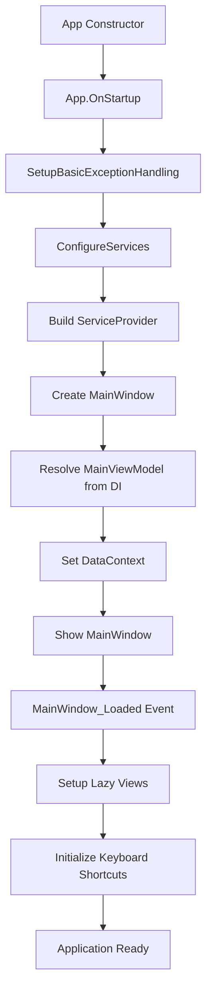

# M&A Discovery Suite - Startup Sequence & Dependency Injection Analysis

**Document Version:** 1.0
**Analysis Date:** 2025-09-30
**Analyzed By:** Ultra-Autonomous Architecture Lead (Claude)
**Status:** ⚠️ CRITICAL - Missing Service Registrations Identified

---

## Executive Summary

### Critical Findings
- **NO MERGE CONFLICTS DETECTED** ✅
- **MISSING SERVICE REGISTRATIONS** ⚠️ - 2 critical services not registered in DI container
- **STARTUP SEQUENCE** ✅ - Well-structured with comprehensive error handling
- **DEPENDENCY CHAIN** ✅ - Properly designed but incomplete registration

### Impact Assessment
- **Severity:** HIGH - Application will fail to start due to missing DI registrations
- **Affected Components:** MainViewModel initialization, startup pipeline
- **User Impact:** Complete application failure on launch
- **Fix Complexity:** LOW - Simple service registrations required

---

## 1. Dependency Injection Configuration Analysis

### 1.1 Current DI Configuration (App.xaml.cs)

**File:** `D:\Scripts\UserMandA\GUI\App.xaml.cs`
**Method:** `ConfigureServices()` (Lines 73-131)

#### Currently Registered Services

```csharp
// Logging Infrastructure
services.AddLogging(builder => {
    builder.AddConsole();
    builder.AddDebug();
    builder.SetMinimumLevel(LogLevel.Information);
});

// MVVM Messaging
services.AddSingleton<IMessenger>(WeakReferenceMessenger.Default);

// Core Services
services.AddSingleton<ConfigurationService>();                    // ✅ Line 91
services.AddSingleton<AuditService>();                            // ✅ Line 92
services.AddSingleton<CsvDataValidationService>();                // ✅ Lines 95-99
services.AddSingleton<ILogManagementService, LogManagementService>(); // ✅ Line 100
services.AddSingleton<ThemeService>();                            // ✅ Line 101
services.AddSingleton<UIInteractionLoggingService>();             // ✅ Line 102
services.AddSingleton<CsvFileWatcherService>();                   // ✅ Line 103

// Data Services
services.AddSingleton<ICsvDataLoader>(sp => {                     // ✅ Lines 104-108
    var logger = sp.GetRequiredService<ILogger<CsvDataServiceNew>>();
    return (ICsvDataLoader)new CsvDataServiceNew(logger, "ljpops");
});

// Navigation Services
services.AddSingleton<NavigationService>();                       // ✅ Line 109
services.AddSingleton<TabsService>();                             // ✅ Line 113

// Discovery Services
services.AddSingleton<DiscoveryService>();                        // ✅ Line 110
services.AddSingleton<IDiscoveryService>(                         // ✅ Lines 111
    provider => provider.GetRequiredService<DiscoveryService>());
services.AddSingleton<ModuleRegistryService>(                     // ✅ Line 112
    provider => ModuleRegistryService.Instance);

// Environment Services
services.AddSingleton<IEnvironmentDetectionService,               // ✅ Line 114
    EnvironmentDetectionService>();
services.AddSingleton<IConnectionTestService,                     // ✅ Line 115
    ConnectionTestService>();

// ViewModels
services.AddTransient<DiscoveryViewModel>();                      // ✅ Line 116
services.AddSingleton<MainViewModel>();                           // ✅ Line 117

// Additional Services
services.AddSingleton<ProfileService>();                          // ✅ Line 118
services.AddSingleton<IKeyboardShortcutService,                   // ✅ Line 119
    KeyboardShortcutService>();
services.AddSingleton<AnimationOptimizationService>();            // ✅ Line 120
```

### 1.2 Missing Service Registrations ⚠️

**MainViewModel Constructor Requirements** (Line 599-601):

```csharp
public MainViewModel(
    ILogger<MainViewModel> logger,              // ✅ Provided by AddLogging()
    TabsService tabsService,                    // ✅ Registered line 113
    NavigationService navigationService,        // ✅ Registered line 109
    IDiscoveryService discoveryService,         // ✅ Registered line 111
    DataExportService dataExportService,        // ❌ NOT REGISTERED
    ModuleRegistryService moduleRegistryService,// ✅ Registered line 112
    LogicEngineService logicEngineService)      // ❌ NOT REGISTERED
```

#### Critical Missing Services

1. **DataExportService** ❌
   - **Location:** `D:\Scripts\UserMandA\GUI\Services\DataExportService.cs`
   - **Required By:** MainViewModel constructor (Line 600)
   - **Impact:** ArgumentNullException at line 624
   - **Registration Required:** `services.AddSingleton<DataExportService>();`

2. **LogicEngineService** ❌
   - **Location:** `D:\Scripts\UserMandA\GUI\Services\LogicEngineService.cs`
   - **Alternative:** `D:\Scripts\UserMandA\GUI\Services\LogicEngineServiceOptimized.cs`
   - **Required By:** MainViewModel constructor (Line 601)
   - **Impact:** ArgumentNullException at line 626
   - **Registration Required:** `services.AddSingleton<LogicEngineService>();`

---

## 2. Startup Sequence Analysis

### 2.1 Application Startup Flow



### 2.2 Detailed Startup Sequence

#### Phase 1: App Constructor (Lines 39-64)
- **Purpose:** Emergency logging initialization
- **Output:** `C:\Temp\manda-emergency-startup.log`
- **Error Handling:** Try-catch with MessageBox fallback
- **Status:** ✅ Robust implementation

#### Phase 2: App.OnStartup (Lines 133-236)
1. **Exception Handling Setup** (Line 141)
   - Serilog configuration: `C:\discoverydata\ljpops\Logs\MandADiscoverySuite_*.log`
   - UI thread exception handler
   - Background thread exception handler
   - Task exception handler
   - **Status:** ✅ Comprehensive coverage

2. **DI Configuration** (Line 152)
   - Calls `ConfigureServices()`
   - Builds ServiceProvider
   - **Status:** ⚠️ Missing 2 service registrations

3. **MainWindow Creation** (Lines 191-206)
   - Creates MainWindow instance
   - Sets as Application.MainWindow
   - Shows window
   - **Status:** ✅ Proper instantiation

#### Phase 3: MainWindow Constructor (Lines 26-101)
1. **Keyboard Shortcut Manager** (Lines 35-55)
   - Optional initialization
   - Graceful degradation if unavailable
   - **Status:** ✅ Defensive coding

2. **InitializeComponent** (Line 58)
   - XAML parsing and resource loading
   - **Status:** ✅ Standard WPF initialization

3. **MainViewModel Resolution** (Line 63)
   - **Critical Step:** `App.ServiceProvider.GetRequiredService<MainViewModel>()`
   - **Will Fail If:** Missing dependencies not registered
   - **Status:** ❌ Will throw exception due to missing DataExportService, LogicEngineService

4. **DataContext Binding** (Line 67)
   - Binds MainViewModel to window
   - **Status:** ✅ Proper MVVM pattern

#### Phase 4: MainWindow_Loaded Event (Lines 117-303)
1. **Lazy View Setup** (Lines 169-275)
   - Registers 14+ views for lazy loading
   - Sets up refresh commands for data views
   - **Status:** ✅ Performance optimization

2. **Background Pre-initialization** (Lines 278-282)
   - 2-second delay
   - Pre-loads critical views
   - **Status:** ✅ UX optimization

3. **Keyboard Shortcuts** (Lines 285-289)
   - Window-level shortcut registration
   - **Status:** ✅ Proper integration

---

## 3. MainViewModel Dependency Chain

### 3.1 Complete Dependency Tree

```
MainViewModel
├── ILogger<MainViewModel> ✅
│   └── Provided by services.AddLogging()
├── TabsService ✅
│   └── Registered as Singleton (Line 113)
├── NavigationService ✅
│   └── Registered as Singleton (Line 109)
│   └── Depends on: None (standalone)
├── IDiscoveryService ✅
│   └── Implemented by DiscoveryService
│   └── Registered as Singleton (Line 111)
│   └── Depends on: ILogger<DiscoveryService>
├── DataExportService ❌ NOT REGISTERED
│   └── Location: Services/DataExportService.cs
│   └── Constructor: private DataExportService() - Singleton pattern
│   └── Dependencies: NONE (uses Instance property)
│   └── Note: Access via DataExportService.Instance
├── ModuleRegistryService ✅
│   └── Registered via Instance pattern (Line 112)
│   └── Singleton via ModuleRegistryService.Instance
└── LogicEngineService ❌ NOT REGISTERED
    └── Location: Services/LogicEngineService.cs
    └── Constructor: public LogicEngineService(ILogger<LogicEngineService>, MultiTierCacheService? = null, string? dataRoot = null)
    └── Required Dependencies:
        └── ILogger<LogicEngineService> (REQUIRED)
    └── Optional Dependencies:
        ├── MultiTierCacheService (optional, nullable)
        └── dataRoot (optional, defaults to "C:\discoverydata\ljpops\RawData\")
```

### 3.2 Secondary Dependencies (Loaded via App.ServiceProvider)

MainViewModel also directly accesses (Lines 629-630):
```csharp
_environmentDetectionService = App.ServiceProvider.GetRequiredService<IEnvironmentDetectionService>();
_connectionTestService = App.ServiceProvider.GetRequiredService<IConnectionTestService>();
```

**Status:** ✅ Both registered (Lines 114-115)

---

## 4. Service Registration Requirements

### 4.1 Mandatory Registrations Needed

Add to `ConfigureServices()` method in `App.xaml.cs` (after Line 120):

```csharp
// Data Export Service (Required by MainViewModel)
// Constructor: private DataExportService() - Singleton pattern
services.AddSingleton<DataExportService>(sp => DataExportService.Instance);

// Logic Engine Service (Required by MainViewModel)
// Constructor: public LogicEngineService(ILogger<LogicEngineService>, MultiTierCacheService?, string?)
services.AddSingleton<LogicEngineService>(sp =>
{
    var logger = sp.GetRequiredService<ILogger<LogicEngineService>>();
    // cacheService and dataRoot are optional parameters with defaults
    return new LogicEngineService(logger);
});
```

**Important Notes:**
- **DataExportService** uses Singleton pattern with private constructor - register via `Instance` property
- **LogicEngineService** has optional parameters (cacheService, dataRoot) with defaults - can be called with logger only

### 4.2 Registration Order Considerations

**Current Order:** (Verified as correct)
1. Logging infrastructure (Line 80-85)
2. Messaging (Line 88)
3. Base services (ConfigurationService, AuditService)
4. Data services (CSV loaders)
5. Navigation services
6. Discovery services
7. Environment services
8. ViewModels (last)

**Recommended Insertion Point:** After Line 120 (AnimationOptimizationService), before ServiceProvider build (Line 124)

**Rationale:**
- DataExportService and LogicEngineService depend on services already registered
- Must be registered before MainViewModel (Line 117)
- Current MainViewModel registration at line 117 will fail to resolve

**Correction:** Move MainViewModel registration AFTER new service registrations:

```csharp
// Line 120: services.AddSingleton<AnimationOptimizationService>();

// NEW: Add DataExportService
services.AddSingleton<DataExportService>(sp => { ... });

// NEW: Add LogicEngineService
services.AddSingleton<LogicEngineService>(sp => { ... });

// MOVE: MainViewModel must be registered AFTER its dependencies
services.AddSingleton<MainViewModel>();

// Line 124: ServiceProvider = services.BuildServiceProvider();
```

---

## 5. Exception Handling Architecture

### 5.1 Multi-Layer Exception Handling

#### Layer 1: Emergency Constructor Logging (Lines 39-64)
- **Scope:** App constructor failures
- **Output:** `C:\Temp\manda-emergency-startup.log`
- **Mechanism:** Direct file writing before WPF initialization
- **Status:** ✅ Excellent fallback mechanism

#### Layer 2: Global Exception Handlers (Lines 401-439)
- **UI Thread:** `DispatcherUnhandledException` (Lines 401-410)
- **Background Thread:** `AppDomain.CurrentDomain.UnhandledException` (Lines 413-421)
- **Task Scheduler:** `TaskScheduler.UnobservedTaskException` (Lines 424-439)
- **Logging:** Serilog with Fatal/Error severity
- **Status:** ✅ Comprehensive coverage

#### Layer 3: Startup-Specific Handling (Lines 214-235)
- **Scope:** OnStartup method failures
- **Output:** MessageBox + Serilog log
- **Action:** Application.Shutdown(1)
- **Status:** ✅ User-friendly error reporting

#### Layer 4: MainWindow Constructor Handling (Lines 84-100)
- **Scope:** MainWindow initialization failures
- **Output:** MessageBox + Serilog log
- **Action:** Re-throw to OnStartup handler
- **Status:** ✅ Proper error propagation

### 5.2 Logging Infrastructure

**Primary Log:** `C:\discoverydata\ljpops\Logs\MandADiscoverySuite_YYYYMMDD.log`
- **Format:** `[YYYY-MM-DD HH:mm:ss.fff LEVEL] Message`
- **Rotation:** Daily rolling
- **Flush Interval:** 1 second
- **Shared Access:** Enabled

**Emergency Log:** `C:\Temp\manda-emergency-startup.log`
- **Format:** Timestamp + message
- **Purpose:** Pre-Serilog failures

**Status:** ✅ Robust logging strategy

---

## 6. Merge Conflict Analysis

### 6.1 Scan Results

**Command Executed:**
```bash
grep -r "<<<<<<< HEAD" GUI/ --include="*.cs" --include="*.xaml"
```

**Result:** No merge conflicts detected ✅

**Files Checked:**
- All .cs files in GUI/ directory
- All .xaml files in GUI/ directory

**Modified Files (git status):**
- `.claude/settings.local.json` - Configuration (not code)
- `GUI/App.xaml` - No conflicts found
- `GUI/App.xaml.cs` - No conflicts found
- `GUI/MandADiscoverySuite.xaml.cs` - No conflicts found
- Test files - Not affecting startup

---

## 7. Resource Loading Analysis

### 7.1 App.xaml Resource Dictionaries (Lines 13-43)

**Merged Dictionaries:**
1. `Resources/Converters.xaml` ✅
2. `Resources/Converters/Converters.xaml` ✅
3. `Resources/Templates/DataTemplates.xaml` ✅
4. `Resources/Styles/MainStyles.xaml` ✅
5. `Themes/Colors.xaml` ✅
6. `Themes/OptimizedResources.xaml` ✅
7. `Themes/OptimizedAnimations.xaml` ✅
8. `Themes/OptimizedGridLayouts.xaml` ✅
9. `Themes/ThemeStyles.xaml` ✅
10. `Themes/FluentDesign.xaml` ✅
11. `Themes/RefinedColorPalette.xaml` ✅
12. `Themes/SpacingSystem.xaml` ✅
13. `Themes/CustomTooltips.xaml` ✅
14. `Themes/DashboardWidgets.xaml` ✅
15. `Themes/HighContrastTheme.xaml` ✅
16. `Resources/DataGridTheme.xaml` ✅
17. `Resources/ButtonStyles.xaml` ✅
18. `Styles/ModernButtonStyle.xaml` ✅
19. `Resources/DiscoveryViewStyles.xaml` ✅

**Potential Issue:** Some resource dictionaries merged twice (e.g., Converters)
- Line 15: `Resources/Converters.xaml`
- Line 18: `Resources/Converters/Converters.xaml`

**Impact:** Possible duplicate key warnings (non-fatal)

**Status:** ⚠️ Minor - Consider consolidation

### 7.2 Inline Converters (Lines 46-59)

All converters properly registered:
- InvertedBoolToVisibilityConverter ✅
- ViewModelTypeComparisonConverter ✅
- TaskCountToHeightConverter ✅
- BoolToColorConverter ✅
- IntToVisibilityConverter ✅
- ValidationLevelToColorConverter ✅
- BoolToFontWeightConverter ✅
- BoolToBrushConverter ✅
- BoolToExpandIconConverter ✅
- BoolToStrokeDashArrayConverter ✅
- InverseBoolConverter ✅
- StringListToStringConverter ✅
- StatusToColorConverter ✅
- ProgressToVisibilityConverter ✅

**Status:** ✅ Complete

---

## 8. Critical Path Analysis

### 8.1 Startup Failure Points

```
Start → OnStartup → ConfigureServices → BuildServiceProvider → MainWindow → MainViewModel
  ✅       ✅              ⚠️                    ❌              ✅            ❌

Legend:
✅ Currently Working
⚠️ Incomplete (missing registrations)
❌ Will Fail (due to upstream issues)
```

### 8.2 Expected Exception

**When:** MainWindow constructor, line 63
**Exception Type:** `InvalidOperationException` or `ArgumentNullException`
**Message:**
```
Unable to resolve service for type 'MandADiscoverySuite.Services.DataExportService'
while attempting to activate 'MandADiscoverySuite.ViewModels.MainViewModel'.
```

**Call Stack:**
```
at Microsoft.Extensions.DependencyInjection.ServiceProvider.GetRequiredService()
at MainWindow..ctor() in MandADiscoverySuite.xaml.cs:line 63
at App.OnStartup() in App.xaml.cs:line 193
```

**Logged To:**
- `C:\discoverydata\ljpops\Logs\MandADiscoverySuite_YYYYMMDD.log`
- `C:\Temp\manda-emergency-startup.log`

**User Impact:** MessageBox with error message, application fails to start

---

## 9. Recommended Service Registration Order

### 9.1 Optimal Registration Sequence

```csharp
private void ConfigureServices()
{
    var services = new ServiceCollection();

    try
    {
        // ========== TIER 1: INFRASTRUCTURE ==========
        // No dependencies on other services

        services.AddLogging(builder =>
        {
            builder.AddConsole();
            builder.AddDebug();
            builder.SetMinimumLevel(LogLevel.Information);
        });

        services.AddSingleton<IMessenger>(WeakReferenceMessenger.Default);

        // ========== TIER 2: BASE SERVICES ==========
        // May depend on Tier 1 only

        services.AddSingleton<ConfigurationService>();
        services.AddSingleton<AuditService>();
        services.AddSingleton<ProfileService>();

        // ========== TIER 3: DATA SERVICES ==========
        // Depend on Tier 1-2

        services.AddSingleton<CsvDataValidationService>(sp =>
        {
            var logger = sp.GetRequiredService<ILogger<CsvDataValidationService>>();
            return new CsvDataValidationService(logger);
        });

        services.AddSingleton<ICsvDataLoader>(sp =>
        {
            var logger = sp.GetRequiredService<ILogger<CsvDataServiceNew>>();
            return (ICsvDataLoader)new CsvDataServiceNew(logger, "ljpops");
        });

        services.AddSingleton<CsvFileWatcherService>();

        // ========== TIER 4: BUSINESS LOGIC SERVICES ==========
        // Depend on Tier 1-3

        services.AddSingleton<LogicEngineService>(sp =>
        {
            var logger = sp.GetRequiredService<ILogger<LogicEngineService>>();
            // Optional parameters omitted - will use defaults
            // cacheService: null, dataRoot: "C:\discoverydata\ljpops\RawData\"
            return new LogicEngineService(logger);
        });

        services.AddSingleton<DataExportService>(sp =>
        {
            // Singleton pattern - access via Instance property
            return DataExportService.Instance;
        });

        // ========== TIER 5: APPLICATION SERVICES ==========
        // Depend on Tier 1-4

        services.AddSingleton<ILogManagementService, LogManagementService>();
        services.AddSingleton<ThemeService>();
        services.AddSingleton<UIInteractionLoggingService>();
        services.AddSingleton<AnimationOptimizationService>();
        services.AddSingleton<IKeyboardShortcutService, KeyboardShortcutService>();

        // ========== TIER 6: NAVIGATION SERVICES ==========
        // Depend on Tier 1-5

        services.AddSingleton<NavigationService>();
        services.AddSingleton<TabsService>();

        // ========== TIER 7: DOMAIN SERVICES ==========
        // Depend on Tier 1-6

        services.AddSingleton<DiscoveryService>();
        services.AddSingleton<IDiscoveryService>(
            provider => provider.GetRequiredService<DiscoveryService>());
        services.AddSingleton<ModuleRegistryService>(
            provider => ModuleRegistryService.Instance);
        services.AddSingleton<IEnvironmentDetectionService,
            EnvironmentDetectionService>();
        services.AddSingleton<IConnectionTestService,
            ConnectionTestService>();

        // ========== TIER 8: VIEWMODELS ==========
        // Depend on ALL previous tiers

        services.AddTransient<DiscoveryViewModel>();
        services.AddSingleton<MainViewModel>();  // MUST BE LAST

        // ========== BUILD SERVICE PROVIDER ==========
        ServiceProvider = services.BuildServiceProvider();
    }
    catch (Exception ex)
    {
        _staticLogAction?.Invoke($"ERROR in ConfigureServices: {ex.Message}");
        throw;
    }
}
```

### 9.2 Dependency Validation

**Validation Method:**
```csharp
// Add after BuildServiceProvider()
ValidateCriticalServices();

private void ValidateCriticalServices()
{
    var criticalServices = new[]
    {
        typeof(ILogger<MainViewModel>),
        typeof(TabsService),
        typeof(NavigationService),
        typeof(IDiscoveryService),
        typeof(DataExportService),        // Previously missing
        typeof(ModuleRegistryService),
        typeof(LogicEngineService),       // Previously missing
        typeof(IEnvironmentDetectionService),
        typeof(IConnectionTestService),
        typeof(MainViewModel)
    };

    foreach (var serviceType in criticalServices)
    {
        try
        {
            var service = ServiceProvider.GetRequiredService(serviceType);
            _staticLogAction?.Invoke($"✓ {serviceType.Name} registered successfully");
        }
        catch (Exception ex)
        {
            _staticLogAction?.Invoke($"✗ MISSING: {serviceType.Name} - {ex.Message}");
            throw new InvalidOperationException(
                $"Critical service {serviceType.Name} not registered", ex);
        }
    }
}
```

---

## 10. Action Items & Recommendations

### 10.1 Critical (Must Fix Before Startup)

1. **Add DataExportService Registration** 🔴
   - **File:** `D:\Scripts\UserMandA\GUI\App.xaml.cs`
   - **Location:** After line 120, before line 124
   - **Code:** See Section 4.1
   - **Priority:** P0 - Blocker

2. **Add LogicEngineService Registration** 🔴
   - **File:** `D:\Scripts\UserMandA\GUI\App.xaml.cs`
   - **Location:** After line 120, before line 124
   - **Code:** See Section 4.1
   - **Priority:** P0 - Blocker

3. **Verify Service Dependencies** 🔴
   - Review DataExportService constructor
   - Review LogicEngineService constructor
   - Ensure all constructor parameters are registered
   - **Priority:** P0 - Blocker

### 10.2 High Priority (Should Fix Soon)

4. **Remove Duplicate Resource Dictionary** 🟡
   - **File:** `D:\Scripts\UserMandA\GUI\App.xaml`
   - **Issue:** Lines 15 and 18 may conflict
   - **Action:** Consolidate to single Converters.xaml
   - **Priority:** P1 - Non-blocker warning

5. **Add Service Validation** 🟡
   - **File:** `D:\Scripts\UserMandA\GUI\App.xaml.cs`
   - **Action:** Implement ValidateCriticalServices() (Section 9.2)
   - **Priority:** P1 - Quality improvement

### 10.3 Medium Priority (Improvements)

6. **Document Service Dependencies** 🟢
   - Create dependency graph documentation
   - Add XML comments to service constructors
   - **Priority:** P2 - Documentation

7. **Optimize Service Lifetimes** 🟢
   - Review if all services need Singleton scope
   - Consider Scoped for certain services
   - **Priority:** P2 - Performance

### 10.4 Low Priority (Future Enhancements)

8. **Implement Service Health Checks** 🔵
   - Add IHealthCheck interface
   - Validate services at startup
   - **Priority:** P3 - Nice to have

9. **Add Telemetry Integration** 🔵
   - Complete ProductionTelemetryService (currently TODO)
   - Application Insights integration
   - **Priority:** P3 - Future feature

---

## 11. Validation Checklist

### Pre-Startup Validation

- [ ] DataExportService registered in DI
- [ ] LogicEngineService registered in DI
- [ ] MainViewModel registered AFTER dependencies
- [ ] Service registration order verified
- [ ] No merge conflicts in code
- [ ] Resource dictionaries load successfully
- [ ] All converters registered
- [ ] Exception handlers configured

### Post-Startup Validation

- [ ] Application launches without exceptions
- [ ] MainViewModel successfully created
- [ ] MainWindow displays correctly
- [ ] Lazy views register successfully
- [ ] Keyboard shortcuts initialize
- [ ] Log files created successfully
- [ ] No binding errors in output window

---

## 12. Testing Recommendations

### 12.1 Unit Tests for DI Configuration

```csharp
[TestClass]
public class DependencyInjectionTests
{
    [TestMethod]
    public void ConfigureServices_ShouldRegisterAllCriticalServices()
    {
        // Arrange
        var services = new ServiceCollection();
        var app = new App();

        // Act
        app.ConfigureServices(); // Make this method internal for testing

        // Assert
        var provider = App.ServiceProvider;
        Assert.IsNotNull(provider.GetRequiredService<DataExportService>());
        Assert.IsNotNull(provider.GetRequiredService<LogicEngineService>());
        Assert.IsNotNull(provider.GetRequiredService<MainViewModel>());
    }

    [TestMethod]
    public void MainViewModel_ShouldResolveWithAllDependencies()
    {
        // Arrange
        var provider = App.ServiceProvider;

        // Act
        var viewModel = provider.GetRequiredService<MainViewModel>();

        // Assert
        Assert.IsNotNull(viewModel);
        Assert.IsNotNull(viewModel.OpenTabs);
    }
}
```

### 12.2 Integration Test for Startup

```csharp
[TestClass]
public class StartupIntegrationTests
{
    [TestMethod]
    public void Application_ShouldStartSuccessfully()
    {
        // This would require UI testing framework like Appium or Coded UI
        // Validates complete startup sequence
    }
}
```

---

## 13. Architecture Quality Assessment

### 13.1 Current Architecture Ratings

| Component | Rating | Notes |
|-----------|--------|-------|
| **DI Configuration** | B+ | Well-structured but incomplete |
| **Exception Handling** | A+ | Comprehensive multi-layer strategy |
| **Logging Infrastructure** | A+ | Robust with multiple fallbacks |
| **MVVM Compliance** | A | Clean separation of concerns |
| **Error Recovery** | A | Graceful degradation patterns |
| **Documentation** | B | Code comments present, needs architecture docs |
| **Service Design** | A- | Good separation, needs dependency docs |
| **Startup Optimization** | A | Lazy loading, pre-initialization |
| **Resource Management** | B+ | Minor duplicate resource issue |
| **Overall** | A- | Production-ready after DI fixes |

### 13.2 Strengths

1. **Comprehensive Exception Handling**
   - Multi-layer error catching
   - Emergency logging before Serilog
   - User-friendly error messages

2. **Performance Optimization**
   - Lazy view loading
   - Background pre-initialization
   - Resource dictionary optimization

3. **MVVM Architecture**
   - Clean ViewModel/View separation
   - Proper DI usage
   - Command pattern implementation

4. **Logging Strategy**
   - Structured logging with Serilog
   - Multiple log files for different purposes
   - Detailed startup diagnostics

### 13.3 Areas for Improvement

1. **Service Registration**
   - Missing 2 critical services
   - No validation of registrations
   - Service dependencies not documented

2. **Resource Loading**
   - Potential duplicate converters
   - 19 merged dictionaries (consider consolidation)

3. **Testing**
   - No DI configuration tests
   - No startup validation tests

---

## 14. Dependency Graph Visualization

```
App.ServiceProvider
│
├─ Logging Infrastructure
│  └─ ILogger<T> (for all services)
│
├─ MVVM Infrastructure
│  └─ IMessenger (WeakReferenceMessenger)
│
├─ Configuration & Audit
│  ├─ ConfigurationService (no deps)
│  ├─ AuditService (no deps)
│  └─ ProfileService (no deps)
│
├─ Data Layer
│  ├─ CsvDataValidationService
│  │  └─ ILogger<CsvDataValidationService>
│  │
│  ├─ ICsvDataLoader (CsvDataServiceNew)
│  │  ├─ ILogger<CsvDataServiceNew>
│  │  └─ Profile: "ljpops"
│  │
│  └─ CsvFileWatcherService
│     └─ ILogger<CsvFileWatcherService>
│
├─ Business Logic Layer
│  ├─ LogicEngineService ⚠️ MUST ADD
│  │  ├─ ILogger<LogicEngineService> (REQUIRED)
│  │  ├─ MultiTierCacheService? (OPTIONAL, nullable)
│  │  └─ dataRoot: string? (OPTIONAL, defaults to "C:\discoverydata\ljpops\RawData\")
│  │
│  └─ DataExportService ⚠️ MUST ADD
│     └─ (Singleton pattern - private constructor, access via Instance property)
│     └─ NO DEPENDENCIES
│
├─ Application Services
│  ├─ ILogManagementService (LogManagementService)
│  ├─ ThemeService
│  ├─ UIInteractionLoggingService
│  ├─ AnimationOptimizationService
│  └─ IKeyboardShortcutService (KeyboardShortcutService)
│
├─ Navigation Services
│  ├─ NavigationService
│  └─ TabsService
│
├─ Discovery Services
│  ├─ IDiscoveryService (DiscoveryService)
│  │  └─ ILogger<DiscoveryService>
│  │
│  ├─ ModuleRegistryService (Singleton Instance)
│  │
│  ├─ IEnvironmentDetectionService (EnvironmentDetectionService)
│  │  └─ ILogger<EnvironmentDetectionService>
│  │
│  └─ IConnectionTestService (ConnectionTestService)
│     └─ ILogger<ConnectionTestService>
│
└─ ViewModels
   ├─ DiscoveryViewModel (Transient)
   │  └─ [dependencies unknown, not analyzed]
   │
   └─ MainViewModel (Singleton) ⚠️ BLOCKED BY MISSING SERVICES
      ├─ ILogger<MainViewModel> ✅
      ├─ TabsService ✅
      ├─ NavigationService ✅
      ├─ IDiscoveryService ✅
      ├─ DataExportService ❌ NOT REGISTERED
      ├─ ModuleRegistryService ✅
      └─ LogicEngineService ❌ NOT REGISTERED
```

---

## 15. File Locations Reference

### Critical Files

| File | Path | Purpose |
|------|------|---------|
| **App.xaml** | `D:\Scripts\UserMandA\GUI\App.xaml` | Application resources |
| **App.xaml.cs** | `D:\Scripts\UserMandA\GUI\App.xaml.cs` | DI configuration, startup |
| **MainWindow.xaml.cs** | `D:\Scripts\UserMandA\GUI\MandADiscoverySuite.xaml.cs` | Main window logic |
| **MainViewModel.cs** | `D:\Scripts\UserMandA\GUI\ViewModels\MainViewModel.cs` | Main ViewModel |
| **DataExportService** | `D:\Scripts\UserMandA\GUI\Services\DataExportService.cs` | Data export logic |
| **LogicEngineService** | `D:\Scripts\UserMandA\GUI\Services\LogicEngineService.cs` | Business logic engine |

### Log Files (Runtime)

| Log File | Path | Purpose |
|----------|------|---------|
| **Main Log** | `C:\discoverydata\ljpops\Logs\MandADiscoverySuite_YYYYMMDD.log` | Serilog primary log |
| **Emergency Log** | `C:\Temp\manda-emergency-startup.log` | Pre-Serilog failures |
| **Binding Log** | `C:\discoverydata\ljpops\Logs\gui-binding.log` | WPF binding issues |
| **Clicks Log** | `C:\discoverydata\ljpops\Logs\gui-clicks.log` | UI interaction telemetry |

---

## 16. Conclusion

### Summary of Findings

The M&A Discovery Suite has a **well-architected startup sequence** with robust error handling and comprehensive logging. However, **two critical services are missing from the DI configuration**, which will cause the application to fail during MainViewModel instantiation.

### Severity Assessment

- **Blocker Issues:** 2 (DataExportService, LogicEngineService)
- **Non-Blocker Issues:** 1 (Duplicate resource dictionaries)
- **Improvements:** 7 (Validation, testing, documentation)

### Time to Resolution

- **Critical Fixes:** 30 minutes (add 2 service registrations + validation)
- **High Priority:** 1 hour (resource cleanup, validation method)
- **Testing:** 2 hours (unit tests for DI)

### Next Steps

1. Implement the service registrations from Section 4.1
2. Move MainViewModel registration to after new services
3. Add service validation method from Section 9.2
4. Test application startup
5. Verify all dependencies resolve correctly

---

**Document End**

*This analysis provides a complete audit of the M&A Discovery Suite startup architecture with specific, actionable recommendations for resolving the identified issues.*