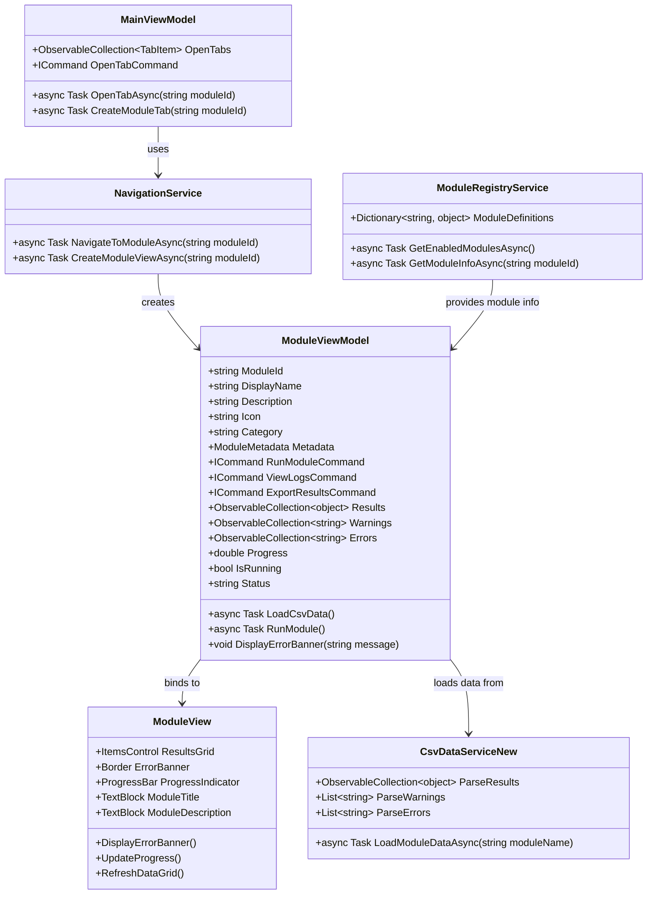

# Discovery Module Integration Architecture

## Overview

This architecture extends the M&A Discovery Suite to dynamically integrate discovery modules from ModuleRegistry.json into the side navigation, creating dedicated module views with CSV data loading and error handling.

## Architecture Components

### Core Classes Design



### Data Flow Architecture

```mermaid
graph TD
    A[Side Navigation Click] --> B[MainViewModel.OpenTabCommand]
    B --> C[NavigationService.NavigateToModuleAsync]
    C --> D[ModuleRegistryService.GetModuleInfoAsync]
    D --> E[Create ModuleViewModel Instance]
    E --> F[Create ModuleView with DataTemplate]
    F --> G[ModuleViewModel.LoadCsvData]
    G --> H[CsvDataServiceNew.LoadModuleDataAsync]
    H --> I[C:\\discoverydata\\{profile}\\Raw\\{ModuleName}.csv]
    I --> J[Parse CSV with warnings/errors]
    J --> K[Populate ModuleViewModel.Results]
    K --> L[Display ResultsGrid]
    L --> M[Show ErrorBanner if issues]
```

## Component Implementation Details

### 1. Base ModuleViewModel Implementation

```csharp
namespace MandADiscoverySuite.ViewModels
{
    public class ModuleViewModel : BaseViewModel, IModuleViewModel
    {
        private readonly MainViewModel _mainViewModel;
        private readonly ModuleRegistryService _registryService;
        private readonly CsvDataServiceNew _csvService;

        public string ModuleId { get; set; }
        public string DisplayName { get; set; }
        public string Description { get; set; }
        public string Icon { get; set; }
        public string Category { get; set; }

        public ModuleMetadata Metadata { get; set; }
        public ObservableCollection<object> Results { get; set; } = new();
        public ObservableCollection<string> Warnings { get; set; } = new();
        public ObservableCollection<string> Errors { get; set; } = new();

        public double Progress { get; set; }
        public bool IsRunning { get; set; }
        public string Status { get; set; } = "Ready";

        public IAsyncRelayCommand RunModuleCommand { get; }
        public IAsyncRelayCommand ViewLogsCommand { get; }
        public IAsyncRelayCommand ExportResultsCommand { get; }

        public ModuleViewModel(MainViewModel mainViewModel)
        {
            _mainViewModel = mainViewModel;
            _registryService = ModuleRegistryService.Instance;
            _csvService = new CsvDataServiceNew();

            RunModuleCommand = new AsyncRelayCommand(RunModuleAsync);
            ViewLogsCommand = new AsyncRelayCommand(ViewLogsAsync);
            ExportResultsCommand = new AsyncRelayCommand(ExportResultsAsync);

            PropertyChanged += OnPropertyChanged;
        }

        public async Task LoadAsync()
        {
            await LoadCsvData();
        }

        private async Task LoadCsvData()
        {
            try
            {
                IsRunning = true;
                Status = "Loading...";

                var csvPath = Path.Combine(
                    "C:\\discoverydata",
                    _mainViewModel.CurrentProfileName,
                    "Raw",
                    $"{ModuleId}.csv"
                );

                if (File.Exists(csvPath))
                {
                    var (results, warnings, errors) = await _csvService.ParseCsvFileAsync(csvPath);

                    // Clear previous results
                    Results.Clear();
                    Warnings.Clear();
                    Errors.Clear();

                    // Populate collections
                    foreach (var result in results)
                        Results.Add(result);

                    foreach (var warning in warnings)
                        Warnings.Add(warning);

                    foreach (var error in errors)
                        Errors.Add(error);

                    // Show warnings/errors in banner if any
                    if (Warnings.Any() || Errors.Any())
                    {
                        var message = BuildBannerMessage();
                        await DisplayErrorBanner(message);
                    }
                }
                else
                {
                    await DisplayErrorBanner($"{ModuleId} CSV file not found. Run discovery first.");
                }

                Status = "Loaded";
            }
            catch (Exception ex)
            {
                await DisplayErrorBanner($"Error loading {ModuleId} data: {ex.Message}");
                Status = "Error";
            }
            finally
            {
                IsRunning = false;
            }
        }

        private string BuildBannerMessage()
        {
            var messages = new List<string>();

            if (Errors.Any())
                messages.Add($"{Errors.Count} parsing errors");

            if (Warnings.Any())
                messages.Add($"{Warnings.Count} warnings");

            return string.Join(", ", messages);
        }

        public async Task DisplayErrorBanner(string message)
        {
            // Implementation through messaging system or direct view update
            var bannerMessage = new BannerMessage
            {
                Message = message,
                Type = Errors.Any() ? BannerType.Error : BannerType.Warning
            };

            // Send to ModuleView for display
            await Task.CompletedTask; // Placeholder
        }

        private async Task RunModuleAsync()
        {
            // Execute module PowerShell script
            // Similar to existing DiscoveryModuleViewModel logic
        }

        private async Task ViewLogsAsync()
        {
            // Open log viewer for this module
        }

        private async Task ExportResultsAsync()
        {
            // Export results to CSV/Excel
        }
    }
}
```

### 2. ModuleView XAML Structure

```xaml
<UserControl x:Class="MandADiscoverySuite.Views.ModuleView"
             xmlns="http://schemas.microsoft.com/winfx/2006/xaml/presentation"
             xmlns:x="http://schemas.microsoft.com/winfx/2006/xaml"
             xmlns:mc="http://schemas.openxmlformats.org/markup-compatibility/2006"
             xmlns:d="http://schemas.microsoft.com/expression/blend/2008"
             mc:Ignorable="d"
             d:DesignHeight="800" d:DesignWidth="1200">

    <UserControl.Resources>
        <Style x:Key="ErrorBannerStyle" TargetType="Border">
            <Setter Property="Background" Value="#FFFEE2E2"/>
            <Setter Property="BorderBrush" Value="#FFDC2626"/>
            <Setter Property="BorderThickness" Value="1"/>
            <Setter Property="CornerRadius" Value="8"/>
            <Setter Property="Padding" Value="16"/>
            <Setter Property="Margin" Value="0,0,0,16"/>
        </Style>

        <Style x:Key="WarningBannerStyle" TargetType="Border">
            <Setter Property="Background" Value="#FFFFF8E1"/>
            <Setter Property="BorderBrush" Value="#FFF59E0B"/>
            <Setter Property="BorderThickness" Value="1"/>
            <Setter Property="CornerRadius" Value="8"/>
            <Setter Property="Padding" Value="16"/>
            <Setter Property="Margin" Value="0,0,0,16"/>
        </Style>
    </UserControl.Resources>

    <Grid>
        <Grid.RowDefinitions>
            <RowDefinition Height="Auto"/>
            <RowDefinition Height="Auto"/>
            <RowDefinition Height="*"/>
        </Grid.RowDefinitions>

        <!-- Module Header -->
        <Border Grid.Row="0" Style="{StaticResource ModernCardStyle}" Margin="0,0,0,16">
            <Grid>
                <Grid.ColumnDefinitions>
                    <ColumnDefinition Width="Auto"/>
                    <ColumnDefinition Width="*"/>
                    <ColumnDefinition Width="Auto"/>
                </Grid.ColumnDefinitions>

                <!-- Module Icon -->
                <Border Grid.Column="0" Width="64" Height="64" Background="#FFE2E8F0" CornerRadius="8">
                    <TextBlock Text="{Binding Icon}" FontSize="32" HorizontalAlignment="Center" VerticalAlignment="Center"/>
                </Border>

                <!-- Module Info -->
                <StackPanel Grid.Column="1" Margin="16,0">
                    <TextBlock Text="{Binding DisplayName}" FontSize="24" FontWeight="Bold" Foreground="{DynamicResource PrimaryTextBrush}"/>
                    <TextBlock Text="{Binding Category}" FontSize="14" Foreground="{DynamicResource SecondaryTextBrush}" Margin="0,4,0,8"/>
                    <TextBlock Text="{Binding Description}" FontSize="12" Foreground="{DynamicResource MutedForegroundBrush}"
                               TextWrapping="Wrap" MaxWidth="600"/>
                </StackPanel>

                <!-- Action Buttons -->
                <StackPanel Grid.Column="2" Orientation="Horizontal">
                    <Button Content="▶️ Run Module" Command="{Binding RunModuleCommand}"
                            Style="{StaticResource ModernButtonStyle}" Margin="0,0,8,0"/>
                    <Button Content="📋 View Logs" Command="{Binding ViewLogsCommand}"
                            Style="{StaticResource ModernButtonStyle}" Background="#FF4A5568" Margin="0,0,8,0"/>
                    <Button Content="📤 Export" Command="{Binding ExportResultsCommand}"
                            Style="{StaticResource ModernButtonStyle}" Background="#FF38B2AC"/>
                </StackPanel>
            </Grid>
        </Border>

        <!-- Error/Warning Banner -->
        <Border Grid.Row="1"
                x:Name="ErrorBanner"
                Visibility="{Binding Warnings.Count, Converter={StaticResource CountToVisibilityConverter}}"
                Style="{StaticResource WarningBannerStyle}">
            <StackPanel Orientation="Horizontal">
                <TextBlock Text="⚠️" FontSize="16" Margin="0,0,8,0" VerticalAlignment="Center"/>
                <TextBlock Text="{Binding BannerMessage}" VerticalAlignment="Center"/>
                <Button Content="✕" Margin="16,0,0,0" Background="Transparent" BorderThickness="0"
                        Foreground="{DynamicResource SecondaryTextBrush}" FontSize="12" Padding="4"/>
            </StackPanel>
        </Border>

        <!-- Progress Indicator -->
        <ProgressBar Grid.Row="2" Value="{Binding Progress}" Maximum="100" Height="4"
                     Background="Transparent" Foreground="#FF667eea"
                     Visibility="{Binding IsRunning, Converter={StaticResource BoolToVisibilityConverter}}"
                     Margin="0,0,0,16"/>

        <!-- Results Grid -->
        <Border Grid.Row="2" Style="{StaticResource ModernCardStyle}">
            <Grid>
                <Grid.RowDefinitions>
                    <RowDefinition Height="Auto"/>
                    <RowDefinition Height="*"/>
                </Grid.RowDefinitions>

                <!-- Results Header -->
                <Grid Grid.Row="0">
                    <Grid.ColumnDefinitions>
                        <ColumnDefinition Width="*"/>
                        <ColumnDefinition Width="Auto"/>
                    </Grid.ColumnDefinitions>

                    <TextBlock Grid.Column="0" Text="Discovery Results"
                               Style="{StaticResource SectionHeaderStyle}"/>

                    <StackPanel Grid.Column="1" Orientation="Horizontal">
                        <TextBlock Text="{Binding Results.Count}" FontSize="12" VerticalAlignment="Center" Margin="0,0,8,0"/>
                        <TextBlock Text="records found" FontSize="12" Foreground="{DynamicResource SecondaryTextBrush}" VerticalAlignment="Center"/>
                    </StackPanel>
                </Grid>

                <!-- Data Grid -->
                <DataGrid Grid.Row="1"
                          ItemsSource="{Binding Results}"
                          Style="{StaticResource ModernDataGridStyle}"
                          AutoGenerateColumns="True"
                          IsReadOnly="True"
                          CanUserSortColumns="True"
                          Margin="0,16,0,0">

                    <!-- Custom column headers and formatting would be added here -->
                </DataGrid>

                <!-- Empty State -->
                <StackPanel Grid.Row="1"
                           HorizontalAlignment="Center" VerticalAlignment="Center"
                           Visibility="{Binding Results.Count, Converter={StaticResource InverseCountToVisibilityConverter}}">
                    <TextBlock Text="{Binding Icon}" FontSize="48" HorizontalAlignment="Center" Margin="0,0,0,16" Opacity="0.3"/>
                    <TextBlock Text="No data available" FontSize="18" FontWeight="SemiBold"
                               Foreground="{DynamicResource SecondaryTextBrush}" HorizontalAlignment="Center"/>
                    <TextBlock Text="Run the module discovery to populate this view"
                               FontSize="14" Foreground="{DynamicResource MutedForegroundBrush}" HorizontalAlignment="Center" Margin="0,8,0,0"/>
                </StackPanel>
            </Grid>
        </Border>
    </Grid>
</UserControl>
```

### 3. Side Navigation Integration

Extend the main window sidebar to include discovery modules:

```xaml
<!-- Enhanced Sidebar Navigation -->
<Border Grid.Column="0" Background="{DynamicResource CardBrush}" BorderBrush="#FF2D3748" BorderThickness="0,0,1,0">
    <ScrollViewer VerticalScrollBarVisibility="Auto">
        <StackPanel>

            <!-- Overview Button -->
            <Button Style="{StaticResource NavButtonStyle}" Command="{Binding OpenTabCommand}" CommandParameter="dashboard">
                <StackPanel Orientation="Horizontal">
                    <TextBlock Text="📊" FontSize="18" Margin="0,0,16,0"/>
                    <StackPanel>
                        <TextBlock Text="Overview"/>
                        <TextBlock Text="Dashboard & Stats" FontSize="10" Foreground="{DynamicResource SecondaryTextBrush}"/>
                    </StackPanel>
                </StackPanel>
            </Button>

            <!-- Discovery Section Header -->
            <Border Padding="24,12" Background="#FF1C2433" BorderBrush="#FF2D3748" BorderThickness="0,1,0,0">
                <TextBlock Text="🔍 Discovery" Foreground="{DynamicResource SecondaryTextBrush}"
                          FontSize="12" FontWeight="SemiBold" TextTransform="Uppercase"/>
            </Border>

            <!-- General Discovery Button -->
            <Button Style="{StaticResource NavButtonStyle}" Command="{Binding OpenTabCommand}" CommandParameter="discovery">
                <StackPanel Orientation="Horizontal">
                    <TextBlock Text="🔍" FontSize="18" Margin="0,0,16,0"/>
                    <StackPanel>
                        <TextBlock Text="Discovery"/>
                        <TextBlock Text="DNS & Domain Enumeration" FontSize="10" Foreground="{DynamicResource SecondaryTextBrush}"/>
                    </StackPanel>
                </StackPanel>
            </Button>

            <!-- Dynamic Discovery Modules -->
            <ItemsControl ItemsSource="{Binding DiscoveryModules}">
                <ItemsControl.ItemTemplate>
                    <DataTemplate>
                        <Button Style="{StaticResource NavButtonStyle}"
                                Command="{Binding DataContext.OpenTabCommand, RelativeSource={RelativeSource AncestorType=Window}}"
                                CommandParameter="{Binding ModuleId, StringFormat='module:{0}'}">
                            <StackPanel Orientation="Horizontal">
                                <TextBlock Text="{Binding Icon}" FontSize="18" Margin="0,0,16,0"/>
                                <StackPanel>
                                    <TextBlock Text="{Binding DisplayName}" MaxWidth="180" TextTrimming="CharacterEllipsis"/>
                                    <TextBlock Text="{Binding Category}" FontSize="10" Foreground="{DynamicResource SecondaryTextBrush}"/>
                                </StackPanel>
                            </StackPanel>
                        </Button>
                    </DataTemplate>
                </ItemsControl.ItemTemplate>
            </ItemsControl>

        </StackPanel>
    </ScrollViewer>
</Border>
```

### 4. DataTemplate Integration in App.xaml

```xaml
<Application.Resources>
    <ResourceDictionary>

        <!-- Module ViewModel to ModuleView Template Mapping -->
        <DataTemplate DataType="{x:Type vm:ActiveDirectoryModuleViewModel}">
            <views:ModuleView/>
        </DataTemplate>

        <DataTemplate DataType="{x:Type vm:AzureDiscoveryModuleViewModel}">
            <views:ModuleView/>
        </DataTemplate>

        <DataTemplate DataType="{x:Type vm:ExchangeDiscoveryModuleViewModel}">
            <views:ModuleView/>
        </DataTemplate>

        <!-- Fallback Template for any ModuleViewModel -->
        <DataTemplate x:Key="ModuleViewFallbackTemplate">
            <views:ModuleView/>
        </DataTemplate>

        <!-- Dynamic Template Selector -->
        <local:ModuleTemplateSelector x:Key="ModuleTemplateSelector"
                                      FallbackTemplate="{StaticResource ModuleViewFallbackTemplate}"/>

    </ResourceDictionary>
</Application.Resources>
```

## Implementation Steps

### Phase 1: Core Framework
1. Create `ModuleViewModel` base class with common properties and commands
2. Create `ModuleView` UserControl with data binding structure
3. Implement CSV data loading in `CsvDataServiceNew`
4. Add error/warning banner system

### Phase 2: Navigation Integration
1. Extend `MainViewModel` to load discovery modules from registry
2. Add dynamic module buttons to sidebar navigation
3. Extend `OpenTabCommand` to handle module parameter format
4. Update `NavigationService` to support module navigation

### Phase 3: Data Integration
1. Implement CSV file location logic (C:\discoverydata\{profile}\Raw\{ModuleName})
2. Add parse result handling (warnings/errors)
3. Implement error banner display mechanism
4. Add module-specific data template registration

### Phase 4: UI Enhancements
1. Add progress indicators for data loading
2. Implement module-specific result grids
3. Add export functionality
4. Style consistency across all module views

## Data Flow Implementation

1. **User clicks discovery module in sidebar**
   - `MainWindow` sidebar button triggers `OpenTabCommand`
   - Command parameter: `"module:ActiveDirectoryDiscovery"`

2. **Command routing**
   - `MainViewModel.OpenTabCommand` receives parameter
   - `OpenTabAsync("module:ActiveDirectoryDiscovery")` called
   - Parameter parsed to extract module ID

3. **Module resolution and view creation**
   - `ModuleRegistryService.GetModuleInfoAsync("ActiveDirectoryDiscovery")` called
   - New `ModuleViewModel` instance created with module metadata
   - `ModuleView` created and bound to ViewModel

4. **Data loading**
   - `ModuleViewModel.LoadAsync()` automatically called
   - CSV file path constructed: `C:\discoverydata\{profile}\Raw\ActiveDirectoryDiscovery.csv`
   - `CsvDataServiceNew.ParseCsvFileAsync()` loads and parses data
   - Results, warnings, and errors populated in ViewModel collections

5. **UI updates**
   - `Results` collection bound to DataGrid
   - Error banner shown if warnings/errors exist
   - Module view appears in main tab area

## Error Handling Strategy

- **CSV File Not Found**: Show informative message encouraging discovery run
- **Parse Errors**: Collect all parse errors and display in red banner
- **Parse Warnings**: Collect warnings and display in yellow banner
- **Network Errors**: Graceful handling with retry options
- **Invalid Module Config**: Fall back to generic module view template

This architecture provides a scalable, maintainable solution for integrating any number of discovery modules with consistent UI/UX patterns, automatic data loading, and comprehensive error handling.