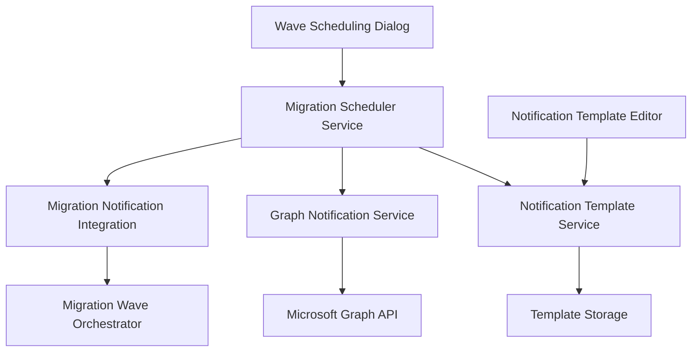

# Migration Scheduling and Notification System

**Enterprise Migration Scheduling & Notification Platform**  
*M&A Discovery Suite - T-033 Implementation*

## Overview

The Migration Scheduling and Notification System provides enterprise-grade capabilities for scheduling migrations, managing blackout periods, and sending automated notifications to users. This system enables administrators to orchestrate complex migration workflows with precise timing, dependency management, and comprehensive user communication.

### Key Features

- **Timer-Based Wave Execution**: Automated scheduling with precise timing control
- **Blackout Period Management**: Configurable time windows where migrations are blocked
- **Email Notification System**: Graph API-powered email notifications with template customization
- **Concurrency Control**: Configurable limits for simultaneous migration operations
- **Dependency Resolution**: Automatic wave dependency management
- **Token Replacement**: Dynamic email content with user-specific data
- **Administrative Dashboard**: Comprehensive scheduling and monitoring interface

## Architecture Overview

### Core Components



### Service Dependencies

- **LogicEngineService**: User data retrieval for notifications
- **MigrationService**: Wave execution integration  
- **Microsoft Graph API**: Email delivery infrastructure
- **File System**: Template storage and configuration persistence

## Installation and Configuration

### Prerequisites

1. **Microsoft Graph API Permissions**:
   - `Mail.Send` - Send emails on behalf of the organization
   - `User.Read.All` - Read user profile information
   - `Directory.Read.All` - Access directory data for user lookup

2. **Azure AD App Registration**:
   ```json
   {
     "ClientId": "your-client-id",
     "ClientSecret": "your-client-secret", 
     "TenantId": "your-tenant-id",
     "Authority": "https://login.microsoftonline.com/your-tenant-id"
   }
   ```

3. **File System Permissions**:
   - Write access to `C:\discoverydata\<profile>\Notifications\`
   - Read access to CSV discovery data files

### Configuration Setup

1. **Graph API Configuration** (`appsettings.json`):
   ```json
   {
     "GraphNotification": {
       "ClientId": "12345678-1234-1234-1234-123456789012",
       "ClientSecret": "your-secure-client-secret",
       "TenantId": "87654321-4321-4321-4321-210987654321",
       "Authority": "https://login.microsoftonline.com/87654321-4321-4321-4321-210987654321"
     }
   }
   ```

2. **Scheduler Configuration**:
   ```json
   {
     "MigrationScheduler": {
       "MaxConcurrentWaves": 3,
       "DefaultRetryCount": 3,
       "RetryDelayMinutes": 15,
       "TimerIntervalMinutes": 1,
       "BlackoutPeriods": [
         {
           "Name": "Business Hours",
           "StartTime": "08:00:00",
           "EndTime": "18:00:00",
           "DaysOfWeek": ["Monday", "Tuesday", "Wednesday", "Thursday", "Friday"]
         }
       ]
     }
   }
   ```

## User Guide

### Scheduling Migration Waves

#### Opening the Wave Scheduling Dialog

1. Navigate to **Migration** > **Wave Management**
2. Select a migration wave from the list
3. Click **Schedule Wave** button
4. The Wave Scheduling Dialog will open

#### Basic Wave Scheduling

**Step 1: Set Execution Time**
```
┌─ Execution Schedule ─────────────────┐
│ Start Date: [MM/DD/YYYY]             │
│ Start Time: [HH:MM AM/PM]            │
│                                      │
│ ☐ Recurring Schedule                 │
│   └─ Every: [X] Days/Weeks/Months    │
└──────────────────────────────────────┘
```

**Step 2: Configure Concurrency**
- **Max Concurrent Operations**: Number of simultaneous migrations (1-10)
- **Retry Attempts**: Number of retry attempts on failure (0-5)
- **Retry Delay**: Minutes between retry attempts (5-60)

**Step 3: Set Dependencies** (Optional)
- Select prerequisite waves that must complete first
- System automatically manages dependency resolution
- Dependent waves will not start until prerequisites finish

#### Advanced Scheduling Options

**Blackout Period Configuration**:
```
┌─ Blackout Periods ────────────────────┐
│ [Add Period] [Edit] [Remove]          │
│                                       │
│ ┌─────────────────────────────────────┐ │
│ │ Name: Business Hours                │ │
│ │ Start: 08:00 AM  End: 06:00 PM     │ │
│ │ Days: M T W T F                    │ │
│ │ Active: ☑                          │ │
│ └─────────────────────────────────────┘ │
└───────────────────────────────────────┘
```

**Notification Settings**:
- **Pre-Migration Email**: Sent before wave starts
- **Post-Migration Email**: Sent after wave completes  
- **Administrative Alerts**: Error and status notifications
- **Custom Templates**: Use custom email templates for specific waves

### Managing Blackout Windows

#### Creating Blackout Periods

1. In the Wave Scheduling Dialog, navigate to **Blackout Periods** tab
2. Click **Add Period**
3. Configure the blackout period:

**Blackout Period Properties**:
- **Name**: Descriptive name (e.g., "Business Hours", "Maintenance Window")
- **Start Time**: Beginning of blackout period (HH:MM format)
- **End Time**: End of blackout period (HH:MM format)  
- **Days of Week**: Which days the blackout applies
- **Active**: Enable/disable the blackout period
- **Description**: Optional detailed description

#### Types of Blackout Periods

**Business Hours Blackout**:
```
Name: Business Hours
Start: 08:00 AM
End: 06:00 PM
Days: Monday through Friday
Purpose: Prevent disruption during work hours
```

**Maintenance Window Blackout**:
```
Name: System Maintenance
Start: 02:00 AM  
End: 04:00 AM
Days: Saturday, Sunday
Purpose: Block during scheduled maintenance
```

**Holiday Blackout**:
```
Name: Holiday Period
Start: 00:00 AM
End: 11:59 PM
Days: All days (with specific date ranges)
Purpose: Prevent migrations during holidays
```

#### Blackout Period Management

**Viewing Active Blackouts**:
- Navigate to **Migration** > **Scheduler Status**
- View current blackout status in the status panel
- See upcoming blackout periods in the schedule view

**Blackout Conflict Resolution**:
- System automatically detects scheduling conflicts
- Warning messages display when waves conflict with blackouts
- Options to reschedule or override blackout restrictions

### Email Template Management

#### Accessing the Template Editor

1. Navigate to **Migration** > **Notification Templates**
2. The Template Editor interface opens with:
   - **Template List**: Available templates by category
   - **Editor Pane**: Rich text editor for template content
   - **Preview Pane**: Real-time template preview
   - **Token Panel**: Available replacement tokens

#### Template Categories

Templates are organized in folders under `C:\discoverydata\<profile>\Notifications\`:

```
Notifications/
├── PreMigration/
│   ├── UserPreMigration.html
│   ├── ManagerPreMigration.html
│   └── AdminPreMigration.html
├── PostMigration/
│   ├── UserPostMigration.html
│   ├── ManagerPostMigration.html
│   └── AdminPostMigration.html
└── Alerts/
    ├── MigrationFailure.html
    ├── MigrationSuccess.html
    └── SchedulerAlert.html
```

#### Creating Email Templates

**Step 1: Select Template Type**
- **Pre-Migration**: Sent before migration starts
- **Post-Migration**: Sent after migration completes
- **Alert**: System notifications and errors

**Step 2: Design Template Content**

Sample pre-migration template:
```html
<h2>Migration Notification</h2>
<p>Dear {UserDisplayName},</p>

<p>Your account migration is scheduled for <strong>{MigrationDate}</strong> 
at <strong>{MigrationTime}</strong>.</p>

<h3>What to Expect:</h3>
<ul>
    <li>Temporary service interruption: {EstimatedDowntime}</li>
    <li>New login instructions will be provided</li>  
    <li>Data will be preserved during migration</li>
</ul>

<p>If you have questions, contact {AdminContact}.</p>

<p>Best regards,<br/>
{CompanyName} IT Team</p>
```

**Step 3: Configure Token Replacement**

Available tokens for user notifications:
- `{UserDisplayName}` - User's full display name
- `{UserEmail}` - User's email address
- `{UserDepartment}` - Department information
- `{MigrationDate}` - Scheduled migration date
- `{MigrationTime}` - Scheduled migration time
- `{EstimatedDowntime}` - Expected downtime duration
- `{AdminContact}` - Administrator contact information
- `{CompanyName}` - Organization name
- `{WaveName}` - Migration wave identifier
- `{TicketNumber}` - Support ticket reference

#### Template Editing Features

**Rich Text Editor**:
- HTML editing with syntax highlighting
- WYSIWYG preview mode
- Insert images and links
- Format text with styles

**Token Insertion**:
- Click token from the panel to insert into template
- Automatic token validation
- Preview with sample data

**Template Management**:
- **Duplicate**: Create copies of existing templates
- **Export**: Save templates to external files
- **Import**: Load templates from files
- **Version Control**: Template change history

### Viewing Scheduled Waves

#### Schedule Dashboard

Navigate to **Migration** > **Schedule Overview** to view:

**Current Schedule Grid**:
```
Wave Name       | Scheduled Time      | Status    | Dependencies
UserMigration1  | 2025-08-30 02:00 AM | Scheduled | None
MailboxWave2    | 2025-08-30 04:00 AM | Scheduled | UserMigration1
FileServerWave  | 2025-08-30 06:00 AM | Pending   | MailboxWave2
```

**Status Indicators**:
- 🟢 **Scheduled**: Wave is scheduled and ready to execute
- 🟡 **Pending**: Wave is waiting for dependencies
- 🔵 **Running**: Wave is currently executing
- ✅ **Completed**: Wave finished successfully
- ❌ **Failed**: Wave encountered errors
- ⏸️ **Blocked**: Wave blocked by blackout period

#### Wave Management Actions

**Reschedule Wave**:
1. Right-click on wave in schedule grid
2. Select **Reschedule**
3. Choose new date/time
4. Confirm dependency impacts

**Cancel Scheduled Wave**:
1. Select wave from grid
2. Click **Cancel Schedule**
3. Confirm cancellation
4. Wave returns to unscheduled state

**View Wave Details**:
- Click wave name to open detail view
- See migration objects, progress, and logs
- Access notification history
- Review dependency chain

## Administrative Guide

### System Configuration

#### Scheduler Service Settings

**Performance Configuration**:
```json
{
  "MaxConcurrentWaves": 3,          // Simultaneous wave limit
  "TimerIntervalMinutes": 1,        // Schedule check frequency  
  "ThreadPoolMinThreads": 10,       // Minimum worker threads
  "ThreadPoolMaxThreads": 100       // Maximum worker threads
}
```

**Retry Configuration**:
```json
{
  "DefaultRetryCount": 3,           // Default retry attempts
  "RetryDelayMinutes": 15,         // Delay between retries
  "ExponentialBackoff": true,       // Use exponential backoff
  "MaxRetryDelayMinutes": 120      // Maximum retry delay
}
```

**Notification Configuration**:
```json
{
  "BatchSize": 50,                  // Emails per batch
  "RateLimitDelay": 1000,          // Milliseconds between batches
  "DefaultSender": "noreply@company.com",
  "AdminNotificationEmail": "admin@company.com"
}
```

#### Security Configuration

**Graph API Permissions**:
Ensure your Azure AD application has these permissions:
- `Mail.Send` (Application permission)
- `User.Read.All` (Application permission)
- `Directory.Read.All` (Application permission)

**Client Credentials Setup**:
1. Register app in Azure AD
2. Generate client secret
3. Grant admin consent for permissions
4. Configure app settings with credentials

#### Monitoring and Logging

**Scheduler Logs** (`C:\discoverydata\logs\scheduler.log`):
```
2025-08-28 14:30:00 [INFO] Wave 'UserMigration1' scheduled for 2025-08-30 02:00:00
2025-08-28 14:30:01 [INFO] Blackout period check: No conflicts found
2025-08-28 14:30:02 [INFO] Dependencies resolved: None required
2025-08-28 14:30:03 [INFO] Notification scheduled: Pre-migration emails
```

**Notification Logs** (`C:\discoverydata\logs\notifications.log`):
```
2025-08-28 14:30:05 [INFO] Template loaded: PreMigration/UserPreMigration.html
2025-08-28 14:30:06 [INFO] Token replacement completed for 150 users
2025-08-28 14:30:07 [INFO] Graph API batch send initiated: 150 recipients
2025-08-28 14:30:10 [INFO] Email delivery successful: 148/150 (2 failures)
```

**Error Monitoring**:
- Failed authentication attempts
- Email delivery failures  
- Scheduling conflicts
- Dependency resolution errors
- Service availability issues

### Backup and Recovery

#### Template Backup

**Automatic Backup**:
Templates are automatically backed up during changes:
```
C:\discoverydata\<profile>\Notifications\Backups\
├── 2025-08-28_14-30-00\
│   ├── PreMigration\
│   ├── PostMigration\
│   └── Alerts\
```

**Manual Backup**:
1. Navigate to Template Editor
2. Click **Export All Templates**
3. Save to secure location
4. Include timestamp in backup filename

#### Configuration Recovery

**Scheduler Configuration**:
- Backup `appsettings.json` regularly
- Document custom blackout periods
- Maintain Azure AD app registration details

**Database Recovery**:
- Schedule data backed up with main database
- Template files separate from database
- Maintain copy of Graph API credentials securely

## Troubleshooting Guide

### Common Issues and Solutions

#### Scheduling Problems

**Issue: Wave Won't Schedule**
```
Symptoms: Error message when trying to schedule wave
Causes:
- Blackout period conflict
- Dependency resolution failure  
- Invalid date/time format
- Insufficient permissions

Solutions:
1. Check blackout period conflicts in schedule view
2. Verify all prerequisite waves exist and are valid
3. Ensure date/time is in future and properly formatted
4. Confirm user has scheduling permissions
```

**Issue: Waves Not Executing at Scheduled Time**
```
Symptoms: Scheduled waves remain in "Scheduled" status
Causes:
- Scheduler service stopped
- Timer configuration issues
- System resource constraints
- Blackout period activation

Solutions:
1. Restart MigrationSchedulerService
2. Check system event logs for timer errors
3. Verify system has adequate memory/CPU
4. Review active blackout periods
```

#### Notification Problems

**Issue: Emails Not Sending**
```
Symptoms: No emails received by users
Causes:
- Graph API authentication failure
- Insufficient permissions
- Template processing errors
- User email address issues

Solutions:
1. Test Graph API connection in settings
2. Verify app permissions in Azure AD
3. Check template syntax and tokens
4. Validate user email addresses in data source
```

**Issue: Partial Email Delivery**
```
Symptoms: Some users receive emails, others don't
Causes:
- API rate limiting
- Invalid recipient addresses
- Mailbox delivery restrictions
- Token replacement errors

Solutions:
1. Review rate limiting settings and increase delays
2. Check notification logs for specific user errors
3. Verify recipient mailbox settings
4. Test token replacement with problematic users
```

#### Template Issues

**Issue: Template Not Loading**
```
Symptoms: Error when selecting template in editor
Causes:
- File permission issues
- Corrupted template files
- Invalid file format
- Storage path problems

Solutions:
1. Check file system permissions on Notifications folder
2. Restore template from backup
3. Validate HTML syntax in template
4. Verify template storage path configuration
```

**Issue: Token Replacement Failing**
```
Symptoms: Tokens appear literally in sent emails
Causes:
- Invalid token syntax
- Missing user data fields
- Data source connection issues
- Token case sensitivity problems

Solutions:
1. Verify token syntax matches available tokens
2. Check user data completeness in LogicEngine
3. Test data source connectivity
4. Use exact case-sensitive token names
```

### Performance Optimization

#### Scheduler Performance

**High Wave Volume**:
- Increase `MaxConcurrentWaves` gradually
- Monitor system resource usage
- Consider wave size optimization
- Implement wave batching strategies

**Slow Schedule Resolution**:
- Optimize dependency chain complexity
- Cache frequently accessed configuration
- Reduce timer check interval if needed
- Monitor database query performance

#### Notification Performance

**Large User Count**:
- Adjust batch size for Graph API calls
- Implement progressive notification sending
- Use email distribution lists where possible
- Consider notification scheduling spread

**Template Processing Speed**:
- Cache compiled templates
- Optimize token replacement algorithms  
- Minimize complex HTML in templates
- Use efficient data access patterns

### Diagnostic Commands

#### PowerShell Diagnostics

**Test Graph API Connection**:
```powershell
Test-GraphConnection -ClientId "your-client-id" -TenantId "your-tenant-id"
```

**Validate Scheduler Configuration**:
```powershell
Test-SchedulerConfiguration -ConfigPath "appsettings.json"
```

**Check Blackout Periods**:
```powershell
Get-ActiveBlackoutPeriods -DateTime (Get-Date)
```

**Verify Template Integrity**:
```powershell
Test-NotificationTemplates -TemplatePath "C:\discoverydata\profile\Notifications"
```

#### System Health Checks

**Service Status**:
- Check MigrationSchedulerService is running
- Verify notification service dependencies
- Monitor memory and CPU usage
- Review event logs for errors

**Database Connectivity**:
- Test LogicEngine data access
- Verify user data completeness
- Check CSV file accessibility
- Monitor query performance

**File System Health**:
- Validate template storage access
- Check backup directory space
- Verify log file rotation
- Monitor disk space usage

## API Reference

### MigrationSchedulerService Methods

#### Core Scheduling Methods

```csharp
// Schedule a migration wave
public async Task<ScheduleResult> ScheduleWaveAsync(
    string waveId,
    ScheduleWaveOptions options,
    CancellationToken cancellationToken = default)

// Cancel a scheduled wave
public async Task<bool> CancelScheduledWaveAsync(
    string waveId,
    CancellationToken cancellationToken = default)

// Get scheduled waves
public Task<IEnumerable<ScheduledWave>> GetScheduledWavesAsync(
    DateTime? fromDate = null,
    DateTime? toDate = null,
    CancellationToken cancellationToken = default)

// Check blackout periods
public bool IsInBlackoutPeriod(DateTime dateTime)

// Update scheduler configuration
public Task UpdateConfigurationAsync(SchedulerConfiguration configuration)
```

#### Event Handling

```csharp
// Wave lifecycle events
public event EventHandler<WaveScheduledEventArgs> WaveScheduled;
public event EventHandler<WaveStartedEventArgs> WaveStarted;
public event EventHandler<WaveCompletedEventArgs> WaveCompleted;
public event EventHandler<WaveFailedEventArgs> WaveFailed;

// System events  
public event EventHandler<BlackoutPeriodActiveEventArgs> BlackoutPeriodActive;
public event EventHandler<SchedulerStatusChangedEventArgs> SchedulerStatusChanged;
```

### NotificationTemplateService Methods

#### Template Management

```csharp
// Load template by name
public async Task<NotificationTemplate> GetTemplateAsync(
    string category,
    string templateName,
    CancellationToken cancellationToken = default)

// Save template
public async Task SaveTemplateAsync(
    NotificationTemplate template,
    CancellationToken cancellationToken = default)

// Get all templates in category
public async Task<IEnumerable<NotificationTemplate>> GetTemplatesByCategoryAsync(
    string category,
    CancellationToken cancellationToken = default)

// Delete template
public async Task<bool> DeleteTemplateAsync(
    string category,
    string templateName,
    CancellationToken cancellationToken = default)
```

#### Token Processing

```csharp
// Replace tokens in template content
public string ReplaceTokens(string template, object tokenData)

// Get available tokens for template type
public IEnumerable<string> GetAvailableTokens(string templateCategory)

// Preview template with sample data
public async Task<NotificationPreview> PreviewTemplateAsync(
    string templateContent,
    string sampleUserId = null,
    CancellationToken cancellationToken = default)
```

### GraphNotificationService Methods

#### Email Operations

```csharp
// Send single notification
public async Task<NotificationResult> SendNotificationAsync(
    string recipientEmail,
    string subject,
    string htmlContent,
    CancellationToken cancellationToken = default)

// Send bulk notifications  
public async Task<BulkNotificationResult> SendBulkNotificationsAsync(
    IEnumerable<NotificationRequest> notifications,
    CancellationToken cancellationToken = default)

// Test connection to Graph API
public async Task<ConnectionTestResult> TestConnectionAsync(
    CancellationToken cancellationToken = default)
```

### Data Models

#### ScheduledWave

```csharp
public class ScheduledWave
{
    public string WaveId { get; set; }
    public string WaveName { get; set; }
    public DateTime ScheduledStartTime { get; set; }
    public DateTime? ActualStartTime { get; set; }
    public DateTime? CompletionTime { get; set; }
    public WaveStatus Status { get; set; }
    public int MaxConcurrentOperations { get; set; }
    public int RetryCount { get; set; }
    public TimeSpan RetryDelay { get; set; }
    public List<string> Dependencies { get; set; }
    public ScheduleWaveOptions Options { get; set; }
    public List<string> NotificationRecipients { get; set; }
    public Dictionary<string, object> Metadata { get; set; }
}
```

#### NotificationTemplate

```csharp
public class NotificationTemplate
{
    public string Id { get; set; }
    public string Name { get; set; }
    public string Category { get; set; }
    public string Subject { get; set; }
    public string HtmlContent { get; set; }
    public string TextContent { get; set; }
    public DateTime CreatedDate { get; set; }
    public DateTime LastModifiedDate { get; set; }
    public string CreatedBy { get; set; }
    public string LastModifiedBy { get; set; }
    public Dictionary<string, string> Metadata { get; set; }
    public List<string> RequiredTokens { get; set; }
}
```

#### BlackoutPeriod

```csharp
public class BlackoutPeriod
{
    public string Id { get; set; }
    public string Name { get; set; }
    public TimeSpan StartTime { get; set; }
    public TimeSpan EndTime { get; set; }
    public List<DayOfWeek> DaysOfWeek { get; set; }
    public bool IsActive { get; set; }
    public string Description { get; set; }
    public BlackoutPeriodPriority Priority { get; set; }
    public DateTime? EffectiveStartDate { get; set; }
    public DateTime? EffectiveEndDate { get; set; }
}
```

## Best Practices

### Scheduling Best Practices

#### Wave Scheduling Strategy

**1. Time Zone Considerations**:
- Always specify time zones explicitly
- Consider global organization impact
- Document time zone assumptions
- Test across different regions

**2. Dependency Management**:
- Keep dependency chains shallow (max 3 levels)
- Document dependency reasons
- Test dependency resolution logic
- Plan for dependency failures

**3. Blackout Period Design**:
- Align with business operations
- Consider maintenance windows
- Plan for holiday periods
- Review and update regularly

#### Resource Planning

**1. Concurrency Limits**:
```
Small Environment (<1K users): 1-2 concurrent waves
Medium Environment (1K-10K):   2-3 concurrent waves  
Large Environment (>10K):      3-5 concurrent waves
```

**2. Timing Considerations**:
- Allow buffer time between waves
- Consider network bandwidth during business hours
- Plan for retry attempts in scheduling
- Account for validation and rollback time

### Notification Best Practices

#### Email Template Design

**1. Content Guidelines**:
- Use clear, professional language
- Provide specific timing information
- Include contact information for support
- Explain what users should expect
- Use consistent branding and formatting

**2. Token Usage**:
- Always provide fallback values for tokens
- Test token replacement with real data
- Use descriptive token names
- Document custom tokens clearly

**3. Delivery Optimization**:
- Send pre-migration notifications 24-48 hours in advance
- Send post-migration confirmations within 1 hour
- Use appropriate email priorities
- Monitor delivery rates and adjust as needed

#### User Communication Strategy

**1. Pre-Migration Communication**:
```
Timeline: 48 hours before migration
Content: Schedule, expectations, preparation steps
Recipients: Affected users, managers, IT support
Template: PreMigration/UserPreMigration.html
```

**2. Post-Migration Communication**:
```
Timeline: Within 1 hour of completion  
Content: Completion status, next steps, support info
Recipients: Affected users, managers, administrators
Template: PostMigration/UserPostMigration.html
```

**3. Error Communication**:
```
Timeline: Immediate upon failure detection
Content: Error description, resolution steps, timeline
Recipients: Administrators, managers, affected users
Template: Alerts/MigrationFailure.html
```

### Security Best Practices

#### Authentication and Authorization

**1. Graph API Security**:
- Use client credentials flow for service-to-service auth
- Rotate client secrets regularly (every 6-12 months)
- Apply principle of least privilege for permissions
- Monitor authentication logs for suspicious activity

**2. Configuration Security**:
- Store sensitive configuration in Azure Key Vault
- Encrypt configuration files at rest
- Limit access to configuration files
- Audit configuration changes

**3. Template Security**:
- Validate template content for XSS vulnerabilities
- Sanitize user-provided token data
- Limit template editing permissions
- Audit template modifications

#### Data Protection

**1. User Data Handling**:
- Minimize user data in logs
- Encrypt sensitive data in transit and at rest
- Implement data retention policies
- Comply with privacy regulations (GDPR, etc.)

**2. Email Security**:
- Use secure email protocols (TLS)
- Validate recipient email addresses
- Implement anti-spam measures
- Monitor for email delivery issues

### Maintenance Best Practices

#### Regular Maintenance Tasks

**1. Weekly Tasks**:
- Review scheduler logs for errors
- Check notification delivery rates
- Verify blackout period accuracy
- Monitor system performance metrics

**2. Monthly Tasks**:
- Update blackout periods for holidays
- Review and optimize template performance
- Analyze scheduling patterns and trends
- Test disaster recovery procedures

**3. Quarterly Tasks**:
- Rotate Graph API client secrets
- Review and update notification templates
- Audit user permissions and access
- Performance testing and optimization

#### Monitoring and Alerting

**1. Key Metrics**:
- Wave execution success rate
- Email delivery success rate
- Average wave completion time
- System resource utilization
- Error frequency and types

**2. Alerting Thresholds**:
```
Critical: Wave failure rate >5%
Warning: Email delivery rate <95%
Info: Wave completion time >expected +50%
Critical: System resource utilization >90%
Warning: Error frequency >10/hour
```

**3. Response Procedures**:
- Document escalation procedures
- Maintain runbook for common issues
- Test alerting mechanisms regularly
- Train support staff on troubleshooting

## Conclusion

The Migration Scheduling and Notification System provides comprehensive enterprise-grade capabilities for managing complex migration workflows. By following the guidelines and best practices outlined in this documentation, administrators can ensure reliable, secure, and efficient migration operations with effective user communication throughout the process.

For additional support or questions about the migration scheduling system, please contact the M&A Discovery Suite support team or refer to the troubleshooting section above.

---

**Document Version**: 1.0  
**Last Updated**: August 28, 2025  
**Applies To**: M&A Discovery Suite v1.2.3+  
**Support Contact**: [Your Support Contact Information]