**Author:** ljpops.com (Lukian Poleschtschuk)

**Last Updated:** 30/12/2025

**Status:** Production

**Version:** 1.0
# M&A Discovery Suite GUI v2 - Architecture Documentation

## Table of Contents

1. [Overview](#overview)
2. [System Architecture](#system-architecture)
3. [Process Architecture](#process-architecture)
4. [Data Flow](#data-flow)
5. [State Management](#state-management)
6. [Service Layer](#service-layer)
7. [IPC Communication](#ipc-communication)
8. [Module Structure](#module-structure)
9. [Organisation Map](#organisation-map)
10. [Performance Architecture](#performance-architecture)
11. [Security Architecture](#security-architecture)

## Overview

The M&A Discovery Suite GUI v2 is built on Electron, combining a Node.js main process with a React-based renderer process for maximum performance and native OS integration.

### Technology Stack

| Layer | Technology |
|-------|-----------|
| Desktop Framework | Electron 38.2 |
| UI Framework | React 18 |
| Language | TypeScript 5.6 |
| State Management | Zustand |
| Styling | Tailwind CSS 3.4 |
| Data Grid | AG Grid Enterprise 34.2 |
| Build Tool | Webpack 5 |
| Package Manager | npm 9+ |

## System Architecture

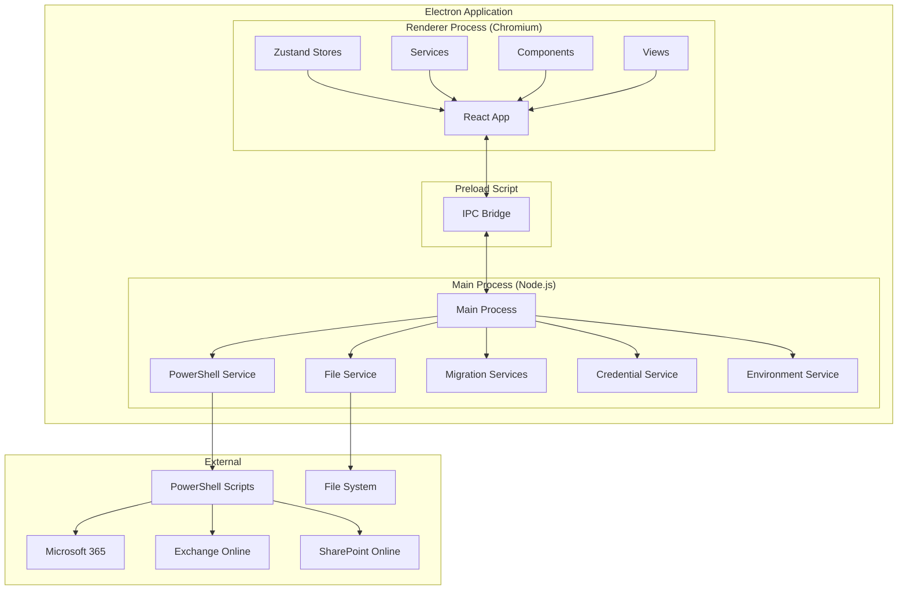

## Process Architecture

### Main Process

The main process runs on Node.js and handles:

- PowerShell script execution
- File system operations
- Credential management
- Environment detection
- IPC communication
- Window management

**Key Services:**

- `PowerShellService`: Session-pooled PowerShell execution
- `MigrationOrchestrationService`: Multi-wave migration coordination
- `FileWatcherService`: File system monitoring
- `CredentialService`: Secure credential storage
- `EnvironmentDetectionService`: Environment validation

### Renderer Process

The renderer process runs React in Chromium and handles:

- UI rendering
- User interactions
- State management
- Client-side validation
- Data visualization

**Key Components:**

- `App.tsx`: Root application component
- `MainLayout`: Primary layout structure
- `VirtualizedDataGrid`: High-performance data grid
- `Sidebar`: Navigation and profile management
- `Views`: Page-level components

### Preload Script

The preload script bridges the main and renderer processes:

```typescript
// Expose IPC APIs securely
const electronAPI = {
  // PowerShell execution
  executePowerShell: (scriptName: string, args: string[]) =>
    ipcRenderer.invoke('powershell:execute', { scriptName, args }),

  // File operations
  readFile: (path: string) =>
    ipcRenderer.invoke('file:read', path),

  // Discovery operations
  startDiscovery: (config: DiscoveryConfig) =>
    ipcRenderer.invoke('discovery:start', config),

  // Migration operations
  planMigration: (wave: MigrationWave) =>
    ipcRenderer.invoke('migration:plan', wave),
};

contextBridge.exposeInMainWorld('electronAPI', electronAPI);
```

## Data Flow

### Discovery Workflow

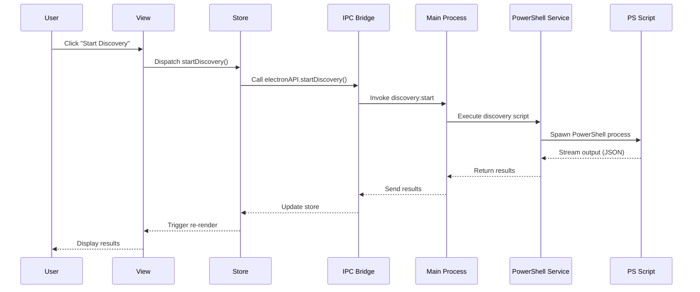

### Migration Workflow

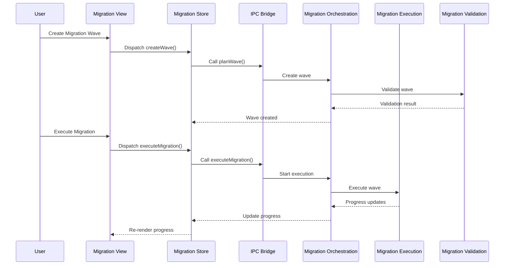

### Export Workflow

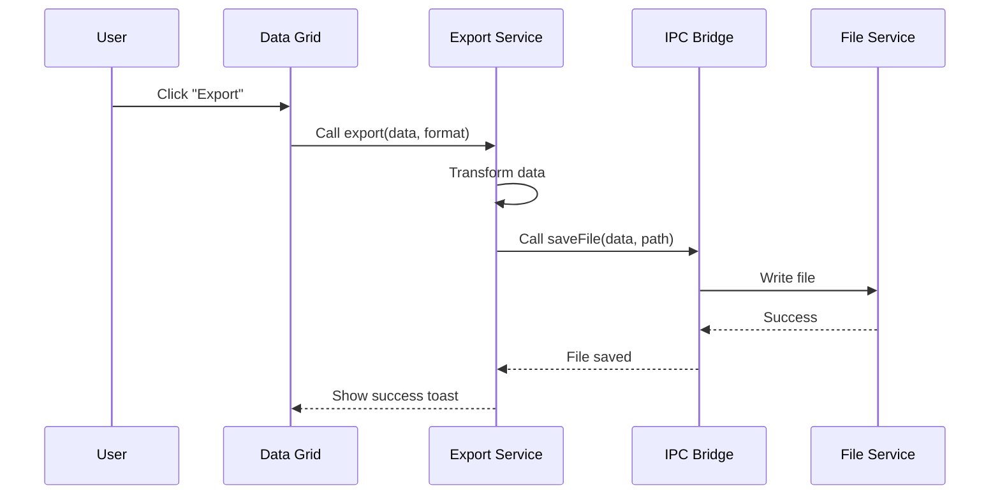

## State Management

### Zustand Store Architecture

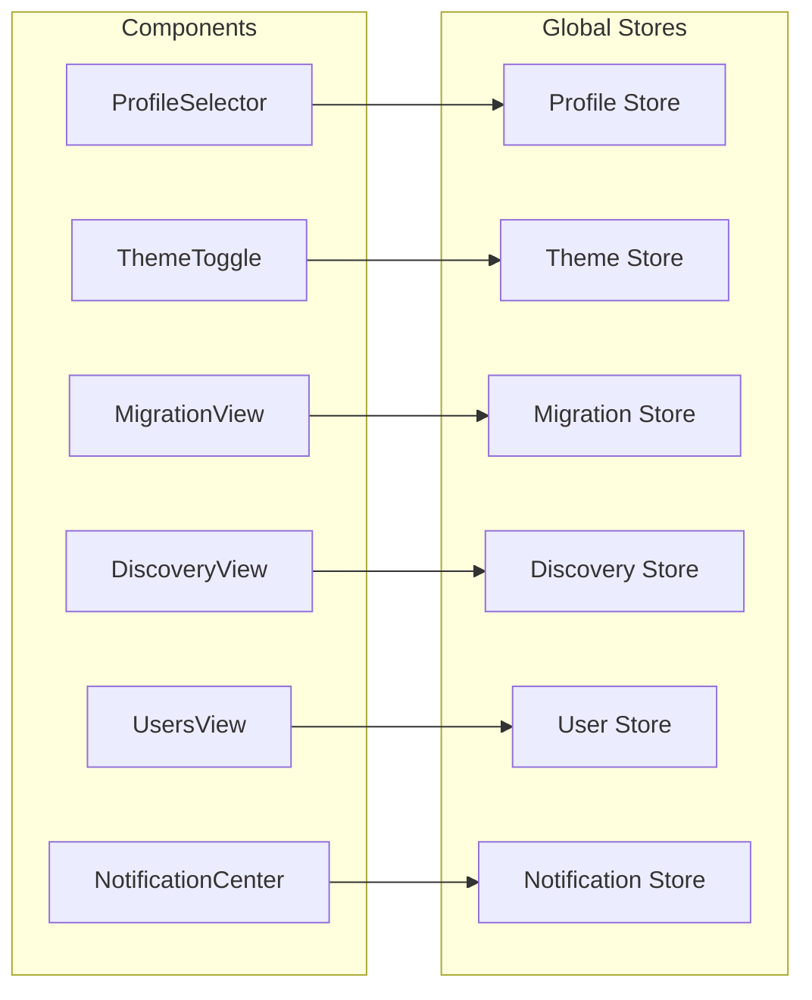

### Store Pattern

```typescript
// Store structure
interface Store {
  // State
  data: any[];
  loading: boolean;
  error: string | null;

  // Actions
  loadData: () => Promise<void>;
  setData: (data: any[]) => void;
  clearData: () => void;
}

// Implementation with middleware
const useExampleStore = create<Store>()(
  devtools(              // Enable Redux DevTools
    persist(             // Persist to localStorage
      immer((set, get) => ({
        // State
        data: [],
        loading: false,
        error: null,

        // Actions
        async loadData() {
          set({ loading: true });
          try {
            const data = await fetch();
            set({ data, loading: false });
          } catch (error) {
            set({ error: error.message, loading: false });
          }
        },
      })),
      { name: 'example-store' }
    )
  )
);
```

## Service Layer

### Main Process Services

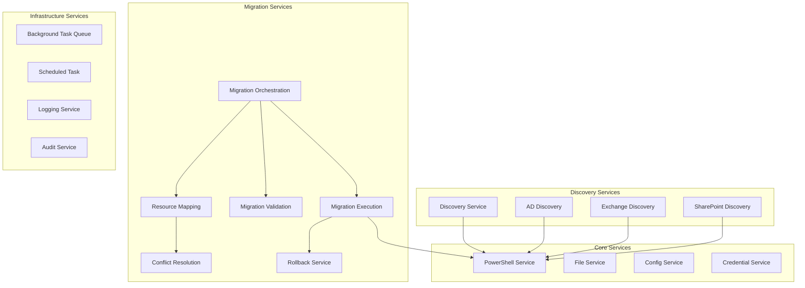

### Renderer Process Services

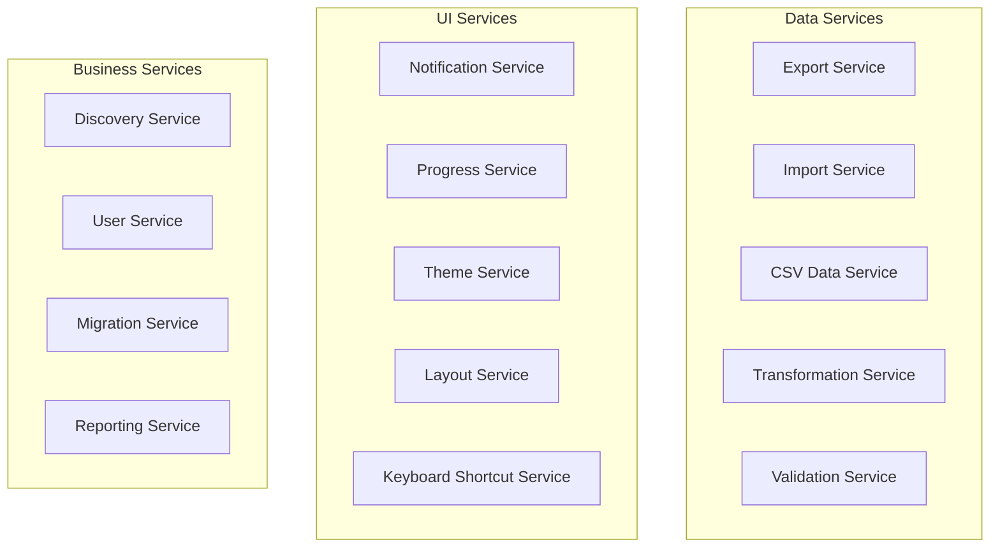

## IPC Communication

### IPC Architecture

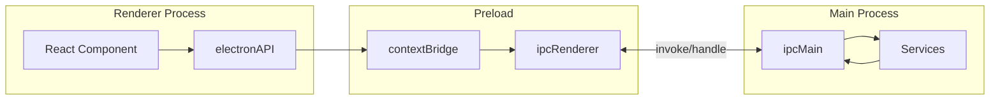

### IPC Channels

| Channel | Direction | Purpose |
|---------|-----------|---------|
| `powershell:execute` | Renderer → Main | Execute PowerShell script |
| `powershell:cancel` | Renderer → Main | Cancel running script |
| `powershell:output` | Main → Renderer | Stream output |
| `file:read` | Renderer → Main | Read file |
| `file:write` | Renderer → Main | Write file |
| `file:watch` | Renderer ← Main | File change events |
| `discovery:start` | Renderer → Main | Start discovery |
| `discovery:progress` | Main → Renderer | Discovery progress |
| `migration:plan` | Renderer → Main | Plan migration |
| `migration:execute` | Renderer → Main | Execute migration |
| `migration:progress` | Main → Renderer | Migration progress |
| `notification:show` | Main → Renderer | Show notification |
| `config:get` | Renderer → Main | Get config |
| `config:set` | Renderer → Main | Set config |

## Module Structure

### Component Hierarchy

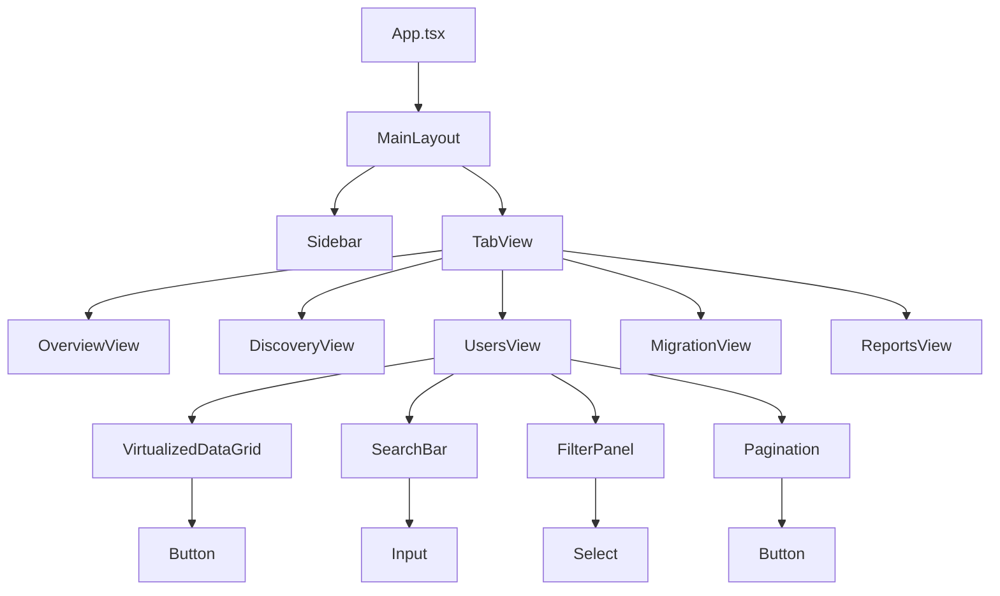

### Service Dependencies

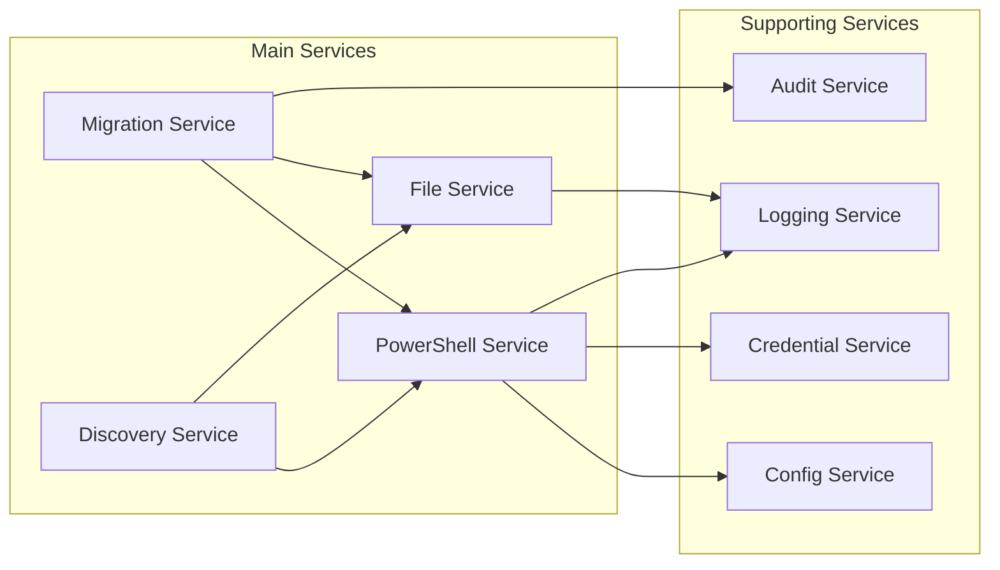

## Organisation Map

The Organisation Map is a LeanIX-style enterprise architecture visualization that maps discovered data to interactive entity diagrams, enabling informed M&A decisions through visual relationship exploration.

### Overview

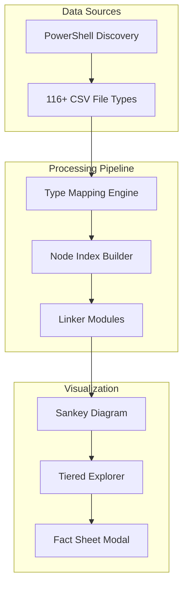

### Entity Type Taxonomy

The system supports 16 entity types organized into layers:

| Layer | Entity Types | Priority |
|-------|-------------|----------|
| **Infrastructure** | datacenter, it-component | 1 |
| **Applications** | application | 2 |
| **Identity** | user, mailbox | 2 |
| **Platform** | platform, group, license, subscription, resource-group | 3 |
| **Organization** | l3-organization, line-of-business, business-unit-location | 1.5 |
| **Business** | business-capability | 4 |
| **Interfaces** | provider-interface, consumer-interface | 2.5 |

### Relation Types

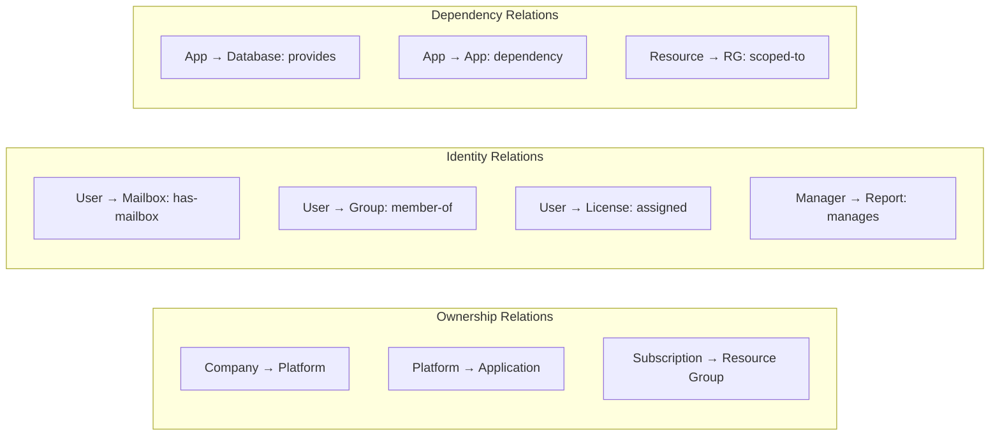

### Linker Architecture

Seven specialized linker modules generate cross-file relationships with confidence scoring:

| Linker | Purpose | Key Relations |
|--------|---------|---------------|
| **linkTenant** | Tenant/subscription hierarchy | ownership, scoped-to |
| **linkIdentity** | User/group/mailbox relations | has-mailbox, member-of, manages |
| **linkLicensing** | License assignment matching | assigned |
| **linkAzureInfra** | Azure resource hierarchy | ownership, scoped-to |
| **linkApps** | Application dependencies | provides, consumes, dependency |
| **linkDependencies** | Service/config dependencies | dependency |
| **linkSecurity** | Security policy relations | ownership |

### Confidence Scoring

Each relationship includes confidence metadata:

```typescript
interface SankeyLink {
  source: string;
  target: string;
  value: number;
  type: RelationType;
  confidence: number;      // 0-100 score
  matchRule: MatchRule;    // EXACT | HIGH | MEDIUM | LOW
  evidence: LinkEvidence[]; // Source files and fields
}
```

| Match Rule | Confidence | Criteria |
|------------|------------|----------|
| EXACT | 95-100 | UPN, ObjectId, or AppId match |
| HIGH | 85-94 | Email or verified ID match |
| MEDIUM | 70-84 | Name-based match |
| LOW | 50-69 | Heuristic or inferred match |

### Service Principal Classification

To prevent "Applications" bucket inflation, service principals are classified by their actual function:

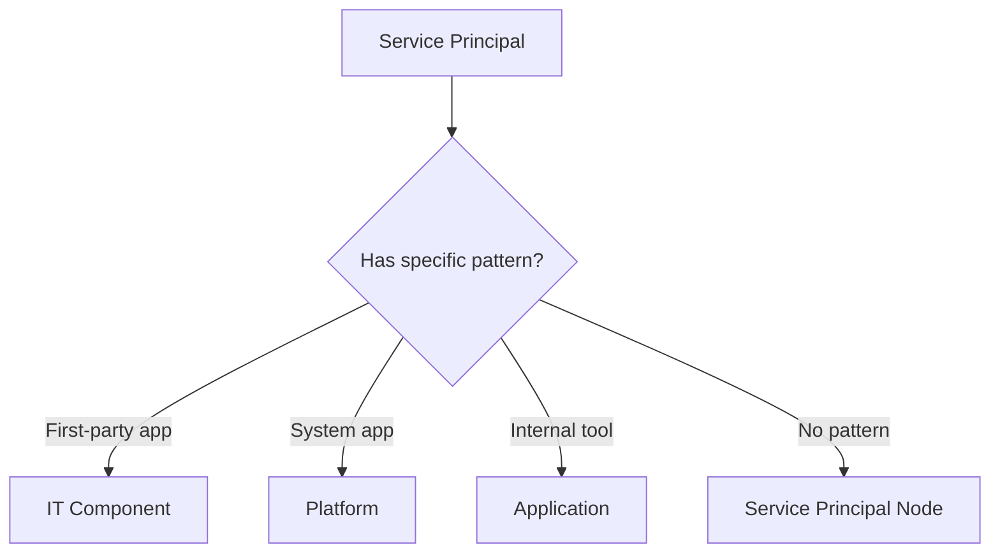

**Classification patterns:**
- Microsoft Graph, Azure AD, O365 → Platform
- Backup, Monitoring, Security tools → IT Component
- Custom line-of-business apps → Application
- Unclassified → Service Principal (IT Component)

### Performance Optimizations

```mermaid
graph LR
    subgraph "Limits"
        N[5,000 Node Limit]
        L[10,000 Link Limit]
    end

    subgraph "Indices"
        I1[byId: O(1)]
        I2[byUPN: O(1)]
        I3[byObjectId: O(1)]
        I4[byMail: O(1)]
        I5[byAppId: O(1)]
        I6[bySkuId: O(1)]
    end

    subgraph "Caching"
        C1[Node Cache by File]
        C2[Index Pre-computation]
        C3[Lazy Link Generation]
    end
```

### UI Components

| Component | Location | Purpose |
|-----------|----------|---------|
| OrganisationMapView | `views/organisation/` | Main map view |
| SankeyDiagram | `components/organisms/` | D3-based Sankey visualization |
| TieredExplorer | `components/organisms/` | Relation bucket browser |
| FactSheetModal | `components/organisms/` | 9-tab entity details (LeanIX style) |
| OrganisationMapFilters | `components/organisms/` | Entity type and status filters |
| DetailPanel | `components/organisms/` | Slide-out entity details |

### File Structure

```
guiv2/src/renderer/
├── hooks/
│   └── useOrganisationMapLogic.ts    # Main logic hook (116+ type mappings)
├── views/organisation/
│   ├── OrganisationMapView.tsx       # Main view
│   └── linkers/                       # 7 linker modules
│       ├── linkTenant.ts
│       ├── linkIdentity.ts
│       ├── linkLicensing.ts
│       ├── linkAzureInfra.ts
│       ├── linkApps.ts
│       ├── linkDependencies.ts
│       └── linkSecurity.ts
├── types/models/
│   └── organisation.ts               # Type definitions
└── components/organisms/
    ├── SankeyDiagram.tsx
    ├── TieredExplorer.tsx
    ├── FactSheetModal.tsx
    └── OrganisationMapFilters.tsx
```

## Performance Architecture

### Virtual Scrolling

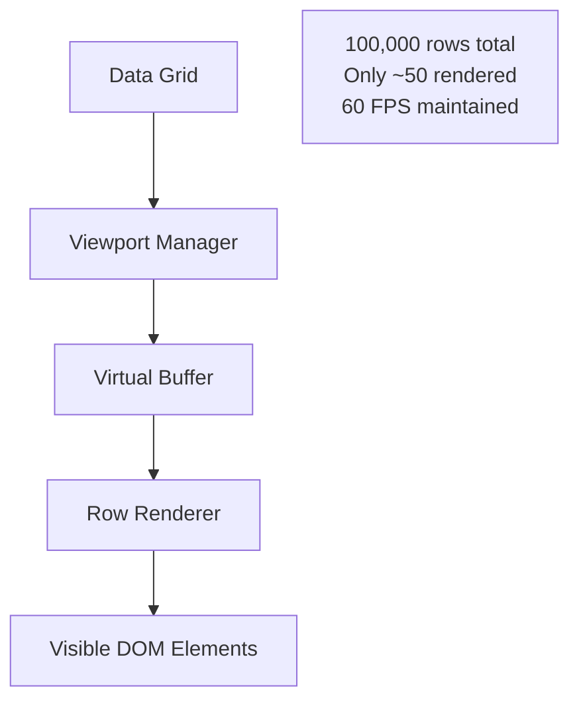

### PowerShell Session Pooling

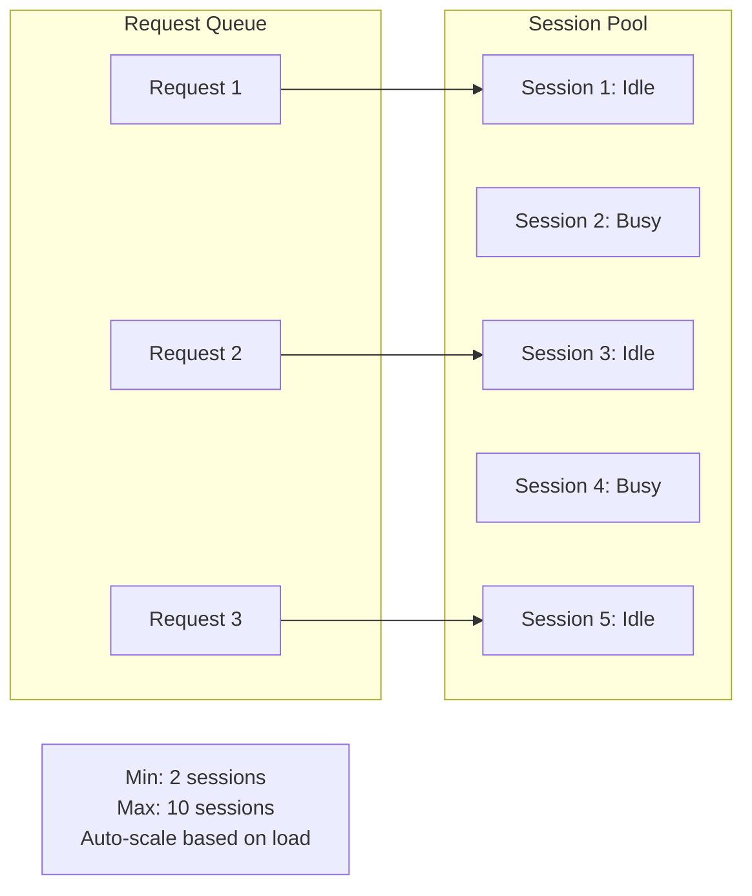

### Code Splitting

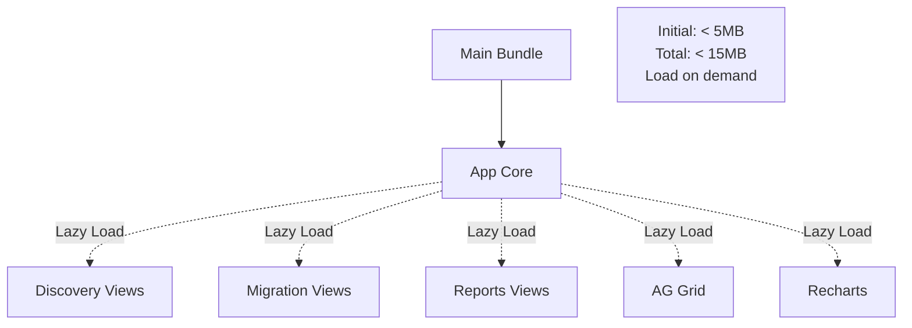

## Security Architecture

### Credential Storage

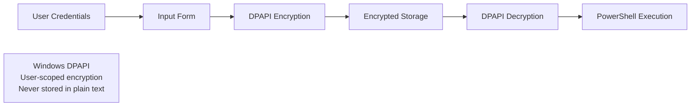

### IPC Security

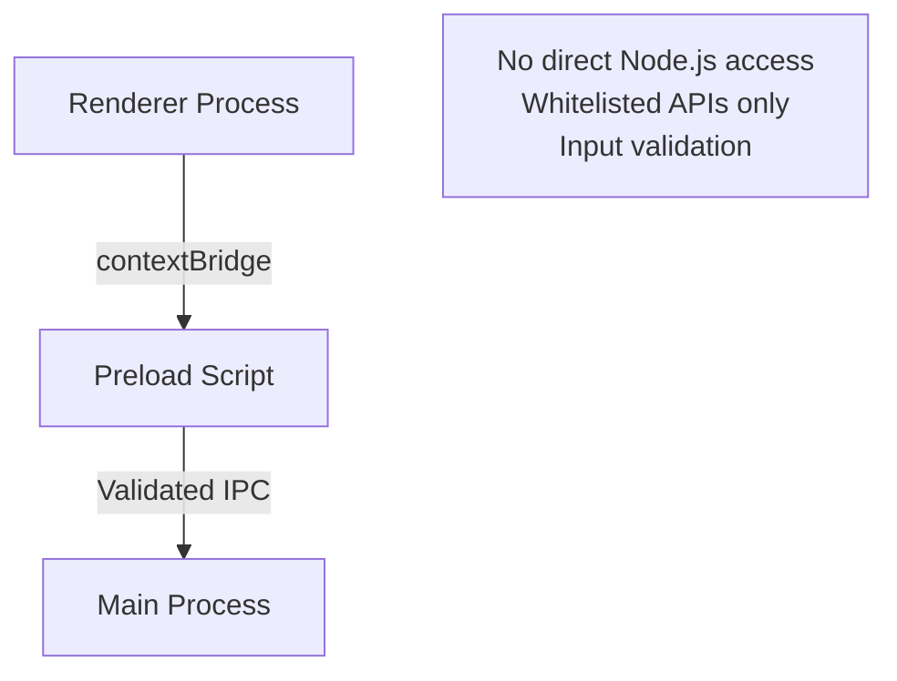

### Audit Trail

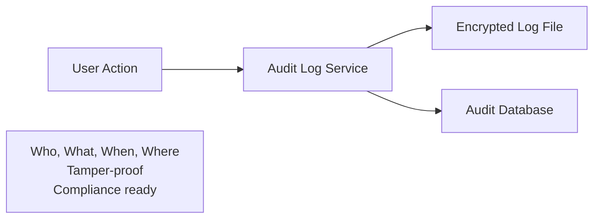

---

For more information, see:
- [Developer Guide](DEVELOPER_GUIDE.md)
- [API Reference](API_REFERENCE.md)
- [Deployment Guide](DEPLOYMENT.md)

